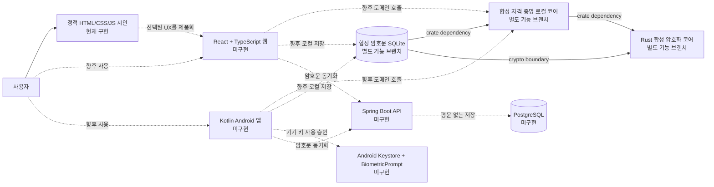
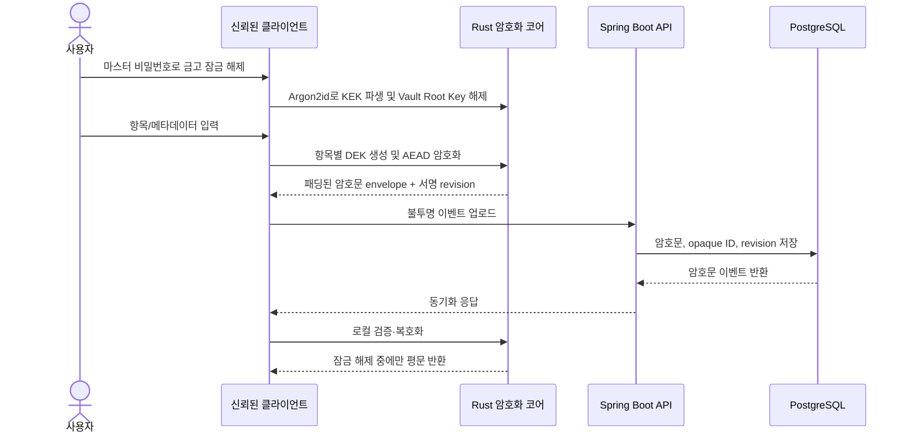

# 보존본 — 2026-09-12 공유 가이드

> 역사 기록입니다. 현재 구현 상태는 docs/KEYATLAS_PROJECT_SHARED_GUIDE.md를 따릅니다.

# KeyAtlas 프로젝트 공유 가이드

> 기준일: 2026-09-12
> 저장소: `https://github.com/kjs844-art/secure-vault`
> 제품명 `KeyAtlas`는 working title입니다.

이 문서는 새 협업자가 **무엇을 만드는지, 지금 실제로 무엇이 있는지, 다음에 무엇을 해야 하는지**를 한 번에 파악하기 위한 인수인계 문서입니다. 목표 설계와 현재 구현을 의도적으로 구분합니다.

## 1. 한 문장 소개

KeyAtlas는 개발자와 AI 도구 사용자가 여러 서비스의 **아이디·비밀번호·API 키·Secret·MCP 연결 정보**를 계층적으로 정리하고, 향후 Android와 웹에서 검색·열람·복사할 수 있게 하는 개인용 제로지식 보안 금고입니다.

현재 통합 기준인 `main`과 이 디자인 브랜치는 **보안/제품 설계와 합성 데이터 기반 정적 UI 시안 단계**입니다. 별도 기능 브랜치에는 합성 데이터 전용 Rust 암호화·자격 증명 모델·SQLite 저장 코어가 있으나 `main`에 병합되지 않았고, 실제 Secret을 저장할 수 있는 완제품 앱, 서버 인증, 복구, 동기화, 배포는 아직 없습니다.

## 2. 제품 범위와 핵심 사용자 흐름

목표 데이터 구조는 다음과 같습니다.

```text
서비스 → 계정 → 조직/워크스페이스/프로젝트 → 환경 → 비밀번호/API 키/Secret/MCP
```

목표 사용자 흐름은 다음과 같습니다.

1. 온라인 가입·동기화가 필요할 때 Google OIDC 또는 passkey로 KeyAtlas 서비스 계정에 로그인합니다.
2. 로그인과 별개로 마스터 비밀번호 또는 신뢰 기기로 개인 금고를 잠금 해제합니다.
3. 잠금 해제된 클라이언트가 항목과 의미 있는 메타데이터를 로컬에서 암·복호화합니다.
4. 사용자는 서비스명, 계정, 프로젝트, 사용처로 로컬 검색하고 필요한 값만 잠시 봅니다.
5. 서버가 생기면 평문이 아니라 불투명 암호문 이벤트와 동기화 메타데이터만 보관합니다.

Android의 기존 로컬 금고를 오프라인에서 여는 흐름에는 매번 OIDC 로그인이 선행될 필요가 없습니다.

MVP에는 개인 금고, 수동 입력/로컬 가져오기, 검색·보기·복사, Android 오프라인 사용, 암호화 백업·복구, 충돌 보존을 포함할 계획입니다. 자동 입력, 팀 금고, TOTP 생성, 일반 파일/카드/신분증 보관, AI의 Secret 원문 접근은 MVP 범위 밖입니다.

## 3. 현재 상태 요약

### `main` 및 현재 디자인 브랜치 기준

조사 시점의 현재 브랜치는 `codex/firstvibe-keyatlas-design-preview`이고 기반 커밋은 `9c2dee8`로 `main`/`origin/main`과 같았습니다. 아래 표는 이 체크아웃에 실제 존재하는 파일 기준입니다.

| 영역 | 상태 | 현재 저장소에서 확인된 사실 |
| --- | --- | --- |
| 제품/보안 문서 | 작성됨 | MVP, ADR, 보안 아키텍처, 위협 모델, 단계적 수익화 설계가 있음 |
| 디자인 시안 | 로컬 정적 프로토타입 구현 | `design-prototypes/2026-09-11/`에 HTML 6개, CSS 2개, JS 1개, 검증/서버 MJS 2개, 문서 2개가 있음 |
| 웹 프론트엔드 | 미구현 | `apps/web/README.md`만 있음. React/TypeScript 소스, `package.json`, 빌드 설정 없음 |
| Android 앱 | 미구현 | `apps/android/README.md`만 있음. Kotlin/Gradle 소스와 네이티브 앱 빌드 없음 |
| Rust 암호화 코어 | 현재 브랜치에는 미구현 | `crates/vault-crypto/README.md`와 구현 계획만 있음. `.rs`, `Cargo.toml`, `Cargo.lock` 없음 |
| 백엔드 API | 미구현 | `services/api/README.md`만 있음. Spring Boot/Java 소스와 `pom.xml`/Gradle 설정 없음 |
| DB/동기화 | 현재 브랜치에는 미구현 | PostgreSQL 및 append-only 암호문 동기화는 설계뿐이며 스키마·마이그레이션·실행 DB 없음 |
| 인증 | 미구현 | Google OIDC, WebAuthn/passkey, 세션, device roster가 연결되지 않음 |
| 금고 잠금 해제/복구 | 미구현 | 마스터 비밀번호, 복구 키, 신뢰 기기, Android Keystore/BiometricPrompt가 연결되지 않음 |
| 결제/구독 | 미구현 | Free/Pro는 미래 가설 문서뿐이며 결제 SDK, 상품, 판매 검증 없음 |
| 클라우드/배포 | 미구현 | 운영 인프라, 도메인, CI 배포, 공개 URL, 앱스토어 배포 없음 |
| 네이티브 iOS 앱 | 미구현/후순위 | 단계적 출시 아이디어만 있으며 MVP 구현 대상이 아님 |

따라서 현재 디자인 화면의 검색, 선택, 가짜 원문 표시, 연결 지도는 **프론트 시연 동작**입니다. 저장, 암호화, 로그인, 생체인증, 외부 서비스 연결, 실제 클립보드 복사는 하지 않습니다.

### 별도 기능 브랜치 기준

다음은 2026-09-12에 로컬 branch 및 `origin/*` 추적 ref의 tree와 커밋을 읽어 확인한 상태입니다. **원격 최신성, PR 존재/승인, `main` 병합 준비 완료를 뜻하지 않으며**, 아래 테스트도 이번 디자인 체크아웃에서 재실행한 것이 아니라 각 브랜치에 커밋된 검증 기록을 요약한 것입니다.

| 브랜치/HEAD | 별도 브랜치에 존재하는 구현 | 검증 기록과 한계 |
| --- | --- | --- |
| `codex/firstvibe-v0alpha1-crypto` / `e517854` | Rust 2024 `vault-crypto`: Argon2id 기반 합성 root wrap, XChaCha20-Poly1305 항목 seal/open, canonical codec, 변조·trait 경계 테스트 | 기록상 2026-08-14 수정 후 최상위 테스트 50개와 trybuild 16개 통과. 독립 암호 검토/실제 Secret 승인은 아님 |
| `codex/firstvibe-credential-local-core` / `e272713` | `vault-local-core`: 고정된 합성 자격 증명/관계 모델과 seal/open 흐름 | 기록상 workspace 최상위 68개와 compile-fail 24개 통과. 임의 평문 입력, 저장, 네트워크, UI, 복구는 의도적으로 없음 |
| `codex/firstvibe-sqlite-store` / `d92346e` | 위 코어 + `vault-local-store-sqlite`, Windows platform/VFS crate, `storage-v1` SQL, 로컬 검증 스크립트 | 2026-09-07 기록상 일반 workspace 168 passed/1 ignored. ignored Phase 0A 보안 gate와 rollback/누락 anchor, 복구, Android, sync, 독립 검토는 미완료 |
| `codex/firstvibe-recovery-credential-design` / `44c8b99` | 암호 코어 위 복구·보호수단 ADR/구현 계획 | recovery Key Slot, 신뢰 기기, Keystore 연동은 구현되지 않음 |
| `hermes/synthetic-web-prototype` / `25539df` | 합성 웹 프로토타입 **설계 문서** | React/TypeScript 실행 소스나 `package.json`은 없음 |

즉, Rust/SQLite 코드는 “없는 것”이 아니라 **기능 브랜치에서 검토·통합을 기다리는 합성 전용 기반**입니다. 반대로 웹/Android/Spring Boot/PostgreSQL/로그인/복구/결제/클라우드 배포는 확인한 어느 통합 경로에서도 완성된 제품으로 존재하지 않습니다.

## 4. 현재와 목표 아키텍처

아래에서 정적 시안은 현재 디자인 브랜치에서 실행할 수 있습니다. Rust/SQLite 기반은 별도 기능 브랜치에 있고 시안과 연결되지 않았으며, 앱/API/PostgreSQL은 목표 구조입니다.



책임 경계는 다음과 같습니다.

| 계층 | 목표 기술 | 책임 | 서버에 평문을 보내는가 |
| --- | --- | --- | --- |
| 웹 프론트 | React + TypeScript | 화면, 로컬 검색, 자동 잠금, 암호문 IndexedDB | 아니오 |
| Android | Kotlin | 주 클라이언트, 오프라인 암호문, Keystore/생체 승인 | 아니오 |
| 공용 보안 코어 | Rust → WASM/Android binding | KDF, 키 래핑, AEAD, 서명/검증, 직렬화 | 해당 없음: 클라이언트 내부 |
| API | Spring Boot | 계정 인증, passkey, 기기 목록, 불투명 이벤트/체크포인트 동기화 | 받지 않아야 함 |
| DB | PostgreSQL | 계정/운영 정보와 패딩된 암호문 저장 | 저장 금지 |
| 계약 | 버전형 wire contract | Android·Web·API 사이 envelope/event/checkpoint 호환성 | 평문 필드 금지 |

## 5. 목표 암호화·동기화 흐름

다음은 **승인된 설계 방향**이며 아직 실행 코드로 구현되거나 독립 검토된 암호 프로토콜이 아닙니다.



설계상 무작위 Vault Root Key를 만들고, 마스터 비밀번호 기반 KEK와 복구 KEK/신뢰 기기 키가 이를 각각 감쌉니다. 각 항목은 별도 무작위 DEK를 사용합니다. 기본 후보는 Argon2id와 XChaCha20-Poly1305이지만, 파라미터와 라이브러리는 테스트 벡터와 외부 암호 검토 전에는 확정된 프로덕션 사양으로 취급하지 않습니다.

Google 로그인/passkey는 **서비스 계정 인증**, 마스터 비밀번호/신뢰 기기는 **금고 잠금 해제**입니다. 둘을 합치거나 Google 토큰으로 금고 루트 키를 만들면 안 됩니다.

## 6. 데이터·복구·충돌 원칙

- 서버는 사이트명, URL, 아이디, 비밀번호, API 제공자, 태그, 메모, 검색어의 평문을 알 수 없어야 합니다.
- 서버가 볼 수 있는 운영 메타데이터(IP, 요청 시각, 암호문 크기, opaque slot의 revision 빈도)는 문서로 공개해야 합니다.
- 동시 변경된 비밀번호/API 키/Secret은 자동 덮어쓰기 또는 문자열 병합하지 않고 두 버전을 보존합니다.
- 삭제와 오프라인 수정이 충돌하면 삭제 상태를 유지하되 수정본은 암호화 복구함에 남깁니다.
- 분실 기기는 세션/device roster를 취소하고 새 key epoch로 이동해야 합니다. 이미 그 기기가 본 평문은 회수할 수 없으므로 외부 자격 증명을 회전합니다.
- 복구 키, 마스터 비밀번호, 등록된 신뢰 기기와 별도로 검증된 금고 복구용 보안키 수단을 모두 잃으면 운영자도 복구할 수 없습니다. 일반 계정 로그인용 passkey를 곧바로 금고 복구 수단으로 간주하지 않습니다.
- 생체정보를 앱이나 서버가 저장·업로드하지 않습니다. Android 생체인증은 Keystore 안의 기기 키 사용 승인에만 씁니다.

## 7. 저장소 구조

```text
secure-vault/
├─ apps/
│  ├─ web/README.md                 # React/TypeScript 목표 설명; 소스 없음
│  └─ android/README.md             # Kotlin/Keystore 목표 설명; 소스 없음
├─ crates/
│  └─ vault-crypto/README.md        # Rust 코어 목표 설명; crate 소스/manifest 없음
├─ services/
│  └─ api/README.md                 # Spring Boot 목표 설명; 소스/빌드 설정 없음
├─ contracts/README.md              # 버전형 계약의 원칙만 정의
├─ tests/fixtures/synthetic/README.md
│                                      # 실제 Secret 금지 규칙; fixture 구현 없음
├─ design-prototypes/2026-09-11/    # 현재 실행 가능한 정적 디자인 시안
├─ docs/                            # MVP, ADR, 보안/위협 모델, 계획·명세
├─ .github/pull_request_template.md # PR 보안 체크리스트
├─ README.md
├─ SECURITY.md
└─ CONTRIBUTING.md
```

`apps`, `services`, `crates`, `contracts`는 현재 **모노레포 자리와 책임 경계를 예약한 구조**입니다. 이름만 보고 구현된 앱/크레이트/서비스가 있다고 판단하면 안 됩니다.

## 8. 디자인 시안

위치: `design-prototypes/2026-09-11/`

| 파일 | 역할 |
| --- | --- |
| `index.html` | 3D 느낌의 웹 인트로와 각 시안 진입점 |
| `initial-comparison.html` | 최초 3개 방향 비교 |
| `01-monolith.html` | 어두운 프리미엄 금고 방향 |
| `02-quiet-vault.html` | 밝고 읽기 쉬운 기본 금고; 현재 추천안 |
| `03-atlas-network.html` | 발급처 → 자격증명 → 사용처 연결 지도 |
| `mobile-app.html` | 브라우저에서 보는 모바일 UX 시안; 네이티브 앱 아님 |
| `orbit-globe.js/css` | Canvas 3D 좌표 투영과 공통 지구/궤도 표현; Three.js/WebGL 아님 |
| `web-premium.css` | 웹 인트로 공통 스타일 |
| `serve.mjs` | `127.0.0.1:4178`에 허용된 시안 파일만 제공 |
| `validate.mjs` | JS 문법, 중복 ID, 로컬 참조, 외부 자동 자원/저장 API 사용을 정적 검사 |
| `README.md`, `DESIGN.md` | 검증 기록과 디자인 선택 기준 |

추천 조합은 일상 금고에 **Quiet Vault**, 소개/잠금 상징에 **Monolith**, 필요할 때 펼치는 연결 보기에 **Atlas Network**를 사용하는 것입니다. 이는 사용자 테스트 결론이 아니라 현재 디자인 판단입니다.

## 9. 새 팀원이 시작하는 방법

### 시안만 확인하기

Node.js 외 별도 패키지 설치가 필요하지 않습니다. PowerShell에서 실행합니다.

```powershell
git clone --branch codex/firstvibe-keyatlas-design-preview --single-branch https://github.com/kjs844-art/secure-vault.git
cd secure-vault\design-prototypes\2026-09-11
node validate.mjs
node --check orbit-globe.js
node --check serve.mjs
node serve.mjs
```

Chrome에서 `http://127.0.0.1:4178/`을 엽니다. 종료는 서버를 실행한 터미널에서 `Ctrl+C`입니다. 실제 자격 증명을 입력하지 마세요.

### 작업을 시작하기 전 읽을 문서

1. `README.md`
2. `SECURITY.md`
3. `docs/MVP.md`
4. `docs/SECURITY_ARCHITECTURE.md`
5. `docs/THREAT_MODEL.md`
6. `docs/adr/0001-zero-knowledge.md`
7. 담당 영역의 `README.md`와 관련 설계/계획 문서

## 10. 현재 실행 가능한 검증

```powershell
cd design-prototypes\2026-09-11
node validate.mjs
node --check orbit-globe.js
node --check serve.mjs
```

`validate.mjs`가 확인하는 범위는 정적 문법, 중복 ID, 로컬 파일 참조, 자동 외부 자원, 네트워크/브라우저 저장 API 사용 여부입니다. 실제 브라우저 상호작용, 전 기기 반응형, 접근성, 침투 테스트, 보안 감사를 대체하지 않습니다.

현재 디자인 브랜치에는 `Cargo.toml`, `package.json`, Android Gradle 프로젝트, Spring Boot 빌드 파일이 없으므로 여기서 `cargo test`, `npm test`, `gradlew test`, `mvn test`로 검증할 구현물이 없습니다. 각 영역을 부트스트랩할 때 테스트 명령과 잠금 파일을 함께 추가해야 합니다.

별도 Rust/SQLite 브랜치를 검토할 때는 현재 작업 트리를 깨끗하게 만든 뒤 별도 worktree를 만들고, 그 브랜치 문서에 기록된 범위를 먼저 확인합니다. 예를 들면 SQLite 브랜치 루트의 기본 검증 명령은 다음과 같습니다.

```powershell
powershell -NoProfile -File .\scripts\verify-local.ps1
powershell -NoProfile -File .\scripts\verify-local.ps1 -Scope Workspace
powershell -NoProfile -File .\tests\verification\verify-local.Tests.ps1
pwsh -NoProfile -File .\tests\verification\verify-fixture-isolation.Tests.ps1
```

암호화 브랜치의 핵심 검증 명령은 다음과 같습니다.

```powershell
cargo fmt --all --check
cargo clippy --workspace --all-targets --all-features --locked -- -D warnings
cargo test --workspace --all-features --locked -- --test-threads=1
cargo run -p vault-crypto --example synthetic_local_alpha --locked
```

기록된 과거 통과 결과를 현재 코드의 재검증으로 바꾸어 말하지 않습니다. 해당 브랜치를 통합하기 직전에 정확한 HEAD에서 다시 실행해야 합니다.

커밋 전에는 최소한 다음을 실행합니다.

```powershell
git status --short
git diff --cached --name-status
git diff --cached
git diff --check
```

설치되어 있다면 `gitleaks dir . --redact`와 `gitleaks git . --redact`도 실행합니다. 단순 문자열 검색을 gitleaks와 동등한 검사로 주장하면 안 됩니다.

## 11. 협업과 브랜치 규칙

- `main`에 직접 작업하지 않습니다. 한 작업마다 `codex/firstvibe-<짧은주제>` 같은 기능 브랜치를 만듭니다.
- 여러 에이전트/사람이 동시에 작업하면 파일 소유 범위를 먼저 나눕니다. 예: `apps/web`, `apps/android`, `services/api`, `crates/vault-crypto`.
- `git add .` 대신 검토한 파일만 명시적으로 stage합니다.
- PR 하나에는 한 가지 목적만 담고, 변경 이유·사용자 영향·검증 명령과 결과·미검증 범위를 적습니다.
- 암호 프로토콜 변경은 ADR, 테스트 벡터, 이전 버전 마이그레이션 전략, 외부 검토 계획 없이는 병합하지 않습니다.
- UI 통과를 암호화/서버/배포 성공으로 간주하지 않습니다. 각 계층의 증거를 분리합니다.
- 병합 전 `main` 기준 diff, 충돌, 테스트, Secret 검사, 생성물/로그 포함 여부를 검토합니다.
- GitHub는 소스와 문서의 협업 장소이지 사용자 금고 데이터 백업 장소가 아닙니다.

## 12. 보안상 절대 금지

- 실제 아이디, 비밀번호, API 키, Secret, MCP 토큰, 2FA 복구 코드를 코드·fixture·Issue·PR·채팅에 넣지 않습니다.
- `.env`, 개인키, 인증서, keystore, 세션 쿠키, HAR, DB 덤프, 금고 export/backup, 실제 계정 화면을 커밋하지 않습니다.
- 실제 토큰과 같은 접두사·길이의 예제도 만들지 않습니다. 명백한 합성 문자열만 사용합니다.
- 금고 origin/runtime에 광고, 분석 SDK, 세션 녹화, 채팅 위젯, 임의의 제3자 JavaScript를 넣지 않습니다.
- Secret 평문, 검색어, 복호화 오류 입력값을 로그·오류 보고·분석 이벤트에 남기지 않습니다.
- Google 로그인만으로 외부 사이트 계정/키를 가져올 수 있다고 설명하지 않습니다.
- 독립 암호 검토, 공급망 검토, 복구·분실 기기 훈련, 침투 테스트, CSP 검증 전 실제 Secret 베타를 열지 않습니다.
- 유출 시 Git 기록에서 파일만 지우고 끝내지 않습니다. 외부 자격 증명을 즉시 폐기·회전하고 CI 로그/캐시/아티팩트까지 별도 처리합니다.

## 13. 지금까지 한 일과 다음 로드맵

| 단계 | 산출물/완료 조건 | 현재 |
| --- | --- | --- |
| 0. 제품 경계 | 개인 금고 MVP, zero-knowledge ADR, 위협 모델, 금지사항 | 완료 |
| 1. UX 방향 | 6개 정적 화면, 로컬 서버/검증기, 디자인 선택 | 시안 작성 완료; 최종 디자인 선택/사용자 테스트 필요 |
| 2. 합성 암호화 알파 | Rust crate, 엄격한 codec, Argon2id root wrap, 항목 AEAD, 변조 거부, 테스트 벡터 | 별도 브랜치 구현/검증 기록 있음; main 통합·독립 검토 전 |
| 3. 합성 관계/로컬 저장 | 자격 증명 관계 코어, immutable revision, SQLite CAS/conflict, 재시작 복원 | 별도 브랜치 구현/검증 기록 있음; 보안 gate 일부 미완료, main 통합 전 |
| 4. 복구/기기 키 | recovery key slot, 신뢰 기기, key epoch, Android Keystore ADR와 테스트 | 설계/계획만 있고 구현은 미완료 |
| 5. Android 주 클라이언트 | Kotlin UI, 오프라인 암호문 DB, 자동 잠금, 합성 데이터 E2E | 미구현 |
| 6. Web 클라이언트 | React/TypeScript, Rust/WASM, 암호문 IndexedDB, 메모리 검색, CSP | 미구현 |
| 7. API/DB 동기화 | Spring Boot, PostgreSQL, OIDC/passkey, opaque append-only events, 충돌 보존 | 미구현 |
| 8. 통합 보안 검증 | 다중 기기/오프라인/복구/분실 훈련, 로그 검사, 독립 암호 검토, 침투 테스트 | 미구현 |
| 9. 제한 베타 | 합성 데이터 → 개인 비공개 베타 → 제한된 실제 Secret 베타 | 미시작; 8단계 통과 전 금지 |
| 10. 공개 배포/수익화 | 운영 인프라, 개인정보/계정 삭제, 모니터링, 스토어, 검증된 Free/Pro | 미구현/미검증 |

가장 안전한 다음 작업은 한 번에 전체 앱을 만드는 것이 아니라 다음 순서입니다.

1. 디자인 방향과 핵심 화면을 결정합니다.
2. 합성 데이터만 받는 Rust 암호화 harness와 버전형 contract를 테스트 우선으로 만듭니다.
3. 복구/device-key 설계를 승인하고 실패 훈련을 자동화합니다.
4. Android를 주 클라이언트로 만든 뒤 Web, API/PostgreSQL 동기화를 연결합니다.
5. 독립 보안 검토를 통과한 후에만 실제 Secret 제한 베타를 검토합니다.

## 14. 협업자가 기억할 핵심

KeyAtlas가 지향하는 것은 “예쁜 비밀번호 목록”이 아니라 **서비스, 계정, 프로젝트, 환경, 사용처의 맥락을 함께 보존하는 개인용 제로지식 금고**입니다. 그러나 현재 저장소가 증명하는 것은 설계 문서와 정적 시안뿐입니다. 다음 기여는 이 경계를 정직하게 유지하면서 합성 데이터 테스트로 한 계층씩 실제 구현으로 바꾸는 작업이어야 합니다.
