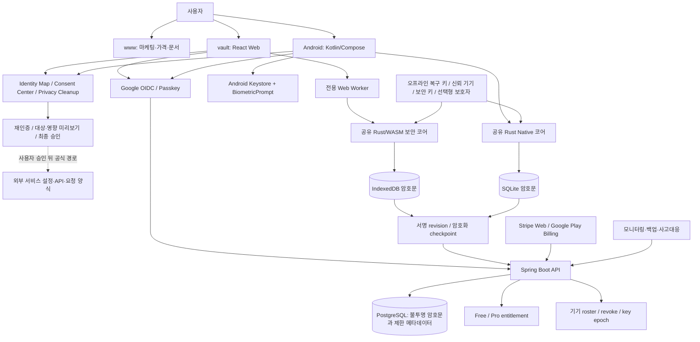

# KeyAtlas: 0부터 공개 웹·Android 서비스까지 전체 체크리스트

> 최초 작성: **2026-09-18 KST** · 최신 갱신: **2026-09-24 KST** <br>
> 제품명: **KeyAtlas (working title)** — 최종 이름·상표·도메인은 아직 확정하지 않음 <br>
> GitHub: [kjs844-art/secure-vault](https://github.com/kjs844-art/secure-vault) <br>
> 이 문서를 갱신하는 worktree: `C:\Users\USER\Documents\ChatGPT\KeyAtlas\agent-staging\keyatlas-luna-release-support` <br>
> 문서 브랜치·기준 SHA: `codex/firstvibe-luna-release-support` · `0b1c7bf2a5cf4681adbf845d30c7695251d3fb94` + 이번 미커밋 문서 변경 <br>
> 최신 통합·협업 기준: `41eeed0492e5325816e0797bbefa727408574e3c` → `d9c66661db7d7b66f6453e94e467c424107cba66` <br>
> 가장 중요한 현재 제한: **`REAL_SECRET_GATE=CLOSED` — 실제 비밀번호·API 키·Secret·복구 코드를 아직 입력하면 안 됨**

이 문서는 아이디어 단계부터 실제 사용자가 가입하고 결제하며 웹과 Android 앱을 사용하는 공개 서비스까지 필요한 일을 **의존 순서대로 한 장에 모은 실행 지도**다. 구현 사실, 설계만 있는 부분, 아직 시작하지 않은 부분을 구분하며 “코드가 있음”과 “운영 가능한 서비스임”을 같은 뜻으로 쓰지 않는다.

---

## 0. 2026-09-24 최신 상태와 Master TODO

### 0.1 이 문서를 읽는 법과 진실의 우선순위

파일을 이동하거나 중복본을 삭제하지 않고 조사했다. 같은 이름의 문서가 여러 worktree에
복사돼 있으므로, 아래 순서로 사실을 판단한다.

1. **이 파일**: 제품 전체 설계·세부 TODO·예상 시간의 단일 종합 지도
2. `docs/CURRENT_CHECKPOINT_2026-09-19.md`: 2026-09-19 통합 상태와 검증 경계
3. `docs/handoff/KEYATLAS_COLLAB_TASKS_001_100.md`: 2026-09-22 협업 작업 배치표
4. `docs/verification/`: exact SHA에서 실제로 실행한 검사와 제한 사항
5. `docs/SECURITY_ARCHITECTURE.md`, ADR: 보안 설계와 아직 승인되지 않은 제안

상위 폴더 `C:\Users\USER\Documents\ChatGPT\KeyAtlas` 자체는 commit이 없는 별도 빈 Git
저장소처럼 보인다. 실제 제품 Git 이력은 하위 worktree와 원본 저장소에 있으므로 상위
폴더의 파일 존재만으로 GitHub 백업·push·PR·merge를 판단하지 않는다.

### 0.2 제품 정의 — 이제 네 축으로 본다

KeyAtlas는 다음 네 기능이 연결되는 **개인 디지털 보안·프라이버시 운영센터**다.

```text
1. Secure Vault
   비밀번호 · API Key · Secret · 복구 코드 · 보안 메모를 클라이언트에서 암호화
            │
2. Identity & Connection Map
   어떤 로그인 수단으로 어느 서비스에 가입했고 어떤 키를 어디에 연결했는지 기록
            │
3. Consent Center
   마케팅 수신 · 제3자 제공 · OAuth 권한 · 구독 · 약관 버전과 철회 상태를 기록
            │
4. Privacy Cleanup Center
   수신 거부 · 연결 해제 · 키 폐기/교체 · 회원 탈퇴 · 개인정보/게시물 삭제 요청을 추적
```

디지털 장의사·세탁소형 기능은 “인터넷의 모든 계정을 몰래 찾아 자동 삭제”하는 기능이
아니다. 사용자가 소유·통제하는 자료와 공식 제공자 화면/API에서 증거를 모으고, 삭제·탈퇴·
동의 철회 요청을 준비하며, 사용자가 최종 승인한 사건의 진행 상태와 결과를 보존하는 기능이다.

### 0.3 2026-09-24 Git·구현 증거 스냅샷

| 항목 | 현재 판정 | 정확한 의미 |
|---|---|---|
| 2026-09-19 통합 tip | ○ 원격 기록 있음 | `codex/firstvibe-integration-20260919`의 `41eeed0`; 웹·SQLite hardening과 proposed recovery/Android ADR을 모은 통합 기록 |
| 2026-09-22 협업 baseline | ○ 원격 기록 있음 | `d9c6666`; 1~100 작업표·branch manifest·공통 프롬프트가 추가됨 |
| 1~100 협업 branch | ○ 예약됨 / ✕ 작업 완료 아님 | 원격 branch가 baseline을 가리키는 것은 작업 공간 예약일 뿐 구현·테스트·PR·merge 증거가 아님 |
| #30 provider metadata | ⚠ 로컬 보완 후보 | `534b37c`; malformed 입력·UTC 날짜·숨김 own-key 경계를 보완했고 focused 87/87·독립 P1/P2 0이나, generated WASM 부재로 전체 회귀가 차단됐고 UI·원격·통합은 미완료 |
| #58 evidence labels | ⚠ 로컬 후보 | `6803eb5`; 상태 증거 용어 문서 1개, 아직 baseline 통합·push·PR 미확인 |
| #93 release manifest | ⚠ 로컬 후보 | `f1a98b5`; 로컬 SHA-256 manifest 스크립트·테스트가 있으나 CI 연결·통합·원격 검증 미확인 |
| main | ✕ 최신 통합 아님 | 기능·협업 tip을 main에 병합했다는 증거가 없음 |
| 실제 Secret 사용 | ✕ 금지 | 외부 감사·복구·동기화·플랫폼·운영 gate가 닫혀 있음 |
| Privacy Cleanup | ✕ 구현 전 | 이번 갱신에서 제품 요구와 TODO를 추가했으며 코드·화면·외부 연결은 아직 없음 |

`commit 존재 → push → PR → 검증 → review → merge → 배포`는 각각 별도 상태다.
위 세 로컬 후보는 유용한 결과지만 **통합 완료나 GitHub 백업 완료로 표기하지 않는다.**

### 0.4 한눈에 보는 완료·부분완료·남은 일

#### 완료된 범위 — exact 범위 밖으로 확대 해석하지 않기

- [x] [합성/로컬] Rust 암호화·엄격한 codec·불변 revision 기반
- [x] [합성/로컬] 암호문 SQLite 재시작·CAS·충돌·원자성·평문 marker 검사 기반
- [x] [합성/로컬] React → Worker → Rust/WASM → IndexedDB 등록·목록·검색·잠금·백업·회전 기반
- [x] [문서/원격] 2026-09-19 통합 체크포인트 `41eeed0` 기록
- [x] [문서/원격] 2026-09-22 협업 1~100 baseline `d9c6666` 기록
- [x] [설계] 서비스 로그인과 금고 잠금 해제를 분리하고 운영자 평문 복구 백도어를 두지 않는 원칙

#### 부분완료 — 다음 검증이나 통합이 있어야 닫힘

- [ ] [부분] 최신 기능과 `origin/main`의 충돌을 보존적으로 해소하고 exact SHA 전체 회귀 실행
- [ ] [부분] 실제 브라우저 다중 탭·저장공간·업그레이드·파일 backup/restore 검증
- [ ] [부분] Windows actual-handle/VFS 또는 승인된 broker 저장 경계 결정
- [ ] [부분] recovery slot·device roster·key epoch·Android 정책 ADR을 Accepted 상태로 전환
- [ ] [부분] #30은 exact generated WASM으로 전체 회귀를 마치고, #58·#93은 수정·재검증한 뒤 작은 PR 단위로 통합
- [ ] [부분] GitHub Actions의 계정/과금 외부 차단을 사용자 확인 후 exact SHA에서 재실행

#### 아직 구현하지 않은 핵심 제품 기능

- [ ] [AI] Privacy PRD와 사용자 여정·수용 기준 확정
- [ ] [AI] `IdentityProfile → ServiceAccount → Credential → Connection` 관계를 제품 화면에 연결
- [ ] [AI] `ConsentGrant`, `Subscription`, `EvidenceSource`, `CleanupCase`, `CleanupAction` 데이터 계약
- [ ] [AI] 디지털 정리센터 합성 목록·상세·상태 이력·증거 보관 UI
- [ ] [AI] 삭제·탈퇴·키 폐기 전 재인증·미리보기·명시적 최종 승인 상태기계
- [ ] [AI] 수신 거부·동의 철회·OAuth 연결 해제·계정 삭제 요청 템플릿과 공식 링크 카탈로그
- [ ] [AI] 복구·신뢰 기기·분실 기기 철회·키 세대 전환 구현
- [ ] [AI] signed checkpoint·rollback/omission/fork 탐지와 opaque sync 계약
- [ ] [AI] Spring Boot API·PostgreSQL schema/migration·로컬 합성 동기화
- [ ] [AI] Google OIDC·Passkey와 선택형 Kakao/Naver 연결
- [ ] [AI] Android Kotlin/Compose·Rust binding·SQLite·Keystore·BiometricPrompt
- [ ] [AI] Free/Pro entitlement·결제 sandbox·구독 lifecycle
- [ ] [AI] 모니터링·비밀값 없는 로그·백업/DR·지원 도구·CI/CD·SBOM
- [ ] [외부] 독립 암호 리뷰·침투 테스트·법률/개인정보 검토

#### 사용자가 결정하거나 직접 준비해야 하는 것

- [ ] [사용자] 최종 제품명·상표 조사·도메인
- [ ] [사용자] 기본 3개/선택 최대 5개 복구 수단과 영구 손실 고지 정책
- [ ] [사용자] Google/Kakao/Naver·클라우드·DB·이메일·결제·Play Console 계정과 MFA
- [ ] [사용자] Free/Pro 가격·무료 한도·환불·지원 범위
- [ ] [사용자] 서비스 국가·사업 주체·법률/개인정보·디지털 정리 업무의 위임 범위
- [ ] [사용자] 각 commit·push·PR·main merge·공개 배포·실제 Secret beta의 별도 승인

### 0.5 Privacy Cleanup Center 상세 설계

#### 데이터 관계

```text
IdentityProfile
  └─ ServiceAccount
       ├─ LoginMethod          Google / Kakao / Naver / Email / Passkey / Manual
       ├─ Credential           Password / API key / Secret / recovery code
       │    └─ Connection      MCP / CLI / CI / 앱 / 서버 / 플러그인 / 환경
       ├─ ConsentGrant         마케팅 / 제3자 제공 / OAuth scope / 알림 / 약관 버전
       ├─ Subscription         free / paid / trial / renewal / cancellation
       └─ EvidenceSource       manual / 가입 메일 / 공식 연결 화면 / import
             └─ CleanupCase
                  └─ CleanupAction + 상태 이력 + 접수 증거 + 다음 확인일
```

금고 원문과 민감한 사건 증거는 클라이언트 측 암호화 대상이다. 서버에는 동기화에 필요한
불투명 암호문과 최소 운영 메타데이터만 둔다는 기존 원칙을 유지한다. 이메일 전체 본문,
신분증, API 키 원문을 운영자 검색용 평문 DB에 복제하지 않는다.

#### 사용자가 실제로 하게 될 일과 수용 기준

1. **가입·연결 기록**
   사용자는 서비스, 로그인 방법, 계정 별칭, 발급받은 credential과 연결처를 기록한다.
   완료 기준: 잠금 해제 후 “어느 계정으로 가입했고 이 키가 어디에 쓰이는가”를 3단계 안에 찾는다.

2. **동의·구독 기록**
   사용자는 마케팅·제3자 제공·OAuth 권한·구독 상태와 확인 날짜를 저장한다.
   완료 기준: 원문 동의 문서 또는 공식 화면 링크, 출처, 마지막 확인일이 서로 구분된다.

3. **정리 대상 발견**
   수동 입력, 사용자가 선택한 import, 가입 메일, 공식 제공자의 연결 목록 등에서 후보를 만든다.
   완료 기준: `사용자 입력 / 공식 연동 / 추정 후보` 라벨을 숨기지 않고 100% 자동 발견이라고 표현하지 않는다.

4. **정리 사건 생성**
   수신 거부, 동의 철회, OAuth unlink, API 키 교체·폐기, 회원 탈퇴, 개인정보·게시물 삭제,
   검색 제외 중 하나를 선택한다.
   완료 기준: 원본 삭제·계정 탈퇴·검색 제외·검색 노출 억제를 서로 다른 결과로 기록한다.

5. **안전한 실행**
   KeyAtlas가 공식 링크·절차·요청서 초안을 제시하고 사용자가 재인증 후 최종 승인한다.
   완료 기준: 잠금 해제만으로 파괴적 작업이 자동 실행되지 않으며 대상·영향·복구 가능성을 다시 보여 준다.

6. **처리 추적과 재확인**
   `발견 → 확인 필요 → 요청 준비 → 승인 대기 → 접수 → 추가 인증 → 완료/거절 → 재확인`을 기록한다.
   완료 기준: 완료 영수증·날짜·남아 있는 데이터 범위·재노출 확인일을 사용자만 열람할 수 있다.

#### 자동화 경계

| 등급 | KeyAtlas가 할 수 있는 일 | 반드시 남겨 둘 사용자 단계 |
|---|---|---|
| 자동 보조 | 공식 링크 탐색, 양식 초안, 만료·재확인 알림, 상태 분류 | 결과 확인과 잘못된 후보 수정 |
| 반자동 | 표준 수신 거부 준비, OAuth 설정 화면 deep link, 키 회전 checklist, 삭제 요청 초안 | 재인증·대상 확인·최종 전송/클릭 |
| 사람 확인 필수 | 타인 게시물, 명예훼손, 불법 콘텐츠, 사망자 계정, 법적 분쟁, 신분 증명 | 사용자 또는 적법한 대리인·전문가가 판단·제출 |

다음 동작은 백그라운드에서 무단 실행하지 않는다: 회원 탈퇴, 계정 병합, API 키 폐기,
연결 해제, 유료 구독 취소, 법적 삭제 요청 전송. 성공을 확인하지 못했으면 `완료`가 아니라
`접수`, `추가 확인 필요`, `실패`, `증거 없음`으로 표시한다.

### 0.6 Privacy 기능 전용 P01~P12 TODO

기존 1~100 협업 branch는 2026-09-22 baseline으로 보존한다. 아래 작업은 아직 branch를
만들지 않은 **Privacy addendum**이며, 구현을 시작할 때 exact base SHA와 파일 소유권을
다시 지정한다.

| ID | 상태 | 작업 | 담당 | 예상 집중 시간 | 완료 증거 |
|---|---|---|---|---:|---|
| P01 | [ ] | Privacy PRD·용어·과장 금지 문구 | [공동] | 2~4일 | 사용자 여정·수용 기준 승인 |
| P02 | [ ] | Consent/Cleanup domain contract | [AI] | 4~8일 | validation·future-version·roundtrip tests |
| P03 | [ ] | 암호화 로컬 저장·검색 projection | [AI] | 1~2주 | 평문 marker 0, 잠금 시 조회 불가 |
| P04 | [ ] | 합성 디지털 정리센터 UI | [AI] | 1~2주 | empty/error/locked/100건 접근성 테스트 |
| P05 | [ ] | 파괴적 작업 승인 상태기계 | [AI]+[공동] | 1~2주 | 재인증·재확인·중복 실행·취소 회귀 |
| P06 | [ ] | 공식 링크·요청서·증거 source catalog | [AI] | 1~2주 | 출처·확인일·UNKNOWN 상태 보존 |
| P07 | [ ] | 수신 거부·동의 철회 보조 | [AI] | 1~3주 | 사용자 승인 없이는 전송 0 |
| P08 | [ ] | OAuth 연결 조회·해제 deep link | [AI]+[사용자] | 2~5주 | provider별 최소 scope·unlink 후 검증 |
| P09 | [ ] | 가입 메일/import 후보 탐색 | [AI]+[공동] | 3~6주 | 최소 권한·local-first·오탐 수정·삭제 |
| P10 | [ ] | 회원 탈퇴·개인정보/게시물 삭제 사건 추적 | [AI]+[외부] | 3~6주 | 제출·거절·완료·재확인 증거 분리 |
| P11 | [ ] | 재노출·미처리 알림과 운영 SLA | [AI]+[사용자] | 2~4주 | secret-free 알림·quiet hours·audit |
| P12 | [ ] | Privacy Care 유료 사람 지원 | [사용자]+[외부] | 6~12주 이상 | 적법한 위임·최소 접근·교육·보험·법률 검토 |

P01~P06은 실제 외부 계정 없이 합성 데이터로 진행할 수 있다. P07 이후는 제공자 정책,
사용자 OAuth 동의, 개인정보 처리, 법률 검토가 필요하다. 모든 제공자에 통하는 범용 API는
없으므로 서비스별 adapter를 작은 범위로 추가한다.

### 0.7 갱신된 조건부 시간 범위

| 목표 | Privacy 기능 제외 기존 범위 | Privacy 핵심을 포함한 갱신 범위 |
|---|---:|---:|
| 합성 Web 데모 안정화 | 1~3주 | P01~P06 병렬 포함 약 3~6주 |
| 로컬 Privacy Cleanup alpha | 해당 없음 | 추가 4~8주 |
| 제한 실제-Secret/Privacy 비공개 beta 후보 | 약 20~32주 | 약 24~40주 + 독립 검토 대기 |
| 공개 Web+Android 서비스 | 약 24~40주 | 약 30~52주 이상 + 심사·법률·감사 대기 |
| 사람 지원형 Privacy Care | 해당 없음 | 공개 셀프서비스 이후 추가 3~6개월 이상 |

병렬 AI는 문서·UI·테스트·공개 metadata를 단축할 수 있지만 암호 설계, 복구, 파괴적 작업,
법률 위임, 독립 감사와 실제 장애 훈련의 승인 시간을 없애지는 못한다. 가장 빠른 안전 경로는
**P01~P06 합성 self-service → 제한된 공식 연동 → 사람 지원형 서비스** 순서다.

---

## 1. 상태 표시와 담당 표시

### 상태 표시

- **○ 완료**: 현재 명시한 범위에서 코드·문서·검증 증거가 존재한다.
- **◐ (일부만 됨)**: 설계나 합성 데이터 구현은 있으나 실제 환경·플랫폼·운영 검증이 남았다.
- **✕ 미완료**: 아직 구현하지 않았거나 선행 보안 조건 때문에 시작하면 안 된다.

> 주의: `○ 완료`는 그 한 줄의 좁은 범위만 완료했다는 뜻이다. 예를 들어 합성 데이터 암호화 테스트가 완료돼도 실제 고객 Secret을 맡길 준비가 끝났다는 뜻은 아니다.

### 담당 표시

- **[AI]**: 코드·테스트·문서·설정 초안처럼 사용자의 계정 결제나 법적 동의 없이 진행할 수 있는 일
- **[사용자]**: 이름 선택, 계정 생성, 본인 인증, 결제, 계약, 법적 승인처럼 본인이 직접 해야 하는 일
- **[공동]**: AI가 후보와 절차를 만들고 사용자가 최종 선택·승인해야 하는 일
- **[외부 전문가]**: 독립 보안 감사, 침투 테스트, 법률·세무 검토처럼 이해관계가 독립된 전문가가 해야 하는 일

---

## 2. 1분 현재 상황

### 우리가 만들고 있는 것

KeyAtlas는 단순 메모장이 아니라 다음 관계를 보존하고 정리하는 **암호화 금고 + 디지털
신원·연결 지도 + 동의 관리 + 프라이버시 정리센터**다.

```text
내 로그인 수단
  └─ Google / Kakao / Naver / Email / Passkey
       └─ 가입한 서비스 계정
            └─ 조직 / 워크스페이스 / 프로젝트 / 환경
                 └─ 비밀번호 / API Key / Secret / 복구 코드 / 기타 자격 증명
                      ├─ 웹앱 / 모바일앱 / MCP / CLI / CI / 서버 / 플러그인
                      ├─ 마케팅 / 제3자 제공 / OAuth 권한 / 구독 / 약관
                      └─ 연결 해제 / 키 교체·폐기 / 탈퇴 / 삭제 요청 / 재확인
```

예를 들어 “OpenAI에서 발급받은 API 키가 로컬 MCP, GitHub Actions, 테스트 앱 어디에 연결됐는가?”를 한눈에 보고, 나중에 키를 교체할 때 모든 연결처를 빠뜨리지 않게 하는 제품이다.

Anthropic/OpenAI 같은 제공자가 생성 직후에만 API 키 원문을 보여 주고 나중에는 마스킹만 보여 주는 문제도 해결 대상이다. 단, **KeyAtlas가 원문을 다시 보여 주려면 최초 발급 때 사용자가 그 원문을 KeyAtlas에 안전하게 저장했어야 한다.** 과거에 저장하지 않았고 제공자도 마스킹한 키를 KeyAtlas가 복원해 내는 것은 불가능하다.

Google·Naver·Kakao 로그인이나 개인정보 하나로 모든 가입 사이트를 조회하는 범용 API는
없다. 계정 발견은 사용자가 소유한 기록, 가입 메일, 비밀번호 관리자·브라우저 export,
공식 연결 화면/API, 직접 확인을 출처별로 합치는 방식이어야 한다. 연결 해제, 서비스 탈퇴,
개인정보 삭제, 게시물 원본 삭제, 검색 제외는 서로 다른 결과로 기록한다.

### 현재 사실 요약

| 항목 | 상태 | 현재 증거 |
|---|---|---|
| GitHub 통합·협업 기준 | ○ 범위 제한 완료 | `41eeed0` 통합 기록과 그 위 `d9c6666` 협업 baseline이 원격에 있음 |
| canonical 협업 worktree | ○ 확인 | 2026-09-24 조사 당시 `d9c6666`, tracked 변경 없음 |
| Rust 합성 암호·로컬 저장 코어 | ◐ (일부만 됨) | 합성 테스트와 계약은 강하지만 production crypto 승인·외부 감사 전 |
| React/Worker/Rust-WASM/IndexedDB 합성 금고 | ◐ (일부만 됨) | 검색·등록·편집·백업·충돌·회전 흐름 구현, 실제 Secret 입력은 닫힘 |
| 마지막 저장소 기록의 Web 검증 | ○ 당시 범위 완료 | 46 files / 1,467 tests, typecheck·production build exit 0 기록; 이번 문서 갱신에서 재실행하지 않음 |
| 마지막 저장소 기록의 scanner | ○ 당시 범위 완료 | PowerShell 7·5.1 각각 102/102 기록; 이번 문서 갱신에서 재실행하지 않음 |
| 최신 원격 CI | ? BLOCKED/UNKNOWN | 저장소 기록상 payment/spending-limit로 step 0개 종료; 2026-09-24 `gh` 조회도 404여서 PASS/FAIL로 판정하지 않음 |
| `main` 통합 | ✕ 미완료 | `d9c6666` 및 9월 24일 로컬 후보가 main에 병합됐다는 증거 없음 |
| 1~100 협업 작업 | ◐ 예약만 됨 | 원격 branch 생성은 완료가 아니며 초기 상태는 모두 baseline `d9c6666` |
| #30/#58/#93 로컬 후보 | ◐ 통합 전 | #30은 `534b37c` focused 87/87·독립 P1/P2 0이지만 전체 회귀 차단; 셋 모두 push·PR·remote CI·baseline 통합·main merge는 미확인 |
| Spring Boot API | ✕ 미완료 | `services/api`는 placeholder 수준 |
| PostgreSQL 운영 DB | ✕ 미완료 | schema·migration·운영 인스턴스 없음 |
| Google/passkey 로그인 | ✕ 미완료 | 설계만 있고 실제 OAuth client·서버 흐름 없음 |
| Identity & Connection Map 제품 화면 | ◐ (일부만 됨) | 관계 코어·합성 목록은 있으나 실제 계정 발견·시각 지도·공식 연동 없음 |
| Consent Center | ✕ 미완료 | 요구와 TODO만 추가, 데이터 모델·화면·외부 연동 없음 |
| Privacy Cleanup Center | ✕ 미완료 | 요구와 P01~P12만 추가, 탈퇴·삭제·동의 철회 실행 코드 없음 |
| Android 앱 | ✕ 미완료 | `apps/android`는 README 수준, 실제 앱/Keystore/생체 인증 없음 |
| 결제·구독 | ✕ 미완료 | 가격 가설만 있고 Stripe/Play Billing 미연결 |
| 도메인·공개 배포 | ✕ 미완료 | 이름·도메인·클라우드 계정·DNS·TLS 미확정 |
| 외부 보안 감사·침투 테스트 | ✕ 미완료 | 계약·실행·재검토 없음 |
| 실제 Secret 제한 베타 | ✕ 미완료 | 보안 gate가 닫혀 있음 |
| 공개 서비스 | ✕ 미완료 | 아직 합성 alpha 단계 |

### 지금 절대로 하지 않을 것

- 실제 비밀번호, 실제 API 키, Secret, seed phrase, 복구 코드를 현재 앱·Git·문서·채팅에 넣지 않는다.
- `main`을 성급하게 덮어쓰거나 force push하지 않는다.
- 무료 DB를 production 보안 금고의 백업·복구 전략으로 착각하지 않는다.
- 금고 origin에 광고, 세션 재생, 임의의 분석·채팅 위젯 등 제3자 JavaScript를 넣지 않는다.
- Secret 또는 복구 키를 Ethereum이나 다른 블록체인에 기록하지 않는다.
- 운영자가 고객의 금고 평문을 볼 수 있는 “편리한 복구 백도어”를 만들지 않는다.

---

## 3. 목표 전체 아키텍처



### origin과 역할을 분리한다

```text
www.도메인       마케팅·가격·도움말·제품 블로그. 분석 도구는 동의 후 최소 사용 가능
vault.도메인     실제 금고 UI. 제3자 JavaScript·광고·세션 재생 금지
api.도메인       Spring Boot API. 브라우저 CORS allowlist 적용
status.도메인    장애·점검 공지
support@도메인   일반 지원
security@도메인  취약점 신고
privacy@도메인   개인정보·삭제 문의
```

### 로그인과 금고 잠금 해제는 다른 일이다

```text
Google / Passkey 로그인
  → “이 사람이 어느 KeyAtlas 계정인가?” 확인

마스터 비밀번호 / 승인된 복구 수단
  → “이 기기에서 금고 암호키를 사용할 수 있는가?” 확인
```

서버 로그인 토큰만으로 Vault Root Key를 만들면 안 된다. 서버는 계정 운영은 해도 금고 평문을 복구할 수 없어야 한다.

---

## 4. 0→공개 서비스 전체 의존 순서

```text
00 기준점·작업 규칙 고정
  ↓
01 제품 범위·이름·사업 원칙
  ↓
02 UX·정보 구조
  ↓
03 위협 모델·보안 약속
  ↓
04 암호·키 계층
  ↓
05 로컬 저장·충돌·무결성
  ↓
06 계정·서비스·Credential 관계 모델
  ↓
06A Identity 발견 증거·신뢰도·출처
  ↓
06B Consent·Subscription 상태 모델
  ↓
06C Privacy Cleanup 사건·승인·결과 상태기계
  ↓
07 합성 Web 금고 완성
  ↓
08 실제 Secret 입력·보기·복사 UX
  ↓
09 암호화 백업·복원
  ↓
10 복구 수단·신뢰 기기·키 세대
  ↓
11 암호문 동기화 프로토콜
  ↓
12 Spring Boot API
  ↓
13 PostgreSQL
  ↓
14 Google OIDC·Passkey·계정 연결
  ↓
15 Android 공유 코어·로컬 DB
  ↓
16 Android Keystore·생체 인증
  ↓
17 Android 제품 화면
  ↓
18 Cloud·환경·IAM
  ↓
19 도메인·DNS·TLS·운영 이메일
  ↓
20 CI/CD·공급망 보안
  ↓
21 Web 배포 보안
  ↓
22 알림 이메일
  ↓
23 Free/Pro·결제·구독
  ↓
24 개인정보·약관·법률
  ↓
25 모니터링·로그·경보
  ↓
26 서버 백업·재해 복구
  ↓
27 고객 지원·운영 도구
  ↓
28 전체 QA·보안 검증·외부 감사
  ↓
29 합성 Private Beta
  ↓
30 제한 실제-Secret Beta
  ↓
31 Google Play 준비
  ↓
32 Web 공개 출시
  ↓
33 Android 공개 출시
  ↓
34 출시 후 상시 운영
  ↓
35 선택 확장: MCP·CLI·브라우저 확장·iOS·팀 금고
```

---

# Part A. 제품과 보안 기반

## 00. 기준점·작업 규칙·CI 진실 복구 — ◐ (일부만 됨)

목적: 여러 AI가 동시에 작업해도 main과 보안 코어를 훼손하지 않고 “어떤 커밋이 검증됐는지” 한 가지 사실로 말하게 한다.

| 상태 | 순서대로 할 일 | 담당 | 어디서 / 어떻게 | 완료 증거 |
|---|---|---|---|---|
| ○ 완료 | 저장소와 원격 연결 | [AI] | 로컬 저장소의 `origin`을 GitHub private repo에 연결 | `git remote -v`가 `kjs844-art/secure-vault`를 표시 |
| ○ 완료 | 통합·협업 기준 원격 기록 | [AI] | `41eeed0` 통합 후 `d9c6666` 협업 baseline 비강제 push | local/upstream exact SHA 일치 기록 |
| ○ 완료 | canonical 협업 worktree 정리 상태 확인 | [AI] | 2026-09-24 `keyatlas-collab-001-100` 확인 | `d9c6666`, tracked dirty 0 |
| ◐ (일부만 됨) | CI workflow 구성 | [AI] | `.github/workflows/security-gates.yml` | 단계 정의는 있으나 최신 remote 결과는 BLOCKED/UNKNOWN |
| ✕ 외부 차단 | exact-SHA 원격 CI 재검증 | [사용자]+[AI] | GitHub 계정/과금·접근 상태 확인 후 같은 SHA 재실행 | step이 실제 실행된 workflow 전체 결과 |
| ✕ 미완료 | 최신 기능 브랜치와 `main` 통합 계획 | [공동] | merge-base와 충돌 파일을 좁게 비교하고 별도 integration branch 사용 | 충돌 이유·선택·테스트 증거가 PR에 기록됨 |
| ✕ 미완료 | `main` 보호 규칙 | [사용자] | GitHub → Settings → Branches/Rulesets | force push 금지, required checks, 승인자 수 적용 |
| ✕ 미완료 | CODEOWNERS와 보안 코어 승인 정책 | [AI] | `.github/CODEOWNERS`에 crypto/storage/sync 소유자 지정 | 중요 파일은 보안 리뷰 없이 병합 불가 |
| ◐ (일부만 됨) | 실제 Secret Git 차단 | [AI] | local/CI scanner·fixture allowlist 기반 존재 | exact 통합 SHA local+remote 재검증과 pre-commit 정책 잔여 |
| ◐ (로컬 후보) | 릴리스 artifact manifest | [AI] | #93 `f1a98b5` 로컬 SHA-256 manifest 도구 | 자체 테스트 재실행·CI 연결·push/PR·통합 잔여 |
| ✕ 미완료 | 릴리스 태그·CHANGELOG·SBOM·서명 규칙 | [AI] | tag, changelog, SBOM, provenance, signing 문서화 | 동일 tag의 source/SBOM/build provenance 추적 가능 |
| ◐ (일부만 됨) | AI별 worktree·브랜치·파일 소유권 표 | [AI] | 1~100 manifest·assignment contract 존재 | 실제 배정·검증·PR 상태가 manifest와 일치 |

예상 시간: 로컬 기준선·후보 통합 **병렬 3~7일 / 한 명 순차 1~2주**. 원격 CI는
GitHub 계정 차단 해소 뒤 별도이며, 현재 첫 우선순위는 `green`을 가정하는 것이 아니라
exact SHA·로컬 증거·미실행 원격 상태를 일치시키는 것이다.

## 01. 제품 정의·이름·사업 원칙 — ◐ (일부만 됨)

| 상태 | 순서대로 할 일 | 담당 | 어디서 / 어떻게 | 완료 증거 |
|---|---|---|---|---|
| ○ 완료 | 핵심 문제 정의 | [공동] | API 키·비밀번호·가입 계정·연결처 관리라는 문제를 문서화 | `docs/MVP.md`, 공유 가이드에 반영 |
| ○ 완료 | 핵심 관계 정의 | [AI] | 서비스→계정→조직/프로젝트/환경→credential→connection | Rust 모델과 문서가 같은 관계를 사용 |
| ◐ (일부만 됨) | v1 대상 credential 유형 | [공동] | Password, API key, client secret, token, recovery code, SSH key metadata 등을 분류 | 저장 허용/금지 필드 표가 승인됨 |
| ✕ 미완료 | 최종 서비스명 결정 | [사용자] | 후보 상표·검색 결과·도메인 가용성 비교 | 최종 이름 1개와 대체 이름 1개 결정 |
| ✕ 미완료 | 상표 충돌 조사 | [사용자]+[외부 전문가] | 사업 예정 국가의 상표 검색 및 필요 시 변리사 검토 | 조사 기록과 사용 가능 판단 |
| ✕ 미완료 | v1 포함·제외 범위 동결 | [공동] | “비밀번호/API 키/연결 지도/복구/동기화”와 이후 기능 분리 | 변경 관리되는 v1 scope 문서 |
| ✕ 미완료 | 자동 발견 약속 제한 | [공동] | Google 계정만으로 가입 사이트 전체를 자동 발견할 수 없음을 명시 | 마케팅·온보딩에 과장 문구 없음 |
| ✕ 미완료 | 수익 모델 초안 승인 | [사용자] | Free/Pro 저장 개수, 기기 수, 기록·백업 기능 비교 | 보안을 유료벽으로 막지 않는 요금표 승인 |
| ✕ 미완료 | 사업 국가·통화·세무 주체 결정 | [사용자] | 개인/사업자, 한국/해외 판매, 통화·세금 책임 확인 | 결제 사업자 가입에 필요한 정보 준비 |

예상 시간: **2~5일**, 상표 전문가 검토는 외부 일정에 따라 추가된다.

## 02. UX·정보 구조·화면 설계 — ◐ (일부만 됨)

| 상태 | 순서대로 할 일 | 담당 | 어디서 / 어떻게 | 완료 증거 |
|---|---|---|---|---|
| ◐ (일부만 됨) | 합성 금고 목록·검색 UI | [AI] | `apps/web` React 화면 | 합성 데이터로 검색·목록 테스트 통과 |
| ◐ (일부만 됨) | 등록·편집·회전·충돌 UX | [AI] | `apps/web` | 합성 profile과 테스트 존재, 실제 브라우저 점검 잔여 |
| ✕ 미완료 | 전체 사용자 여정 wireframe | [AI] | Figma 또는 repo의 Markdown/Mermaid | 가입→금고 생성→저장→복구→탈퇴가 끊기지 않음 |
| ✕ 미완료 | ADHD 친화 dashboard | [공동] | 오늘 할 일 1개, 오래된 키, 미연결 키, 회전 필요 키를 작게 제시 | 5명 이상 사용성 테스트에서 핵심 작업을 찾음 |
| ✕ 미완료 | 서비스/계정/workspace/project/environment 필터 | [AI] | Web·Android 공통 IA | 같은 키의 발급처와 연결처를 3단계 안에 찾음 |
| ✕ 미완료 | reveal/copy 단계 상승 인증 | [공동] | 비밀번호 재입력 또는 로컬 생체 승인 후 제한 시간 노출 | 인증 없이 원문 노출 불가 |
| ✕ 미완료 | 복구 방식 선택 화면 | [공동] | 기본 3개, 선택적으로 최대 5개 수단 등록 | 분실 시나리오와 영구 손실 고지 확인 |
| ✕ 미완료 | 기기 목록·해제 화면 | [AI] | 기기 별 last seen, trust, revoke, epoch 표시 | 잃어버린 기기를 사용자가 직접 revoke 가능 |
| ✕ 미완료 | 백업·복원·삭제 UX | [AI] | 파일 선택, preview, overwrite 방지, 계정 삭제 | 실수로 기존 금고를 덮지 않음 |
| ✕ 미완료 | 접근성 기준 | [AI] | WCAG 2.2 AA 목표, keyboard, screen reader, contrast | axe/manual keyboard/screen reader 증거 |
| ✕ 미완료 | 반응형 설계 | [AI] | 360px 모바일부터 desktop까지 | 주요 화면 viewport 회귀 스냅샷 통과 |
| ✕ 미완료 | 한국어·영어 문구 구조 | [AI] | i18n key 기반, 보안 경고 쉬운 표현 | hard-coded 핵심 문구 제거 |

예상 시간: **2~4주**, 합성 기능 구현과 병행 가능하다.

## 03. 위협 모델·보안 약속 — ◐ (일부만 됨)

| 상태 | 순서대로 할 일 | 담당 | 어디서 / 어떻게 | 완료 증거 |
|---|---|---|---|---|
| ○ 완료 | 초기 위협 모델 | [AI] | `docs/THREAT_MODEL.md` | 공격자·자산·신뢰 경계가 문서화됨 |
| ○ 완료 | 보안 아키텍처 초안 | [AI] | `docs/SECURITY_ARCHITECTURE.md` | client-side encryption과 경계 문서 존재 |
| ○ 완료 | 계정 인증과 금고 복호화 분리 원칙 | [공동] | 제품 문서 | Google login만으로 Root Key가 생기지 않음 |
| ○ 완료 | 운영자도 평문 복구 불가 원칙 | [공동] | 제품·복구 문서 | 백도어 없는 영구 손실 위험을 명시 |
| ◐ (일부만 됨) | Web 위험 모델 | [AI] | XSS, 공급망, 악성 업데이트, DOM·clipboard·extension 위협 | 설계는 있으나 production header/배포 검증 없음 |
| ✕ 미완료 | Android 위험 모델 | [AI] | 분실·root·overlay·screenshot·backup·malware·biometric invalidation | MASVS 기반 위협/완화 표 승인 |
| ✕ 미완료 | 서버 악성/침해 모델 | [AI] | rollback, omission, fork, replay, tenant isolation, metadata leakage | 각 위협에 탐지·중지·복구 절차 연결 |
| ✕ 미완료 | 메타데이터 공개 범위 표 | [공동] | 서버가 IP, user-agent, 시각, 암호문 크기 등을 볼 수 있음을 고지 | 개인정보 문서와 구현이 일치 |
| ✕ 미완료 | 보안 RACI·risk register | [AI] | 위험 ID, 영향, 가능성, owner, due date, residual risk | 출시 gate에 열려 있는 고위험 0개 |
| ✕ 미완료 | 긴급 kill switch | [AI] | 실제 Secret 입력/동기화/신규 가입을 원격 중지하되 기존 로컬 export 유지 | 사고 훈련에서 작동 확인 |

예상 시간: 초기 동결 **1주**, 이후 모든 기능과 함께 계속 갱신한다.

## 04. 암호·키 계층·직렬화 — ◐ (일부만 됨)

| 상태 | 순서대로 할 일 | 담당 | 어디서 / 어떻게 | 완료 증거 |
|---|---|---|---|---|
| ○ 완료 | 합성 KDF 후보 구현 | [AI] | `crates/vault-crypto` Argon2id 계열 | wrong password/roundtrip 테스트 통과 |
| ○ 완료 | 합성 AEAD 구현 | [AI] | XChaCha20-Poly1305 계열, AAD·domain separation | tamper/context 교체 거부 테스트 |
| ○ 완료 | canonical CBOR·version envelope | [AI] | codec/envelope 계약 | 같은 입력의 결정적 encoding과 future-version 보존 |
| ○ 완료 | Secret 타입 외부 유출 방지 compile-fail 테스트 | [AI] | clone/debug/display/serialize/raw constructor 경계 | 외부 crate에서 컴파일 실패가 증거로 남음 |
| ○ 완료 | 항목별 키·credential 관계 기반 | [AI] | Rust 코어 | 합성 항목 암·복호화 및 관계 검증 |
| ◐ (일부만 됨) | 패딩·길이 누출 완화 | [AI] | 암호문 bucket/padding 계약 | 합성 테스트 존재, 실제 규모·성능 튜닝 잔여 |
| ✕ 미완료 | production key hierarchy ADR | [공동] | Vault Root Key, Item DEK, KEK, Key Slot, key epoch를 하나의 ADR로 동결 | 외부 검토자 서명·승인 |
| ✕ 미완료 | Argon2id 기기별 보정 | [AI] | 저사양 Android·desktop에서 메모리/시간 benchmark | 안전 하한과 목표 지연이 수치로 고정 |
| ✕ 미완료 | CSPRNG·nonce 수명 증명 | [AI] | Web Crypto/OS RNG→Rust 경계, nonce 중복 방지 | property/fuzz/vector 검증 |
| ✕ 미완료 | plaintext lifetime·zeroization | [AI] | Rust/JS/Kotlin 메모리 복사 최소화, 가능 범위 zeroize | 코드 리뷰와 메모리 경계 문서 |
| ✕ 미완료 | 독립 테스트 벡터·교차 언어 검증 | [AI]+[외부 전문가] | Rust/WASM/Android 동일 vector | 모든 플랫폼 byte-for-byte 일치 |
| ✕ 미완료 | fuzz·property·Miri/UB 검증 | [AI] | decoder, envelope, migration, conflict input | 정한 시간 budget에서 crash/UB 없음 |
| ✕ 미완료 | crypto agility·migration | [AI] | versioned suite와 re-encrypt migration | 구버전 archive를 손실 없이 새 버전으로 복구 |
| ✕ 미완료 | 독립 암호 설계·구현 감사 | [외부 전문가] | audit scope와 source SHA 고정 | Critical/High 0, 수정 재검토 완료 |

예상 시간: production gate까지 **4~8주 + 외부 감사 대기**. 직접 만든 암호 알고리즘을 추가하지 않는다.

## 05. 로컬 저장·원자성·충돌·무결성 — ◐ (일부만 됨)

| 상태 | 순서대로 할 일 | 담당 | 어디서 / 어떻게 | 완료 증거 |
|---|---|---|---|---|
| ○ 완료 | SQLite immutable revision과 canonical head | [AI] | `crates/vault-local-store-sqlite` | 합성 CRUD/restart 테스트 |
| ○ 완료 | expected-head CAS | [AI] | stale write를 덮지 않고 candidate 보존 | winner 1개, exact loser conflict 1개 |
| ○ 완료 | wrong password 무쓰기 | [AI] | unlock 전 read-only preflight | DB/WAL hash 또는 mutation count 불변 |
| ○ 완료 | 미래 버전·손상 데이터 보존 | [AI] | 읽기 실패 시 원본을 덮지 않음 | byte-preservation 테스트 |
| ○ 완료 | 커밋 전후 crash atomicity 합성 테스트 | [AI] | 강제 종료 fixture | 이전 또는 새 상태만 관찰, 반쪽 상태 없음 |
| ○ 완료 | DB/WAL 합성 평문 marker 검사 | [AI] | fixture marker scan | 허용 범위 밖 marker 0 |
| ◐ (일부만 됨) | IndexedDB durable vault | [AI] | Web Worker/WASM bridge | fake IndexedDB·합성 browser 흐름 강함, 실브라우저 다중탭 잔여 |
| ✕ 미완료 | signed revision/checkpoint | [AI] | manifest, prev hash, signer, sequence, key epoch | 변조된 head/checkpoint 거부 |
| ✕ 미완료 | rollback·row omission·fork 탐지 | [AI] | witness/anchor 또는 신뢰할 수 있는 최신 checkpoint 정책 | 서버가 옛 상태/일부 행을 주면 fail closed |
| ✕ 미완료 | tombstone·삭제 충돌 | [AI] | 삭제도 revision으로 보존 | offline edit와 delete 경합에서 손실 없음 |
| ✕ 미완료 | quota·disk-full·partial write | [AI] | 저장 전 용량 예약과 failure injection | 저장 실패가 기존 금고를 훼손하지 않음 |
| ✕ 미완료 | TOCTOU·multi-process·multi-tab 실검증 | [AI] | 실제 브라우저 2탭/프로세스 경합 | 자동 E2E와 수동 증거 |
| ✕ 미완료 | Windows 실제 handle 권위 판정 | [AI] | 정책 우회 없이 VFS/handle 동작 검증 | Smart App Control 영향과 결과가 분리 기록됨 |

예상 시간: 남은 핵심 **3~7주**.

## 06. Credential 관계 모델·제공자 카탈로그 — ◐ (일부만 됨)

| 상태 | 순서대로 할 일 | 담당 | 어디서 / 어떻게 | 완료 증거 |
|---|---|---|---|---|
| ○ 완료 | service/account/workspace/project/environment/credential/connection 모델 | [AI] | Rust contracts·Web fixture | 관계 규칙 테스트 통과 |
| ○ 완료 | Password와 API Key 타입별 정책 기반 | [AI] | 공통 private builder + type policy | Password에 API 전용 회전 action이 노출되지 않음 |
| ◐ (일부만 됨) | connection 편집·키 교체 체크리스트 | [AI] | 합성 Web UX | 고정 fixture에서 동작, 실제 provider 없음 |
| ✕ 미완료 | credential 유형 전체 표 | [공동] | password, API key, OAuth client, token, webhook secret, recovery code, SSH metadata | 각 타입의 secret/meta/expiry/rotation 정책 승인 |
| ◐ (로컬 보완 후보) | provider catalog schema | [AI] | `534b37c`에 7개 제공자 public-only metadata와 malformed 입력 fail-closed 보완; focused 87/87·독립 P1/P2 0, UI·전체 회귀·baseline 미통합 | exact generated WASM 회귀→push/PR→통합 후에만 완료 전환 |
| ✕ 미완료 | 로그인 출처 기록 | [AI] | Google/Kakao/Naver/email/passkey/manual을 서비스 계정에 연결 | “어느 아이디로 가입했나” 조회 가능 |
| ✕ 미완료 | 발급 출처·사용처 provenance | [AI] | created at/by, last verified, connection, environment, owner | 키를 어디서 받아 어디에 넣었는지 추적 가능 |
| ✕ 미완료 | 상태·만료·마지막 사용·비용 메타데이터 | [AI] | 사용자가 기록하거나 provider 공식 API가 허용하는 범위만 동기화 | active/revoked/expired와 사용·비용 출처가 구분됨 |
| ✕ 미완료 | 제공자 verified integration 경계 | [공동] | manual entry와 OAuth/API로 읽은 상태를 분리 표시 | 사용자가 자동 발견 범위를 오해하지 않음 |
| ✕ 미완료 | rotation 상태기계 | [AI] | planned→issued→staged→cutover→verified→revoked→archived | 연결처 하나라도 미갱신이면 완료 처리 안 됨 |

예상 시간: 기본 v1 **2~4주**, provider별 자동 연동은 출시 후 별도다.

---

## 06A. Identity 발견·Consent·Privacy Cleanup — ✕ 미완료

이 단계는 2026-09-24 제품 범위에 새로 확정했다. 기존 credential 관계 모델을 재사용하지만
외부 서비스의 계정·동의·삭제 상태를 자동으로 안다고 가정하지 않는다.

| 상태 | 순서대로 할 일 | 담당 | 어디서 / 어떻게 | 완료 증거 |
|---|---|---|---|---|
| ✕ 미완료 | 발견 증거 모델 | [AI] | manual/import/email/공식 연결 화면을 출처·확인일·신뢰도와 함께 저장 | 추정 후보를 확인된 계정으로 표시하지 않음 |
| ✕ 미완료 | Identity Map | [AI] | 로그인 수단→서비스 계정→credential→connection 시각화 | 사용자 검증으로 3단계 안에 발급처·사용처 탐색 |
| ✕ 미완료 | ConsentGrant 모델 | [AI]+[공동] | 마케팅·제3자 제공·OAuth scope·알림·약관 버전 | 필수/선택·활성/철회·출처·확인일 구분 |
| ✕ 미완료 | Subscription 모델 | [AI] | plan·비용·trial·갱신·해지 상태 | KeyAtlas 자체 결제와 외부 서비스 구독을 혼동하지 않음 |
| ✕ 미완료 | CleanupCase 상태기계 | [AI] | 발견→확인→준비→재인증→승인→접수→결과→재확인 | 거절·일부 처리·확인 불가·재노출 상태 보존 |
| ✕ 미완료 | 결과 유형 분리 | [AI] | 탈퇴/unlink/수신거부/동의철회/원본삭제/검색제외/노출억제 | 하나의 모호한 `삭제 완료` 상태를 사용하지 않음 |
| ✕ 미완료 | 파괴적 작업 step-up | [AI]+[공동] | 금고 unlock과 별도의 재인증·대상·영향·취소 가능성 확인 | 승인 없는 외부 변경 0, 중복 제출 0 |
| ✕ 미완료 | 공식 경로 catalog | [AI] | provider 설정·탈퇴·privacy·revoke 공식 URL과 확인일 | 깨진 링크·UNKNOWN·정책 변경을 fail-closed로 표시 |
| ✕ 미완료 | 합성 Cleanup UI | [AI] | 목록·상세·timeline·evidence·next check | 잠김/빈 상태/오류/100건/키보드 접근성 회귀 |
| ✕ 미완료 | 사람·전문가 인계 | [사용자]+[외부 전문가] | 불법 콘텐츠·사망자 계정·명예훼손·분쟁의 위임·최소 접근 | 법률 검토·역할·SLA·감사 로그 승인 |

예상 시간: P01~P06 합성 self-service **3~6주**, 제한된 공식 연동까지 **추가 6~12주**,
사람 지원형 Privacy Care는 법률·운영 준비를 포함해 **추가 3~6개월 이상**.

---

# Part B. Web 제품 완성

## 07. Web 프론트엔드 기반 — ◐ (일부만 됨)

| 상태 | 순서대로 할 일 | 담당 | 어디서 / 어떻게 | 완료 증거 |
|---|---|---|---|---|
| ○ 완료 | React+TypeScript+Vite 기반 | [AI] | `apps/web` | production build 통과 |
| ○ 완료 | 전용 Worker→Rust/WASM 경계 | [AI] | `apps/web` + `crates/vault-client-wasm` | WASM smoke와 bridge 테스트 |
| ○ 완료 | 자동 잠금·visibility/time anomaly 처리 | [AI] | session guard | 단위 테스트 통과 |
| ○ 완료 | 검색·합성 등록·편집·충돌 검토 | [AI] | Web components/state | 1,449 전체 Web 테스트에 포함 |
| ◐ (일부만 됨) | IndexedDB persistence | [AI] | local durable store | fake IDB 강함, 브라우저/업그레이드/저장공간 실검증 잔여 |
| ✕ 미완료 | production router·error boundary | [AI] | onboarding/login/vault/settings/recovery/billing routes | 직접 URL·refresh·오류에서 안전 복구 |
| ✕ 미완료 | 디자인 시스템 | [AI] | token, color, typography, spacing, focus, modal | Storybook 또는 visual regression |
| ✕ 미완료 | 접근성 자동·수동 검증 | [AI] | axe + keyboard + screen reader | blocker 0 |
| ✕ 미완료 | 실제 Chrome/Edge/Firefox/Safari 호환 | [AI] | Playwright browser matrix | 지원 브라우저 E2E green |
| ✕ 미완료 | PWA 여부 결정 | [공동] | offline shell과 update risk 비교 | service worker update/rollback 정책 승인 |
| ✕ 미완료 | 안전한 오류 문구 | [AI] | secret value·stack·metadata 비노출 | 로그·DOM snapshot에 평문 없음 |

예상 시간: 합성 demo 정리 **1~3주 병렬 / 2~5주 순차**.

## 08. 실제 Secret 입력·보기·복사 UX — ✕ 미완료

> 이 단계는 먼저 코드와 테스트를 만들 수 있지만, 28단계의 출시 gate 전에는 production에서 기능 flag를 열면 안 된다.

| 상태 | 순서대로 할 일 | 담당 | 어디서 / 어떻게 | 완료 증거 |
|---|---|---|---|---|
| ✕ 미완료 | 임의 길이 실제 Secret 입력 계약 | [AI] | textarea/input→Worker→Rust, DOM state 최소화 | React state·URL·log·analytics에 원문 없음 |
| ✕ 미완료 | Secret masking 기본값 | [AI] | 기본 숨김, 부분 mask는 저장값과 분리 | screenshot/DOM 검사 |
| ✕ 미완료 | reveal 재인증 | [AI] | 최근 인증 시간과 단계 상승 인증 | 인증 없이 reveal 불가, 자동 재숨김 |
| ✕ 미완료 | copy 재인증과 timeout | [AI] | 사용자 gesture에서만 clipboard 쓰기 | copy 후 화면·로그에 원문 없음 |
| ✕ 미완료 | clipboard 자동 삭제 | [AI] | 가능한 플랫폼에서 일정 시간 후 자신이 쓴 값만 조건부 삭제 | 다른 clipboard 값을 덮지 않음 |
| ✕ 미완료 | 비밀번호 생성기 | [AI] | CSPRNG, 길이·문자 정책, 금지문자 선택 | 통계·property test, Math.random 미사용 |
| ✕ 미완료 | 로컬 중복·재사용 경고 | [AI] | 서버에 해시를 보내지 않고 금고 안에서만 비교 | 동일 secret 경고가 로컬에서만 동작 |
| ✕ 미완료 | paste/import 안전성 | [AI] | file/clipboard 값의 lifetime 제한, preview에서 mask | crash dump·history에 원문 없음 |
| ✕ 미완료 | export 경고와 재인증 | [AI] | 기본은 암호화 export, 평문 export는 별도 위험 확인 | 사용자가 명시적으로 선택해야만 평문 생성 |
| ✕ 미완료 | 브라우저 확장·password manager 간섭 검토 | [AI] | autocomplete 속성, hostile extension은 한계로 고지 | 지원/비지원 보안 경계 문서 |
| ✕ 미완료 | 실제 입력 기능 flag | [AI] | 플랫폼별 `REAL_SECRET_GATE_*` | 기본 false, server와 build 모두 fail closed |

예상 시간: 구현·검증 **3~6주**, 독립 감사 전 공개 금지.

## 09. 암호화 백업·복원·내보내기 — ◐ (일부만 됨)

| 상태 | 순서대로 할 일 | 담당 | 어디서 / 어떻게 | 완료 증거 |
|---|---|---|---|---|
| ◐ (일부만 됨) | 합성 archive v1~v4 읽기/쓰기 | [AI] | Rust/Web archive code | 합성 roundtrip·호환 테스트 |
| ◐ (일부만 됨) | backup guard | [AI] | unresolved conflict가 있으면 backup 완료 오인 방지 | 합성 테스트 통과 |
| ✕ 미완료 | 실제 브라우저 파일 다운로드 | [AI] | native save/download, 임시 URL 정리 | 디스크 파일 hash와 archive manifest 일치 |
| ✕ 미완료 | 파일 선택 복원 | [AI] | overwrite 금지, 새 vault preview, version check | 별도 브라우저 profile에서 복원 성공 |
| ✕ 미완료 | truncation·corruption·wrong key 검사 | [AI] | hash/length/version/AEAD 검증 | 손상 파일은 기존 금고 무쓰기 |
| ✕ 미완료 | 다른 기기 복원 | [AI] | 새 기기 bootstrap 및 device registration과 연결 | 원래 기기 없이 승인된 복구가 가능 |
| ✕ 미완료 | 백업 정기 알림 | [공동] | 로컬-only 정책과 클라우드 sync 사용자를 구분 | 과도한 metadata 없이 알림 |
| ✕ 미완료 | 평문 CSV/JSON export 정책 | [공동] | 기본 비활성, 강한 경고·재인증·자동 cleanup | 법적 data portability와 안전성 균형 승인 |
| ✕ 미완료 | 분기별 복구 훈련 | [사용자]+[AI] | 테스트 계정·합성 archive로 drill | RTO와 결과 기록 |

예상 시간: **2~4주**.

---

# Part C. 복구·동기화·Backend·DB

## 10. 복구 키·신뢰 기기·키 세대 — ◐ (일부만 됨) — 설계 중심

기본 권장안은 **3개 복구 수단을 등록하고 사용자가 최대 5개까지 선택**하는 것이다. 신뢰 기기는 1개 또는 여러 개가 될 수 있지만 한 기기 분실이 전체 복구 실패가 되지 않게 한다.

| 상태 | 순서대로 할 일 | 담당 | 어디서 / 어떻게 | 완료 증거 |
|---|---|---|---|---|
| ○ 완료 | 운영자 복구 불가 원칙 합의 | [공동] | 보안 문서 | server-side master recovery key 없음 |
| ◐ (일부만 됨) | 다중 복구 방식 개념 설계 | [공동] | master password, offline recovery key, trusted device 등 | 대화·문서 초안 존재 |
| ✕ 미완료 | Password Key Slot | [AI] | KDF로 KEK 생성 후 Root Key wrap | 비밀번호 변경이 모든 item 재암호화 없이 가능 |
| ✕ 미완료 | Offline Recovery Key Slot | [AI] | CSPRNG recovery key 생성, 1회 표시·확인 | 서버가 원문을 모름, 복구 drill 성공 |
| ✕ 미완료 | Trusted Device Slot | [AI] | 기기 hardware-backed key로 Root Key wrap | 기기 키 export 불가, revoke 가능 |
| ✕ 미완료 | WebAuthn security key/PRF 연구 | [AI]+[외부 전문가] | 브라우저·Authenticator 지원/복구 한계 검토 | 지원 matrix와 fallback 승인 |
| ✕ 미완료 | 선택형 guardian/social recovery | [공동]+[외부 전문가] | threshold, delay, cancel, notification 설계 | guardian 단독 복호화 불가 |
| ✕ 미완료 | 3~5개 수단 등록 정책 | [공동] | 기본 3개, 최대 5개, 서로 독립된 실패 도메인 | onboarding에서 적정성 확인 |
| ✕ 미완료 | device roster | [AI] | device id, public key, trust, key epoch, last seen | 사용자 화면과 서버 CAS 일치 |
| ✕ 미완료 | 기기 revoke | [AI] | 새 sync 거부 + 새 epoch 전환 | 분실 기기가 새 ciphertext를 해독하지 못함 |
| ✕ 미완료 | key epoch·재암호화 | [AI] | root/item wrapping key rotation과 progress resume | 중단 후 재개·rollback 안전 |
| ✕ 미완료 | 모든 수단 분실 UX | [공동] | “운영자도 복구 불가” 명확히 표시 | 사용자가 확인 후 설정 완료 |
| ✕ 미완료 | 복구 지연·알림·취소 | [AI] | 위험 복구에 delay, 기존 기기 알림, cancel window | account takeover drill 통과 |

예상 시간: **4~8주**. 실제 Secret gate의 필수 선행 단계다.

## 11. 암호문 동기화 프로토콜 — ◐ (일부만 됨) — 계약 초안

| 상태 | 순서대로 할 일 | 담당 | 어디서 / 어떻게 | 완료 증거 |
|---|---|---|---|---|
| ◐ (일부만 됨) | immutable revision·CAS 개념 | [AI] | 로컬 SQLite/Web 모델 | 로컬 합성 충돌 보존 증거 |
| ✕ 미완료 | opaque vault/item identifier | [AI] | 의미 있는 이름을 server key로 사용하지 않음 | DB dump에 서비스명·계정명 없음 |
| ✕ 미완료 | signed revision wire format | [AI] | version, vault, item, prev, epoch, signer, ciphertext, signature | tamper/replay 거부 vector |
| ✕ 미완료 | signed checkpoint/manifest | [AI] | 현재 item head set를 인증 | 누락·rollback·fork 탐지 |
| ✕ 미완료 | idempotency key | [AI] | retry가 중복 revision을 만들지 않음 | network retry property test |
| ✕ 미완료 | offline queue | [AI] | local append, resume, backoff, poison item 분리 | 비행기 모드→재연결 E2E |
| ✕ 미완료 | competing head 처리 | [AI] | 둘 다 보존, 자동 LWW 금지 | 다중 기기 경합 테스트 |
| ✕ 미완료 | tombstone·삭제 동기화 | [AI] | 삭제/수정 경합도 revision | 데이터 손실 없이 사용자 선택 |
| ✕ 미완료 | pagination·resume cursor | [AI] | 대량 vault bounded sync | 100k synthetic items에서 재개 가능 |
| ✕ 미완료 | malicious server test harness | [AI] | row omission, old checkpoint, forked history, reordered pages | client가 경고·중지 |
| ✕ 미완료 | 신규 기기 bootstrap | [AI] | 기존 승인 기기/복구 수단으로 device key 승인 | server 단독 승인 불가 |

예상 시간: **4~7주**.

## 12. Spring Boot API — ✕ 미완료

| 상태 | 순서대로 할 일 | 담당 | 어디서 / 어떻게 | 완료 증거 |
|---|---|---|---|---|
| ✕ 미완료 | Spring Boot 프로젝트 생성 | [AI] | `services/api`, Java 21 LTS 후보, Gradle, locked versions | build와 기본 test green |
| ✕ 미완료 | API version·OpenAPI 계약 | [AI] | `/v1`, request/response/error schema | generated client contract test |
| ✕ 미완료 | 계정·session API | [AI] | login callback, refresh rotation, logout, all-device logout | stolen refresh reuse 탐지 테스트 |
| ✕ 미완료 | passkey API | [AI] | registration/auth challenge, rpId, origin allowlist | replay·wrong origin 거부 |
| ✕ 미완료 | device roster API | [AI] | register/list/revoke/epoch CAS | IDOR·BOLA 테스트 통과 |
| ✕ 미완료 | append-only sync API | [AI] | pull/push revision, checkpoint, pagination, idempotency | protocol conformance suite |
| ✕ 미완료 | quota·entitlement API | [AI] | Free/Pro limits, grace, downgrade | 결제 실패가 즉시 데이터 삭제를 일으키지 않음 |
| ✕ 미완료 | export·account delete API | [AI] | verify, delay, cancel, status | end-to-end deletion evidence |
| ✕ 미완료 | billing webhook inbox | [AI] | signature verify, raw event hash, idempotent processing | duplicate/out-of-order webhook 테스트 |
| ✕ 미완료 | security notification API | [AI] | 새 로그인/기기/복구/삭제/결제 경보 | 이메일에 secret metadata 없음 |
| ✕ 미완료 | CORS·CSRF·cookie 정책 | [AI] | exact origin allowlist, Secure/HttpOnly/SameSite | ASVS 기반 테스트 |
| ✕ 미완료 | rate limit·abuse control | [AI] | login/recovery/sync/export별 정책 | 정상 복구 방해 없이 brute force 완화 |
| ✕ 미완료 | allowlist logging | [AI] | request body 기본 미기록, safe field만 허용 | secret canary가 log/APM에 없음 |
| ✕ 미완료 | health/readiness/admin 경계 | [AI] | health는 민감 정보 없이, admin 최소 권한 | 인터넷에서 내부 상태 노출 안 됨 |

예상 시간: **6~10주**, sync·auth·DB와 병렬 진행.

## 13. PostgreSQL 데이터베이스 — ✕ 미완료

| 상태 | 순서대로 할 일 | 담당 | 어디서 / 어떻게 | 완료 증거 |
|---|---|---|---|---|
| ✕ 미완료 | 로컬 개발 Postgres | [AI] | Docker/Podman 또는 local instance, 합성 data만 | migration/test가 로컬에서 재현 |
| ✕ 미완료 | account/auth schema | [AI] | user, identity, session, passkey public data | unique/foreign key/tenant constraint |
| ✕ 미완료 | vault/device schema | [AI] | vault member, device public key, epoch, status | 다른 사용자 row 접근 불가 |
| ✕ 미완료 | opaque revision schema | [AI] | ciphertext bytea, signed metadata, prev/head | 의미 있는 vault 내용 평문 0 |
| ✕ 미완료 | checkpoint/tombstone schema | [AI] | append-only, canonical head CAS | concurrency integration tests |
| ✕ 미완료 | idempotency/inbox/outbox | [AI] | retries/webhook/email 안정화 | duplicate processing 0 |
| ✕ 미완료 | entitlement/quota schema | [AI] | plan, subscription, usage reservation | race에서 quota 초과·데이터 손실 없음 |
| ✕ 미완료 | deletion/audit schema | [AI] | deletion request, retention deadline, safe audit event | 법률 보존과 사용자 삭제 구분 |
| ✕ 미완료 | Flyway migration | [AI] | forward-only, checksum, staging rehearsal | 빈 DB와 이전 version 모두 upgrade |
| ✕ 미완료 | index·query budget | [AI] | tenant/vault/cursor 기준 인덱스 | 목표 규모 load test 통과 |
| ✕ 미완료 | transaction/isolation 정책 | [AI] | CAS·quota·webhook에 필요한 isolation | race test에서 invariant 보존 |
| ✕ 미완료 | managed production DB | [사용자]+[AI] | region, HA, PITR, encryption, private access 선택 | restore drill과 RPO/RTO 달성 |

서버 DB에는 **Vault Root Key, master password, recovery key 원문, item plaintext**를 저장하지 않는다.

예상 시간: schema·migration **3~6주**, 운영 DR까지는 26단계와 함께 추가.

## 14. Google OIDC·Passkey·계정 연결 — ◐ (일부만 됨) — 설계만

사용자가 느끼는 “2중 보호”는 **서비스 계정 로그인 + 별도 금고 잠금 해제** 두 층으로 만든다. 기억해야 할 마스터 비밀번호를 두 개로 늘리는 방식은 복구 실패만 늘릴 수 있으므로 기본안이 아니다. 위험 동작에는 passkey/생체/마스터 비밀번호로 단계 상승 인증을 다시 요구한다.

| 상태 | 순서대로 할 일 | 담당 | 어디서 / 어떻게 | 완료 증거 |
|---|---|---|---|---|
| ○ 완료 | 서비스 로그인과 금고 복호화 분리 원칙 | [공동] | 보안 문서 | 로그인 토큰으로 Root Key 생성 금지 |
| ✕ 미완료 | 이메일 가입 포함 여부 결정 | [사용자] | passwordless email 또는 email+password 비용·지원 비교 | v1 로그인 수단 확정 |
| ✕ 미완료 | Google Cloud project 분리 | [사용자] | test/prod project, OAuth consent screen, owned domain | test client와 prod client ID가 다름 |
| ✕ 미완료 | Google OIDC Authorization Code+PKCE | [AI] | state/nonce/PKCE, exact redirect URI | CSRF/code interception/replay 테스트 |
| ✕ 미완료 | Passkey WebAuthn | [AI] | RP ID, origin, challenge, credential counter 정책 | 다른 origin·challenge 재사용 거부 |
| ✕ 미완료 | Kakao/Naver 선택 검토 | [공동] | 사용자 수요·심사·개인정보 범위를 비교 | 채택 여부 문서화 |
| ✕ 미완료 | identity link/unlink | [AI] | 현재 인증+단계 상승 후 연결 | 공격자가 이메일만 같다고 자동 병합 못함 |
| ✕ 미완료 | account merge 금지 기본값 | [AI] | provider email equality를 소유권 증거로 쓰지 않음 | takeover 테스트 |
| ✕ 미완료 | refresh rotation·session list | [AI] | 기기별 session, revoke, reuse detection | 탈취 토큰 재사용 탐지 |
| ✕ 미완료 | OAuth production verification | [사용자]+[AI] | 도메인 소유, 개인정보 URL, 최소 scope, 제출 | Google production 상태 승인 |

공식 참고: [Google OAuth production readiness](https://developers.google.com/identity/protocols/oauth2/production-readiness/policy-compliance), [Google passkey guide](https://developers.google.com/identity/passkeys/developer-guides)

예상 시간: 기본 Google+passkey **3~6주**, provider 심사는 외부 대기.

---

# Part D. Android 앱

## 15. Android 공유 코어·로컬 DB 기반 — ◐ (일부만 됨) — 공유 Rust 코어만

| 상태 | 순서대로 할 일 | 담당 | 어디서 / 어떻게 | 완료 증거 |
|---|---|---|---|---|
| ○ 완료 | 재사용 가능한 Rust 코어 존재 | [AI] | `crates/vault-*` | Rust/WASM 합성 테스트 |
| ✕ 미완료 | Android Studio/Kotlin 프로젝트 | [AI] | `apps/android`, Gradle version catalog | debug build·unit test green |
| ✕ 미완료 | package/application ID 결정 | [사용자] | 최종 도메인 역순, 나중에 변경 어려움 | production ID 승인 |
| ✕ 미완료 | Rust Android targets | [AI] | arm64-v8a 우선, 필요 ABI 결정 | 실제 device에서 native library load |
| ✕ 미완료 | UniFFI/JNI binding | [AI] | Rust public API 최소 노출 | Kotlin에서 raw secret clone/debug 경계 차단 |
| ✕ 미완료 | Android local SQLite | [AI] | app-private storage, Rust store 재사용 | process death/restart roundtrip |
| ✕ 미완료 | crypto 재구현 금지 | [AI] | Kotlin은 orchestration만, cryptographic decisions는 Rust | 교차 vector 일치 |
| ✕ 미완료 | lifecycle·background lock | [AI] | onStop/timeout/process death 정책 | background 후 자동 잠금 |
| ✕ 미완료 | Android backup 제외 | [AI] | manifest/data extraction rules 검토 | adb/cloud backup에 vault DB·key material 제외 |
| ✕ 미완료 | offline queue·sync | [AI] | WorkManager + idempotent protocol | offline→online 경합 E2E |
| ✕ 미완료 | 실기기 matrix | [사용자]+[AI] | 최소 저사양/중간/최신 Android | 기능·성능·생체 실패 검증 |

예상 시간: **4~7주**.

## 16. Android Keystore·생체 인증 — ✕ 미완료

| 상태 | 순서대로 할 일 | 담당 | 어디서 / 어떻게 | 완료 증거 |
|---|---|---|---|---|
| ✕ 미완료 | non-exportable device key | [AI] | Android Keystore 생성, 목적·인증 조건 고정 | private key/raw AES key export 경로 없음 |
| ✕ 미완료 | hardware-backed 상태 확인 | [AI] | key info로 TEE/StrongBox 여부 확인 | UI가 실제 보호 수준을 과장하지 않음 |
| ✕ 미완료 | software fallback 정책 | [공동] | hardware 미지원 기기 허용/제한 결정 | 지원 matrix와 경고 승인 |
| ✕ 미완료 | BiometricPrompt+CryptoObject | [AI] | key 사용 승인에 생체/기기 credential 적용 | UI 성공만으로 unlock되지 않음 |
| ✕ 미완료 | biometric enrollment 변경 | [AI] | key invalidation 후 recovery path | 사용자가 데이터 손실 없이 복구 가능 |
| ✕ 미완료 | 재설치·기기 초기화 | [AI] | local key 소멸과 server device revoke 흐름 | 복구 수단 없으면 영구 손실 고지 |
| ✕ 미완료 | screenshot/recents 보호 | [AI] | 민감 화면 secure flag·app switcher redaction | 캡처 테스트 |
| ✕ 미완료 | overlay/tapjacking 방어 | [AI] | 민감 action에서 overlay 감지·UX 정책 | 보안 테스트 |
| ✕ 미완료 | Android clipboard 보호 | [AI] | sensitive flag, timeout, version별 제약 | notification/preview 노출 최소화 |
| ✕ 미완료 | 분실 기기 revoke | [AI] | roster revoke+epoch rotation | 분실 기기의 이후 sync·decrypt 제한 |

공식 참고: [Android Keystore](https://developer.android.com/privacy-and-security/keystore), [Android BiometricPrompt](https://developer.android.com/identity/sign-in/biometric-auth)

예상 시간: **3~6주**, 실기기 보안 검증 포함.

## 17. Android 제품 화면 — ✕ 미완료

| 상태 | 순서대로 할 일 | 담당 | 어디서 / 어떻게 | 완료 증거 |
|---|---|---|---|---|
| ✕ 미완료 | Compose design system | [AI] | Web token과 의미를 맞춘 theme/component | dark/light, font scaling, TalkBack |
| ✕ 미완료 | onboarding·login | [AI] | account login과 vault unlock 분리 | new/existing/recovery 경로 E2E |
| ✕ 미완료 | 목록·검색·filter | [AI] | provider/account/project/env/tag | 1000+ 합성 item 성능 |
| ✕ 미완료 | 상세·편집·연결 지도 | [AI] | credential와 connection 시각화 | 발급처/사용처를 쉽게 식별 |
| ✕ 미완료 | reveal·copy·auto-hide | [AI] | biometric step-up | background/screenshot/clipboard 테스트 |
| ✕ 미완료 | rotation checklist | [AI] | connection별 staged/verified/revoked | 누락 연결처 경고 |
| ✕ 미완료 | backup·restore | [AI] | Storage Access Framework | 다른 기기 합성 복원 성공 |
| ✕ 미완료 | recovery·device management | [AI] | key slot, roster, revoke, epoch | 분실 시나리오 drill |
| ✕ 미완료 | offline/conflict UI | [AI] | 양쪽 암호문 보존 후 사용자 해결 | 데이터 자동 덮어쓰기 없음 |
| ✕ 미완료 | 설정·export·delete | [AI] | lock timer, security status, account deletion | 위험 action 재인증 |
| ✕ 미완료 | notification privacy | [AI] | 알림에 provider/credential 이름 최소화 | lock screen 노출 테스트 |

예상 시간: **5~9주**, 기반·보안과 병렬 가능.

---

# Part E. Cloud·도메인·배포·운영 기반

## 18. Cloud 환경·IAM·Infrastructure as Code — ✕ 미완료

### 권장 저비용 출발 구조

```text
Cloudflare
  ├─ 도메인·DNS·TLS
  ├─ www 정적 마케팅
  └─ vault 정적 Web 배포 또는 Workers 기반 배포

Google Cloud
  └─ Cloud Run: Spring Boot API

Managed PostgreSQL
  └─ 개발/스테이징: Neon 또는 Supabase 후보
     production: PITR·백업·SLA·region 조건을 만족하는 유료 plan
```

무료 plan은 학습·개발·합성 staging에만 사용하고, 고객 Secret 서비스 production은 백업·PITR·가용성 조건을 확인한 뒤 유료 전환한다.

| 상태 | 순서대로 할 일 | 담당 | 어디서 / 어떻게 | 완료 증거 |
|---|---|---|---|---|
| ✕ 미완료 | cloud provider 최종 선택 | [공동] | 비용, region, IAM, logs, backup, support 비교 | architecture decision record |
| ✕ 미완료 | dev/staging/prod project 분리 | [사용자]+[AI] | 각각 별도 project/account와 billing budget | prod credential이 dev에 없음 |
| ✕ 미완료 | billing account·예산 경보 | [사용자] | cloud console에서 결제수단·월 예산·경보 | 50/80/100% 알림 테스트 |
| ✕ 미완료 | 관리자 MFA/passkey | [사용자] | GitHub/cloud/domain/payment 계정 모두 적용 | 복구 코드 오프라인 보관 |
| ✕ 미완료 | least-privilege IAM | [AI] | deploy/runtime/db/monitoring role 분리 | wildcard owner 상시 사용 없음 |
| ✕ 미완료 | CI OIDC workload federation | [AI] | 장기 cloud key 없이 GitHub→cloud short-lived auth | repo secret에 cloud access key 없음 |
| ✕ 미완료 | container registry | [AI] | immutable digest, vulnerability scan, retention | 배포 SHA→image digest 추적 |
| ✕ 미완료 | Secret Manager | [AI] | 서버용 DB password/webhook key만 저장; 고객 vault secret 금지 | access audit와 rotation |
| ✕ 미완료 | Terraform/OpenTofu | [AI] | DNS 제외/포함 범위, API, DB, IAM, alerts를 코드화 | 빈 project에서 staging 재생성 |
| ✕ 미완료 | network/WAF/egress | [AI] | private DB, ingress 제한, egress allowlist 검토 | 네트워크 diagram과 테스트 |
| ✕ 미완료 | break-glass 계정 | [사용자]+[AI] | 오프라인 보관, 사용 alert, 정기 test | 일상 사용 0, drill 성공 |

공식 참고: [Cloud Run pricing](https://cloud.google.com/run/pricing), [Cloudflare Pages](https://developers.cloudflare.com/pages/), [Supabase pricing](https://supabase.com/pricing), [Neon pricing](https://neon.com/pricing). 가격과 무료 한도는 계약 시점·region에 따라 반드시 다시 확인한다.

예상 시간: **2~4주**.

## 19. 도메인·DNS·TLS·운영 이메일 — ✕ 미완료

| 상태 | 순서대로 할 일 | 담당 | 어디서 / 어떻게 | 완료 증거 |
|---|---|---|---|---|
| ✕ 미완료 | 최종 이름·도메인 후보 선정 | [사용자] | `.com`, 국가 도메인, 오타·피싱 유사명 비교 | 1순위·대체 도메인 결정 |
| ✕ 미완료 | 도메인 구매 | [사용자] | registrar 본인 계정, 자동 갱신, MFA, 정확한 registrant 정보 | 소유권·만료일·결제 알림 확인 |
| ✕ 미완료 | registrar lock·DNSSEC | [사용자]+[AI] | 도메인 이전 잠금, DS/DNSSEC 활성화 | DNSSEC validation 성공 |
| ✕ 미완료 | DNS zone 설계 | [AI] | `www`, `vault`, `api`, `status`를 환경별로 분리 | 문서화된 A/AAAA/CNAME/TXT records |
| ✕ 미완료 | TLS 인증서 | [AI] | edge와 origin 모두 TLS, API는 Full/Strict에 해당하는 검증 | SSL Labs/브라우저 검사 |
| ✕ 미완료 | HSTS·redirect | [AI] | HTTP→HTTPS, host canonicalization, preload는 충분한 검증 뒤 | subdomain 포함 중단 위험 검토 |
| ✕ 미완료 | CAA | [AI] | 허용 CA만 지정 | DNS 검사 |
| ✕ 미완료 | 운영 이메일 domain | [사용자] | support/security/privacy 주소와 mailbox owner | 외부 송수신 테스트 |
| ✕ 미완료 | SPF·DKIM·DMARC | [AI]+[사용자] | 이메일 제공자 DNS records 적용 | DMARC report·테스트 메일 pass |
| ✕ 미완료 | well-known security.txt | [AI] | 연락처, policy, expiry | 공개 URL 확인 |
| ✕ 미완료 | OAuth redirect/deep link | [AI] | 정확한 prod URL만 allowlist | wildcard redirect 없음 |
| ✕ 미완료 | dangling DNS/subdomain takeover 검사 | [AI] | 삭제된 hosting target 정기 검사 | takeover 후보 0 |

Cloudflare를 선택할 경우 공식 안내: [Registrar](https://www.cloudflare.com/domains/), [도메인 등록](https://developers.cloudflare.com/registrar/get-started/register-domain/), [DNS record 생성](https://developers.cloudflare.com/dns/manage-dns-records/how-to/create-dns-records/), [Universal SSL](https://developers.cloudflare.com/ssl/edge-certificates/universal-ssl/enable-universal-ssl/), [SSL Full/Strict 설정](https://developers.cloudflare.com/ssl/get-started/)

예상 시간: 구입·기본 설정 **1~3일**, DNS 전파·OAuth 심사 별도.

## 20. CI/CD·공급망 보안 — ◐ (일부만 됨)

| 상태 | 순서대로 할 일 | 담당 | 어디서 / 어떻게 | 완료 증거 |
|---|---|---|---|---|
| ○ 완료 | Rust lockfile·toolchain pin 기반 | [AI] | `Cargo.lock`, `rust-toolchain.toml` | 동일 toolchain 재현 |
| ○ 완료 | Web lockfile 기반 검사 | [AI] | install without lifecycle scripts 전략 | 테스트/typecheck/build 수행 |
| ◐ (일부만 됨) | secret scan | [AI] | pre-dependency + post-build scanner | 로컬 통과, 원격 마지막 단계 red |
| ◐ (일부만 됨) | Rust/WASM/Web gate | [AI] | GitHub Actions | 개별 단계 성공, 전체 latest run green 아님 |
| ✕ 미완료 | SAST·SCA policy | [AI] | CodeQL/언어 도구, dependency audit, severity SLA | Critical/High 정책 위반 0 |
| ✕ 미완료 | SBOM | [AI] | source·Rust·npm·container artifact별 생성 | release에 SPDX/CycloneDX 첨부 |
| ✕ 미완료 | artifact signing/provenance | [AI] | keyless signing 또는 보호된 signer | digest와 source SHA 검증 가능 |
| ✕ 미완료 | WASM reproducibility/integrity | [AI] | generated boundary hash, smoke, CSP | 배포 bundle과 검증 artifact 일치 |
| ✕ 미완료 | container scan | [AI] | base image pin by digest, OS/JVM scan | 허용된 예외 외 High 0 |
| ✕ 미완료 | staging 자동 배포 | [AI] | main merge 후 immutable preview | smoke·migration·rollback 자동 |
| ✕ 미완료 | production 수동 승인 | [사용자] | protected environment approver | 승인 없이 prod deploy 불가 |
| ✕ 미완료 | DB migration gate | [AI] | backup/compatibility/expand-contract | rollback 또는 roll-forward rehearsal |
| ✕ 미완료 | canary·rollback | [AI] | traffic fraction, health signal, previous digest | 훈련에서 목표 시간 내 복귀 |
| ✕ 미완료 | emergency patch 절차 | [AI] | 승인·검증을 생략하지 않는 단축 경로 | tabletop 기록 |

예상 시간: **2~5주**.

## 21. Web 배포 보안 — ✕ 미완료

| 상태 | 순서대로 할 일 | 담당 | 어디서 / 어떻게 | 완료 증거 |
|---|---|---|---|---|
| ✕ 미완료 | marketing/vault origin 분리 | [AI] | 서로 다른 subdomain·bundle·headers | marketing script가 vault origin에 없음 |
| ✕ 미완료 | 엄격한 CSP | [AI] | nonce/hash, `object-src 'none'`, 좁은 connect-src | report-only 후 enforce, 위반 분석 |
| ✕ 미완료 | Trusted Types | [AI] | DOM injection sink 제한 | XSS 회귀 테스트 |
| ✕ 미완료 | 제3자 JS 금지 | [공동] | vault origin에 ads/chat/session replay/tag manager 없음 | built asset inventory 확인 |
| ✕ 미완료 | self-host/SRI | [AI] | 필요한 정적 의존성 self-host, 불가 시 integrity | 외부 CDN 변조 경계 검토 |
| ✕ 미완료 | COOP/COEP 등 header | [AI] | 필요한 isolation과 호환성 검토 | browser header test |
| ✕ 미완료 | cache policy | [AI] | HTML no-cache, immutable hashed assets, secret response no-store | CDN/browser cache 검사 |
| ✕ 미완료 | source map 정책 | [AI] | public 제외 또는 protected upload | production에서 내부 source 불필요 노출 없음 |
| ✕ 미완료 | service worker/update policy | [AI] | 악성/깨진 update rollback, old client expiry | two-version compatibility E2E |
| ✕ 미완료 | WASM integrity/version binding | [AI] | JS↔WASM version/checksum match | mismatch fail closed |
| ✕ 미완료 | Web 실제-Secret 별도 gate | [공동]+[외부 전문가] | Android와 별도 위험 승인 | `REAL_SECRET_GATE_WEB=OPEN` 근거 기록 |

예상 시간: **2~4주**.

## 22. 알림 이메일 — ✕ 미완료

| 상태 | 순서대로 할 일 | 담당 | 어디서 / 어떻게 | 완료 증거 |
|---|---|---|---|---|
| ✕ 미완료 | transactional email provider 선택 | [사용자]+[AI] | SES/Postmark/Resend 등 지역·비용·DPA 비교 | 계약·sender domain 승인 |
| ✕ 미완료 | template 체계 | [AI] | 새 로그인, 기기, 복구, 삭제, 결제, 사고 알림 | locale·accessibility 테스트 |
| ✕ 미완료 | 최소 정보 정책 | [AI] | provider 이름·credential 이름·Secret을 이메일에 넣지 않음 | test mailbox 검토 |
| ✕ 미완료 | queue/outbox | [AI] | DB transaction 후 idempotent send | 중복·유실 테스트 |
| ✕ 미완료 | unsubscribe 분리 | [AI] | 마케팅과 필수 보안 알림 분리 | 법률·사용자 설정 일치 |
| ✕ 미완료 | bounce/complaint 처리 | [AI] | suppression·rate limit·alert | provider health 확인 |

예상 시간: **1~3주**.

---

# Part F. 수익화·법률·운영

## 23. Free/Pro·결제·구독 — ◐ (일부만 됨) — 정책 가설만

### 권장 원칙

- 처음부터 무조건 유료로 막지 않는다. **무료 체험 가능한 핵심 금고**를 제공한다.
- 암호화, 안전한 삭제, export, 계정 탈퇴 같은 기본 보안을 유료벽 뒤에 두지 않는다.
- Pro는 저장 개수, 기기 수, 고급 연결 지도, 회전 알림, history·backup 편의, 팀 기능으로 차별화한다.
- 결제 실패나 downgrade가 발생해도 고객 데이터를 즉시 삭제하지 않는다. read-only/grace/export 기간을 둔다.

| 상태 | 순서대로 할 일 | 담당 | 어디서 / 어떻게 | 완료 증거 |
|---|---|---|---|---|
| ◐ (일부만 됨) | Free/Pro 아이디어 | [공동] | 대화·기획 문서 | 무료 시작, Pro 확장 방향 합의 |
| ✕ 미완료 | plan limit 확정 | [사용자] | credential·device·history·backup·team 한도 | 가격표와 entitlement schema 일치 |
| ✕ 미완료 | willingness-to-pay 검증 | [사용자]+[AI] | landing/waitlist/interview, 실제 개인정보 최소 수집 | 관심·전환 근거 기록 |
| ✕ 미완료 | 사업자·merchant 준비 | [사용자] | 판매 국가, 사업 정보, 은행·세금 정보 | payment account 심사 통과 |
| ✕ 미완료 | Web Stripe sandbox | [사용자]+[AI] | test mode checkout/customer portal | 성공·실패·취소·중복 webhook E2E |
| ✕ 미완료 | webhook 검증 | [AI] | signature, idempotency, ordering, replay | 위조/중복 이벤트 거부 |
| ✕ 미완료 | entitlement source of truth | [AI] | backend가 provider state를 재조정 | client flag 조작으로 Pro 불가 |
| ✕ 미완료 | grace/downgrade 정책 | [공동] | read-only와 export 유지, 삭제 금지 | 시나리오 테스트 |
| ✕ 미완료 | refund·tax·invoice | [사용자]+[외부 전문가] | 국가별 소비자법·세금 검토 | 약관·결제 화면 일치 |
| ✕ 미완료 | Android Play Billing | [사용자]+[AI] | Play-distributed digital feature 정책 적용 | test track purchase + backend verify |
| ✕ 미완료 | Web/Play entitlement reconciliation | [AI] | 동일 계정 중복 구매·restore·cancel 처리 | multi-platform E2E |

현재 가격은 계약 전에 다시 확인한다: [Stripe pricing](https://stripe.com/pricing), [Stripe Korea payments](https://docs.stripe.com/payments/countries/korea), [Google Play payment policy](https://support.google.com/googleplay/android-developer/answer/10281818), [Play Billing backend](https://developer.android.com/google/play/billing/backend), [Play Billing security](https://developer.android.com/google/play/billing/security)

예상 시간: 정책·sandbox **2~5주**, 실제 merchant/스토어 심사 대기 별도.

## 24. 개인정보·약관·컴플라이언스 — ✕ 미완료

| 상태 | 순서대로 할 일 | 담당 | 어디서 / 어떻게 | 완료 증거 |
|---|---|---|---|---|
| ✕ 미완료 | data inventory/map | [AI] | 계정정보·IP·기기·암호문·결제·지원·로그 흐름 | 수집 목적·보존·processor 표 |
| ✕ 미완료 | 법적 근거·관할 결정 | [사용자]+[외부 전문가] | 서비스 국가·사업자 위치·사용자 대상 국가 | 법률 의견 또는 검토 기록 |
| ✕ 미완료 | 개인정보처리방침 | [외부 전문가]+[AI] | 실제 구현과 subprocessor를 반영 | 공개 URL, version/date 기록 |
| ✕ 미완료 | 이용약관 | [외부 전문가]+[AI] | 보안 한계·영구 손실·금지 사용·책임·해지 | 가입 동의와 보관 증거 |
| ✕ 미완료 | 환불·구독 약관 | [외부 전문가] | Web/Play 각 정책과 소비자법 | 결제 전 표시 |
| ✕ 미완료 | cookie/analytics consent | [공동] | vault origin은 비필수 추적 금지 권장 | consent 없이 비필수 cookie 0 |
| ✕ 미완료 | subprocessor·DPA | [사용자]+[외부 전문가] | cloud, DB, email, monitoring, payment 목록 | 계약과 공개 목록 |
| ✕ 미완료 | data export | [AI] | account metadata와 암호화 vault export 구분 | 기한 내 요청 처리 drill |
| ✕ 미완료 | KeyAtlas 자체 account/data deletion | [AI] | app 내 삭제, 공개 안내 URL, delay/cancel, backup expiry | end-to-end 삭제 증거 |
| ✕ 미완료 | 외부 서비스 정리 요청의 위임·권한 | [사용자]+[외부 전문가] | KeyAtlas 자체 삭제와 사용자가 제3자에게 보내는 요청을 분리 | 적법한 위임·철회·범위·책임 문서 |
| ✕ 미완료 | cleanup evidence 최소화 | [AI]+[공동] | URL·접수번호·필요 최소 증거만 암호화, 신분증 장기 보관 기본 금지 | 보존·폐기·export·access drill |
| ✕ 미완료 | consent withdrawal 증거 | [AI] | 무엇을 언제 어떤 공식 경로로 철회했는지 기록 | 실제 처리와 요청 접수를 구분 |
| ✕ 미완료 | provider 정책·자동화 준수 | [AI]+[외부 전문가] | robots/API ToS/이용약관/요청 rate·신원 확인 절차 검토 | 허용되지 않은 scraping·자동 제출 0 |
| ✕ 미완료 | 게시물·검색 제외 법률 경계 | [외부 전문가] | 권리자·본인 작성·타인 작성·불법 콘텐츠·사망자 계정 분류 | 관할별 escalation과 이의제기 절차 |
| ✕ 미완료 | retention schedule | [공동] | logs, billing, abuse, support, deletion tombstone | 자동 purge job·감사 |
| ✕ 미완료 | 미성년자 정책 | [사용자]+[외부 전문가] | 최소 연령·보호자 동의 여부 | store/terms 일치 |
| ✕ 미완료 | 국제 이전·data residency | [외부 전문가] | region·processor·SCC 등 필요성 | 계약·privacy 문구 |
| ✕ 미완료 | 암호화 수출·제재 검토 | [외부 전문가] | 배포 국가와 앱스토어 질문 대응 | 제출 문서 준비 |
| ✕ 미완료 | OSS license·notice | [AI] | Rust/npm/JVM/Android 의존성 | license scan·NOTICE |
| ✕ 미완료 | 취약점 공개 정책 | [AI]+[사용자] | security.txt, safe harbor, scope, response SLA | public VDP URL |

예상 시간: 기술 초안 **2~4주**, 법률 검토·수정 **2~6주 이상**.

## 25. 모니터링·로그·경보 — ✕ 미완료

| 상태 | 순서대로 할 일 | 담당 | 어디서 / 어떻게 | 완료 증거 |
|---|---|---|---|---|
| ✕ 미완료 | SLI/SLO | [공동] | API availability/latency/error, sync correctness, auth success | 수치·측정 query·error budget |
| ✕ 미완료 | allowlist structured logging | [AI] | secret/body/header/cookie 기본 배제 | canary secret가 log에 0 |
| ✕ 미완료 | trace/metric privacy | [AI] | opaque ID도 필요 최소, high-cardinality 제한 | telemetry data map |
| ✕ 미완료 | crash reporting | [AI] | Web/Android/API scrubber, attachment 금지 | synthetic secret crash에 유출 0 |
| ✕ 미완료 | session replay 금지 | [공동] | vault origin·민감 화면에서 사용하지 않음 | vendor inventory 확인 |
| ✕ 미완료 | security audit event | [AI] | login/device/recovery/delete/billing, vault 내용 제외 | 사용자·운영 조회 가능 |
| ✕ 미완료 | alert routing | [사용자]+[AI] | severity, on-call, escalation, quiet hours | test alert 수신 |
| ✕ 미완료 | status page | [사용자]+[AI] | API/sync/auth의 공개 상태 | 장애 drill 업데이트 |
| ✕ 미완료 | 비용·quota 경보 | [AI] | cloud/DB/email/payment thresholds | 예산 초과 전 알림 |
| ✕ 미완료 | 인증서·도메인 만료 경보 | [AI] | 여러 채널·사전 기간 | test/monitor 정상 |
| ✕ 미완료 | 로그 보존·RBAC | [공동] | 최소 기간, 관리자 최소 권한 | 접근 audit |

예상 시간: **2~4주**.

## 26. 서버 백업·재해 복구 — ✕ 미완료

| 상태 | 순서대로 할 일 | 담당 | 어디서 / 어떻게 | 완료 증거 |
|---|---|---|---|---|
| ✕ 미완료 | RPO/RTO 결정 | [사용자]+[AI] | 허용 가능한 데이터 손실·복구 시간 | 수치 승인 |
| ✕ 미완료 | Postgres PITR | [AI] | 자동 backup+WAL, retention | 특정 시각 복원 drill |
| ✕ 미완료 | 암호화 snapshot | [AI] | 별도 계정/region·최소 IAM | production 삭제 후에도 보호된 사본 존재 |
| ✕ 미완료 | backup immutability | [AI] | retention lock/object versioning 후보 | 운영 계정 탈취 시 즉시 삭제 어려움 |
| ✕ 미완료 | backup key/IAM 분리 | [사용자]+[AI] | runtime과 backup admin 분리 | 권한 테스트 |
| ✕ 미완료 | IaC·운영 Secret 복구 | [AI] | source/IaC/secret manager version/rotation | 새 project에서 복구 가능 |
| ✕ 미완료 | 복원 후 무결성 검증 | [AI] | signed checkpoint·row count·schema·sample decrypt는 client synthetic only | silent omission 탐지 |
| ✕ 미완료 | 재해 복구 runbook | [AI] | 담당·순서·연락·rollback | tabletop+실제 staging drill |
| ✕ 미완료 | 분기별 restore drill | [사용자]+[AI] | 기록·시간·문제·개선 owner | RPO/RTO 충족 |

서버 백업에도 고객 Vault Root Key나 복구 키 원문을 추가하지 않는다.

예상 시간: 초기 **2~4주**, 훈련은 지속.

## 27. 고객 지원·운영 관리 — ✕ 미완료

| 상태 | 순서대로 할 일 | 담당 | 어디서 / 어떻게 | 완료 증거 |
|---|---|---|---|---|
| ✕ 미완료 | FAQ·도움말 | [AI] | 가입, 저장, 연결, rotation, backup, recovery, 영구 손실 | 사용자 테스트에서 반복 질문 감소 |
| ✕ 미완료 | 지원 티켓 금지 정보 | [AI] | 비밀번호/API 키/복구 키를 보내지 말라는 경고 | ticket form이 secret field를 요구하지 않음 |
| ✕ 미완료 | account vs vault recovery script | [AI] | 지원자는 account 인증은 도와도 vault 평문은 못 봄 | support training |
| ✕ 미완료 | 최소 관리자 콘솔 | [AI] | account status, billing, abuse, deletion status만 | vault ciphertext 다운로드도 업무 필요성 없이 불가 |
| ✕ 미완료 | admin step-up·audit | [AI] | passkey/MFA, just-in-time access, action reason | 관리자 행동 추적 |
| ✕ 미완료 | abuse·fraud·chargeback flow | [사용자]+[AI] | 자동 잠금 기준과 appeal | runbook |
| ✕ 미완료 | legal request flow | [외부 전문가]+[사용자] | 보유 데이터 한계, 검증, 기록 | policy·template |
| ✕ 미완료 | Privacy Cleanup 지원 flow | [AI]+[사용자]+[외부 전문가] | self-service→지원 티켓→전문가 인계, 최소 권한·증거 격리 | 상담자가 금고 원문 없이 사건을 지원 |
| ✕ 미완료 | 삭제·탈퇴 결과 용어 | [AI] | 요청 접수/일부 처리/원본 삭제/검색 제외/확인 불가를 분리 | 과장된 `완전 삭제` 안내 0 |
| ✕ 미완료 | incident communication | [AI]+[사용자] | status/email/in-app template | tabletop에서 사용 가능 |
| ✕ 미완료 | support SLA | [사용자] | Free/Pro 응답 목표 | 공개 도움말과 운영 가능 인력 일치 |

예상 시간: 출시 전 **2~4주**, 이후 지속 개선.

---

# Part G. QA·보안 Gate·베타·출시

## 28. 전체 QA·외부 보안 검증 — ◐ (일부만 됨) — 합성/local 위주

| 상태 | 순서대로 할 일 | 담당 | 어디서 / 어떻게 | 완료 증거 |
|---|---|---|---|---|
| ○ 완료 | Web 단위/통합 테스트 | [AI] | 46 files / 1,449 tests | 현재 로컬 통과 |
| ○ 완료 | Web typecheck/build | [AI] | TypeScript/Vite | 현재 로컬 통과 |
| ◐ (일부만 됨) | Rust workspace tests | [AI] | GitHub exact SHA에서 통과, 현재 Windows local은 App Control 4551로 실행 차단 | CI 성공과 로컬 환경 차단을 분리 기록 |
| ○ 완료 | WASM default/synthetic smoke | [AI] | GitHub Actions | default 40, synthetic 1,735 checks 성공 |
| ◐ (일부만 됨) | secret scan | [AI] | local green, remote post-build setup/execution red | 원격 전체 green 필요 |
| ✕ 미완료 | browser E2E matrix | [AI] | Playwright Chrome/Edge/Firefox/WebKit | 핵심 flow green |
| ✕ 미완료 | Android unit/instrumented/device E2E | [AI] | emulator+actual devices | lifecycle/biometric/offline 포함 |
| ✕ 미완료 | Web↔Android↔API multi-device | [AI] | network loss, time skew, conflict, revoke | 데이터 손실 0 |
| ✕ 미완료 | disk-full/quota/process-kill | [AI] | failure injection | atomicity invariant 유지 |
| ✕ 미완료 | fuzz/property/mutation | [AI] | crypto codec/sync/migration/API auth | 정한 score/budget 달성 |
| ✕ 미완료 | API security test | [AI]+[외부 전문가] | IDOR/BOLA, CSRF, XSS, SSRF, injection, auth bypass, rate abuse | Critical/High 0 |
| ✕ 미완료 | OAuth/passkey/account-link test | [AI]+[외부 전문가] | state/nonce/PKCE/origin/replay/merge takeover | blocker 0 |
| ✕ 미완료 | rollback/fork/omission test | [AI]+[외부 전문가] | malicious server harness | 모두 탐지·fail closed |
| ✕ 미완료 | backup/recovery/delete drill | [AI]+[사용자] | 다른 기기·계정·복원·삭제 | 기록된 성공 증거 |
| ✕ 미완료 | OWASP ASVS 검토 | [AI]+[외부 전문가] | Web/API 목표 level 명시 | 미충족 high-risk 0 |
| ✕ 미완료 | OWASP MASVS 검토 | [AI]+[외부 전문가] | Android storage/crypto/auth/network/platform | 미충족 high-risk 0 |
| ✕ 미완료 | 독립 crypto audit | [외부 전문가] | source SHA·scope 고정 | 재검토 완료 |
| ✕ 미완료 | 독립 pentest | [외부 전문가] | staging, test accounts, scope, retest | Critical/High 0 |
| ✕ 미완료 | go/no-go 회의 | [사용자]+[AI]+[외부 전문가] | residual risk와 rollback/kill switch 검토 | 서면 승인 |

공식 기준: [OWASP ASVS](https://owasp.org/projects/asvs), [OWASP MASVS](https://mas.owasp.org/MASVS/)

예상 시간: 통합 QA **4~8주**, 외부 감사·재검토 대기 별도.

## 실제 Secret Gate를 열기 위한 12개 필수 조건

현재 값은 **CLOSED**다. 아래가 전부 충족되기 전에는 OPEN으로 바꾸지 않는다.

1. ✕ 미완료 — 최신 exact SHA CI 전체 green, branch protection·required review 적용
2. ✕ 미완료 — production crypto ADR·독립 vector·migration 승인
3. ✕ 미완료 — recovery key slot·trusted device·device revoke·key epoch 구현
4. ✕ 미완료 — rollback·row omission·fork 탐지 구현
5. ✕ 미완료 — 플랫폼별 actual-secret input/reveal/copy gate와 memory/clipboard 검증
6. ✕ 미완료 — 서버 tenant isolation·opaque sync·rate limit·DR 검증
7. ✕ 미완료 — 로그·APM·crash·analytics secret canary 0
8. ✕ 미완료 — SBOM·SCA·artifact signing·provenance·배포 rollback
9. ✕ 미완료 — 독립 crypto audit와 pentest Critical/High 0 및 retest
10. ✕ 미완료 — 개인정보·약관·export·delete·incident response 공개 준비
11. ✕ 미완료 — 제한 beta·kill switch·지원·revoke/rotation emergency drill
12. ✕ 미완료 — 사용자가 잔여 위험을 읽고 플랫폼별 개방을 명시적으로 승인

향후 gate는 하나가 아니라 다음처럼 분리한다.

```text
REAL_SECRET_GATE_ANDROID_LOCAL=CLOSED
REAL_SECRET_GATE_WEB=CLOSED
REAL_SECRET_GATE_SYNC=CLOSED
```

한 플랫폼이 통과했다고 다른 플랫폼까지 자동으로 열지 않는다.

## 29. 합성 Private Beta — ✕ 미완료

| 상태 | 순서대로 할 일 | 담당 | 어디서 / 어떻게 | 완료 증거 |
|---|---|---|---|---|
| ◐ (일부만 됨) | 로컬 합성 demo | [AI] | 현재 Web fixture | 자동 테스트 강함, 배포 beta 아님 |
| ✕ 미완료 | staging 배포 | [AI] | 합성 data만 허용하는 preview URL | build SHA와 banner 표시 |
| ✕ 미완료 | invited tester 모집 | [사용자] | 소수 사용자, 실제 secret 금지 동의 | consent와 tester list |
| ✕ 미완료 | onboarding/usability test | [공동] | task observation, 최소 개인정보 feedback | blocker 개선 |
| ✕ 미완료 | performance/accessibility test | [AI] | 실제 device/network | 목표 충족 |
| ✕ 미완료 | support·rollback exercise | [AI]+[사용자] | beta 장애·업데이트·data reset 절차 | drill 성공 |

예상 시간: **2~4주**.

## 30. 제한 실제-Secret Beta — ✕ 미완료

| 상태 | 순서대로 할 일 | 담당 | 어디서 / 어떻게 | 완료 증거 |
|---|---|---|---|---|
| ✕ 미완료 | 28단계 12개 gate 전부 충족 | [공동] | gate evidence packet | 모두 완료 |
| ✕ 미완료 | Android local-first 우선 여부 결정 | [공동] | Web보다 update/XSS 경계가 나은 채널부터 검토 | 플랫폼별 승인 |
| ✕ 미완료 | 별도 risk consent | [사용자] | beta 한계·영구 손실·test credential 권고 | versioned consent |
| ✕ 미완료 | 소수 invite/canary credential | [사용자] | 먼저 폐기 가능한 저권한 credential 사용 | 문제 시 provider에서 즉시 revoke 가능 |
| ✕ 미완료 | 긴급 export/revoke/rotation | [AI]+[사용자] | outage/compromise runbook | drill 성공 |
| ✕ 미완료 | kill switch·monitoring | [AI] | 새 입력·sync 중지, local export 유지 | 즉시 작동 검증 |
| ✕ 미완료 | beta exit criteria | [공동] | crash/security/recovery/support 수치 | 공개 출시 go/no-go |

예상 시간: **4~8주 이상**.

## 31. Google Play 등록 준비 — ✕ 미완료

| 상태 | 순서대로 할 일 | 담당 | 어디서 / 어떻게 | 완료 증거 |
|---|---|---|---|---|
| ✕ 미완료 | Play Console 개발자 계정 | [사용자] | Google 계정·본인/조직 인증·등록 비용 | 계정 승인 |
| ✕ 미완료 | package ID 동결 | [사용자] | 최종 domain/brand와 맞춤 | release applicationId 고정 |
| ✕ 미완료 | Play App Signing | [사용자]+[AI] | upload key와 Google signing 선택 | fingerprint 백업 |
| ✕ 미완료 | upload key 보관·복구 | [사용자] | 비공개 오프라인 백업, Git 금지 | 복구 절차 기록 |
| ✕ 미완료 | store listing | [AI]+[사용자] | 이름, 설명, icon, screenshots, feature graphic | locale별 preview 승인 |
| ✕ 미완료 | privacy/support URL | [사용자]+[AI] | 공개 HTTPS URL | Play Console 검증 |
| ✕ 미완료 | Data Safety 작성 | [공동]+[외부 전문가] | 실제 SDK/data flow 기반 | 선언과 앱 동작 일치 |
| ✕ 미완료 | content rating·target audience | [사용자] | 설문·연령 정책 | 승인 |
| ✕ 미완료 | 암호화 관련 질문 | [공동]+[외부 전문가] | 사용 국가·수출 검토와 일치 | 제출 기록 |
| ✕ 미완료 | review account/instructions | [AI] | 합성 review vault와 재현 가능한 경로 | reviewer가 핵심 기능 확인 |
| ✕ 미완료 | internal/closed/open testing | [사용자]+[AI] | 단계별 rollout | crash/ANR/security 지표 충족 |
| ✕ 미완료 | Play Billing test | [AI] | license tester, pending/cancel/refund/restore | backend verification 성공 |
| ✕ 미완료 | pre-launch report 대응 | [AI] | 자동 device report triage | blocker 0 |
| ✕ 미완료 | staged production rollout | [사용자]+[AI] | 작은 비율→지표 확인→증가 | rollback 가능 |

공식 참고: [Google Play Data Safety](https://support.google.com/googleplay/android-developer/answer/10787469)

예상 시간: 준비 **2~4주**, 계정/심사/테스트 요구 기간 별도.

## 32. Web 공개 출시 — ✕ 미완료

| 상태 | 순서대로 할 일 | 담당 | 어디서 / 어떻게 | 완료 증거 |
|---|---|---|---|---|
| ✕ 미완료 | production DNS/TLS | [사용자]+[AI] | 19단계 완료 | 외부 HTTPS/header 검사 |
| ✕ 미완료 | prod OAuth/passkey | [사용자]+[AI] | 정확한 domain·redirect | 로그인 E2E |
| ✕ 미완료 | DB migration+backup | [AI] | pre-deploy backup, expand-contract | staging rehearsal |
| ✕ 미완료 | feature flag 기본값 | [AI] | risky feature off, kill switch 확인 | config evidence |
| ✕ 미완료 | WAF/rate limit | [AI] | auth/recovery/sync 보호 | load/abuse test |
| ✕ 미완료 | status/support/legal 공개 | [사용자]+[AI] | URLs와 mailbox | 외부 접근 가능 |
| ✕ 미완료 | canary deployment | [AI] | 소량 traffic·synthetic transaction | error budget 내 |
| ✕ 미완료 | rollback drill | [AI] | 이전 image/config/schema 호환 | 목표 시간 내 복귀 |
| ✕ 미완료 | 무료 plan 공개 | [사용자] | entitlement와 약관 | 신규 가입 성공 |
| ✕ 미완료 | 유료 결제 별도 개방 | [사용자] | 결제·환불·세금·지원 준비 후 | 실제 소액 결제/환불 검증 |

예상 시간: 모든 선행 단계 후 **1~2주**.

## 33. Android 공개 출시 — ✕ 미완료

| 상태 | 순서대로 할 일 | 담당 | 어디서 / 어떻게 | 완료 증거 |
|---|---|---|---|---|
| ✕ 미완료 | release build/signing/version | [AI]+[사용자] | reproducible AAB, versionCode/name | CI artifact provenance |
| ✕ 미완료 | prod API/OAuth certificate fingerprints | [AI]+[사용자] | release signing SHA와 redirect 등록 | production login E2E |
| ✕ 미완료 | staged rollout | [사용자] | 작은 비율부터 확대 | crash/ANR/security/support 지표 정상 |
| ✕ 미완료 | forced update 기준 | [공동] | crypto/protocol critical version만 제한 | offline export/recovery 방해 없음 |
| ✕ 미완료 | store review 대응 | [사용자]+[AI] | reviewer 문의·수정·재제출 | 승인 |
| ✕ 미완료 | 결제 entitlement 검증 | [AI] | purchase/restore/cancel/grace/refund | Web와 일관됨 |

예상 시간: **2~4주 + 심사 대기**.

## 34. 출시 후 상시 운영 — ✕ 미완료

| 상태 | 반복 주기 | 해야 할 일 | 담당 | 완료 증거 |
|---|---|---|---|---|
| ✕ 미완료 | 매일 | 보안·가용성·결제·비용 경보 확인 | [사용자]+[AI] | incident/ticket 기록 |
| ✕ 미완료 | 매주 | dependency/security advisory triage | [AI] | SLA 내 처리 |
| ✕ 미완료 | 매월 | patch release·권한·비용·로그 샘플 검토 | [AI]+[사용자] | checklist |
| ✕ 미완료 | 분기 | restore/recovery/revoke/rollback/tabletop drill | [공동] | RPO/RTO와 문제 개선 |
| ✕ 미완료 | 반기 | threat model·privacy·subprocessor·provider 검토 | [공동]+[외부 전문가] | versioned review |
| ✕ 미완료 | 매년 | 외부 pentest/암호 설계 변경 검토 | [외부 전문가] | retest 완료 |
| ✕ 미완료 | 상시 | VDP 처리, 취약점 patch SLA, 사용자 통지 | [공동] | ticket→fix→disclosure 기록 |
| ✕ 미완료 | 상시 | domain/cert/signing key/API deprecation 관리 | [AI]+[사용자] | 만료·중단 사고 0 |
| ✕ 미완료 | 상시 | 삭제/export/support 요청 처리 | [사용자]+[AI] | 법정·공개 SLA 준수 |

## 35. 출시 이후 선택 확장 — ✕ 미완료

이 항목은 v1 공개 전에 끼워 넣지 않는다.

| 상태 | 후보 | 선행 조건 |
|---|---|---|
| ✕ 미완료 | MCP/CLI에 안전한 credential reference 제공 | raw secret를 모델 prompt/tool log로 보내지 않는 broker·consent 설계 |
| ✕ 미완료 | 브라우저 확장 자동 채움 | phishing domain binding, extension supply chain, unlock/reveal 정책 |
| ✕ 미완료 | 제공자 API 기반 key inventory/rotation | provider OAuth scope 최소화, 공식 API, revoke 안전성 |
| ✕ 미완료 | OpenAI/AI plugin | 금고 원문 접근 금지, metadata-only 또는 명시 승인된 broker |
| ✕ 미완료 | iOS 앱 | Secure Enclave/Keychain/LocalAuthentication 별도 threat model |
| ✕ 미완료 | 가족·팀 금고 | membership, recovery, offboarding, audit, key rotation 재설계 |
| ✕ 미완료 | TOTP/passkey 관리 | seed 보호·phishing resistance·import/export 위험 감사 |
| ✕ 미완료 | 암호화 첨부 파일 | chunking, streaming AEAD, malware, quota, backup 비용 |
| ✕ 미완료 | Enterprise SSO/SCIM | 조직 key ownership, admin 한계, offboarding, audit |
| ✕ 미완료 | public transparency witness | Secret가 아닌 checkpoint commitment만 별도 연구 |

### iOS·Apple App Store를 나중에 추가할 때의 별도 경로

Android 출시가 iOS 출시를 자동으로 의미하지 않는다. iOS를 v1에 넣기로 결정하면 아래가 모두 별도 작업이다.

| 상태 | 순서대로 할 일 | 담당 | 완료 증거 |
|---|---|---|---|
| ✕ 미완료 | Apple Developer Program 가입·조직/개인 신원 확인 | [사용자] | 계정 승인·계약 수락 |
| ✕ 미완료 | Bundle ID·App ID·Associated Domains 동결 | [사용자]+[AI] | production identifier 승인 |
| ✕ 미완료 | Swift/SwiftUI shell과 Rust binding | [AI] | device build·교차 crypto vector 통과 |
| ✕ 미완료 | Keychain/Secure Enclave/LocalAuthentication threat model | [AI]+[외부 전문가] | MASVS 기반 검토 |
| ✕ 미완료 | provisioning·signing key·App Store Connect | [사용자]+[AI] | 재현 가능한 signed archive |
| ✕ 미완료 | In-App Purchase·Server Notification·entitlement | [AI]+[사용자] | sandbox purchase/refund/restore E2E |
| ✕ 미완료 | App Privacy·privacy manifest·수출 질문 | [공동]+[외부 전문가] | 실제 SDK/data flow와 선언 일치 |
| ✕ 미완료 | TestFlight internal/external beta | [사용자]+[AI] | crash/security/recovery 목표 충족 |
| ✕ 미완료 | App Review·phased release·rollback | [사용자]+[AI] | 승인·단계적 출시 |

공식 가입 정보: [Apple Developer Program](https://developer.apple.com/programs/whats-included/). 가입비와 정책은 실제 가입 시점에 다시 확인한다.

**Ethereum/blockchain에 고객 비밀번호, API 키, Secret, recovery key를 올리는 기능은 계획하지 않는다.** 삭제 불가능한 공개 원장과 금고 비밀은 목적이 충돌한다.

---

## 부록 A. 사용자가 직접 준비하거나 결정해야 하는 것

| 순서 | 준비 항목 | 지금 해야 하나 | 사용자가 할 일 | AI가 도울 수 있는 일 |
|---|---|---|---|---|
| 1 | 최종 이름 | 곧 필요 | KeyAtlas 유지/변경 결정 | 후보·상표/검색 체크리스트 정리 |
| 2 | 도메인 | 이름 후 | 본인 계정으로 구매·MFA·자동갱신 | registrar 비교·DNS 레코드 작성 |
| 3 | 사업 주체·국가 | 결제 전 | 개인/사업자, 은행·세금 정보 결정 | 필요한 정보 checklist |
| 4 | GitHub 보호 설정 | 지금 가능 | Ruleset 적용 권한·승인 | 정확한 설정값 안내·workflow 수정 |
| 5 | Google Cloud | backend staging 전 | 계정, billing, 조직/프로젝트, MFA | IAM/IaC/예산 설정 코드 |
| 6 | Managed PostgreSQL | staging 전 | 공급자·region·plan·billing 선택 | schema/migration/backup test |
| 7 | Google OAuth | 로그인 개발 시 | Cloud project/consent/domain verification | PKCE·server/client 코드 |
| 8 | 이메일 발송 | beta 전 | provider 계정·sender domain 승인 | template/outbox/DNS 작성 |
| 9 | Stripe | 유료 beta 전 | merchant KYC·은행·세금 정보 | sandbox·webhook·portal 코드 |
| 10 | Google Play Console | Android beta 전 | 개발자 계정·신원·비용·약관 | AAB/listing/Data Safety 초안 |
| 11 | 법률 검토 | 실제 사용자 전 | 관할 변호사/전문가 선택·승인 | data map·초안·질문 목록 |
| 12 | 외부 보안 감사 | 실제 Secret 전 | 감사 업체·예산·계약·scope 승인 | audit packet·source SHA·재현 환경 |
| 13 | 가격·무료 한도 | 결제 개발 전 | 최종 가격과 혜택 승인 | 원가·경쟁·실험 자료 |
| 14 | 복구 정책 | 코어 동결 전 | 기본 3개/최대 5개와 fallback 승인 | 위협·UX·상태기계 구현 |
| 15 | 출시 승인 | 각 gate마다 | 잔여 위험과 증거를 읽고 go/no-go | evidence packet과 미해결 항목 보고 |

### 사용자가 보내면 안 되는 것

- API 키 원문, master password, recovery key, 결제 카드 정보, OAuth client secret
- 신분증 전체 이미지나 복구 코드
- production `.env` 파일

이 정보는 해당 공급자의 보안 입력창이나 Secret Manager에 사용자가 직접 넣는다. 채팅과 Git에는 넣지 않는다.

---

## 부록 B. AI가 사용자의 개입 없이 진행할 수 있는 것

단, commit/push/PR/merge는 사용자가 그 작업을 요청했을 때만 한다.

- CI 마지막 Secret scan 오류 재현·수정·테스트
- `main` 충돌 분석과 integration plan 작성
- Web synthetic E2E·다중 탭·파일 roundtrip 테스트
- signed revision/checkpoint/wire contract 초안과 합성 구현
- recovery/device/key epoch 상태기계와 테스트
- Spring Boot skeleton·OpenAPI·Postgres migration 코드
- Docker 개발 환경과 Terraform/OpenTofu 초안
- Android skeleton·Rust binding·합성 UI·테스트
- CSP/header/CORS/CSRF/rate-limit 설정 코드
- logging redaction·secret canary test
- 결제 sandbox 코드와 fake webhook 테스트
- privacy data map·약관 기술 부속 초안
- SBOM·SCA·signing·release workflow
- 운영 runbook·DR drill script·support 문서

AI만으로 완료라고 말할 수 없는 것:

- 도메인·클라우드·Play·Stripe 계정 구매와 본인 인증
- 법률 효력 판단
- 독립 보안 감사의 독립성
- 실제 사용자 consent와 공개 출시 승인
- 실제 결제·실제 사용자·스토어 심사 성공

---

## 부록 C. 여러 AI에게 나눌 작업 번호와 브랜치 지도

2026-09-22부터 최신 협업 지도는 `docs/handoff/KEYATLAS_COLLAB_TASKS_001_100.md`와
`KEYATLAS_COLLAB_BRANCH_MANIFEST_001_100.csv`다. 1~100 원격 branch는 모두
`d9c6666`에서 출발하도록 예약됐으며, **RESERVED는 구현 완료가 아니다.** 아래 `(1A)~(35)`
표는 2026-09-18의 앞선 분해 이력으로 보존하고, 새 작업 배정에는 1~100 manifest를 쓴다.

| 2026-09-24 확인 작업 | 로컬 tip | 원격 상태 | 판정 |
|---|---|---|---|
| #30 provider public metadata | `534b37c` | 원격 ref는 `d9c6666` | 로컬 보완·focused 87/87·독립 P1/P2 0; generated WASM 부재로 전체 회귀 차단, UI·통합 필요 |
| #58 evidence state labels | `6803eb5` | 원격 ref는 `d9c6666` | 문서 후보·제품 기능 아님 |
| #93 release artifact manifest | `f1a98b5` | 원격 ref는 `d9c6666` | 로컬 도구 후보·CI 미연결·실행 증거 재확인 필요 |

Privacy addendum P01~P12는 기존 1~100 범위를 조용히 변경하지 않고, 통합 기준 SHA가
확정된 뒤 별도 manifest로 생성한다. 현재는 계획만 있으며 branch를 만들지 않았다.

### 2026-09-18 역사 작업 분해

`(1A)~(21)`은 보안 핵심 상위 업무 라벨이고 `(22)~(35)`는 당시 무료·외부 AI용으로
분해한 작업이다. 당시 기준 SHA는 `b05ff454029676947d8f6c515acf488b3b787d29`였다.

| 번호 | 작업 | 난이도/중요도 | 권장 브랜치 | 선행 조건 |
|---|---|---|---|---|
| (1A) | CI post-build Secret scanner 복구 | 최우선·보안 | `codex/firstvibe-ci-secret-rescan` | 현재 SHA 재현 |
| (2A) | main integration·충돌 해소 | 최우선·고위험 | `codex/firstvibe-main-integration` | (1A) 또는 명확한 CI 기준 |
| (3) | Draft PR #3 landing UI 검증 | 보조 | 기존 PR branch | 디자인/접근성 리뷰 |
| (4) | 실제 브라우저 다중탭 경합 E2E | 중 | `codex/firstvibe-browser-concurrency` | WASM build |
| (5) | 디자인 시스템·접근성 | 중 | `codex/firstvibe-web-a11y` | 화면 계약 |
| (6A) | 실제 파일 backup/restore drill | 보안·고 | `codex/firstvibe-backup-drill` | archive 계약 |
| (7A) | signed checkpoint·rollback anchor | 보안 핵심 | `codex/firstvibe-signed-checkpoint` | crypto ADR |
| (8A) | recovery slot·device key·epoch | 보안 핵심 | `codex/firstvibe-recovery-device-keys` | (7A) 계약 |
| (9A) | opaque sync API·protocol | 보안 핵심 | `codex/firstvibe-sync-api` | (7A)(8A) |
| (10) | Android shell·Rust binding | 중 | `codex/firstvibe-android-shell` | stable Rust API |
| (11) | provider catalog·connection metadata | 낮음/병렬 | `codex/firstvibe-provider-catalog` | domain schema |
| (12A) | 실제 Secret input/reveal/copy 경계 | 보안 핵심 | `codex/firstvibe-secret-ux` | crypto/recovery gate |
| (13A) | OAuth/passkey/account linking | 고 | `codex/firstvibe-auth-passkey` | domain/API skeleton |
| (14A) | production infra·IAM·IaC | 고 | `codex/firstvibe-prod-infra` | provider 선택 |
| (15) | billing sandbox·entitlement | 중 | `codex/firstvibe-billing` | plan/API schema |
| (16A) | monitoring·DR·incident | 고 | `codex/firstvibe-ops-resilience` | staging infra |
| (17A) | 외부 audit/pentest 대응 | 보안 최고 | 별도 audit-fix branch | integrated staging |
| (18) | privacy/terms/data map | 공동 | `codex/firstvibe-legal-readiness` | data flow 확정 |
| (19) | beta/support/onboarding | 중 | `codex/firstvibe-beta-readiness` | staging |
| (20) | release/store assets·workflow | 중 | `codex/firstvibe-release-readiness` | brand/app stable |
| (21) | MCP/plugin 확장 | 출시 후 | `codex/firstvibe-mcp-expansion` | v1 공개 후 |

### 실제 생성된 무료·외부 AI용 예약 브랜치

| 번호 | 브랜치 생성 | 작업 완료 | 작업 | 실제 원격 브랜치 | 병합 선행 조건 |
|---|---|---|---|---|---|
| (22) | ○ 완료 | ✕ 미완료 | 디자인 토큰·공용 표시 컴포넌트 | `codex/firstvibe-collab-22-ui-foundation` | 최신 CI 기준점 확인 |
| (23) | ○ 완료 | ✕ 미완료 | 한국어·영어 문구 체계 | `codex/firstvibe-collab-23-i18n-copy` | 최신 CI 기준점 확인 |
| (24) | ○ 완료 | ✕ 미완료 | 기존 Draft PR #3 랜딩 검토 보고서 | `codex/firstvibe-collab-24-landing-review` | PR #3를 직접 수정하지 않음 |
| (25) | ○ 완료 | ✕ 미완료 | 첫 사용자 온보딩·교육 UI | `codex/firstvibe-collab-25-onboarding-education` | (22)(23) |
| (26) | ○ 완료 | ✕ 미완료 | 합성 catalog 검색·필터·정렬 UX | `codex/firstvibe-collab-26-catalog-browser-ux` | (22)(23)(30) |
| (27) | ○ 완료 | ✕ 미완료 | 서비스→계정→프로젝트→환경 관계 지도 | `codex/firstvibe-collab-27-relationship-map` | (22)(23)(26) |
| (28) | ○ 완료 | ✕ 미완료 | 합성 키 회전 안내 UI | `codex/firstvibe-collab-28-rotation-guide` | (22)(23)(30) |
| (29) | ○ 완료 | ✕ 미완료 | loading·empty·offline·error 상태 UI | `codex/firstvibe-collab-29-ui-states` | (22)(23) |
| (30) | ○ 완료 | ✕ 미완료 | 제공자 공개 metadata | `codex/firstvibe-collab-30-provider-metadata` | 최신 CI 기준점 확인 |
| (31) | ○ 완료 | ✕ 미완료 | FAQ·도움말·초보자 용어 | `codex/firstvibe-collab-31-help-center` | (23)(30) |
| (32) | ○ 완료 | ✕ 미완료 | Free/Pro 가격 비교 mock | `codex/firstvibe-collab-32-pricing-preview` | (22)(23) |
| (33) | ○ 완료 | ✕ 미완료 | 개인정보·약관·삭제 정책 초안 | `codex/firstvibe-collab-33-legal-drafts` | 법률 승인과 구분 |
| (34) | ○ 완료 | ✕ 미완료 | 공개 status·장애 안내 mock | `codex/firstvibe-collab-34-public-status` | (22)(23) |
| (35) | ○ 완료 | ✕ 미완료 | UI 접근성 검토·보고서 | `codex/firstvibe-collab-35-accessibility-review` | 앞선 UI 통합 후 |

이 표는 역사 스냅샷이다. 현재는 1~100 manifest와 exact ref를 다시 확인한다. 원격 CI는
`red`로 단정하지 않고 계정/과금 차단과 조회 404 때문에 `BLOCKED/UNKNOWN`으로 기록한다.
외부 AI가 실제로 배정될 때 허용 파일과 금지 파일을 프롬프트에 고정한다.

### 병렬 작업 규칙

1. 한 작업은 한 worktree와 한 branch를 사용한다.
2. 시작 전 base SHA, 소유 파일, 완료 조건을 기록한다.
3. `crates/vault-crypto`, sync contract, migrations는 동시에 두 AI가 직접 수정하지 않는다.
4. 다른 AI 변경을 stash/reset/checkout으로 지우지 않는다.
5. 작은 commit→검증→push→Draft PR 순서로 남긴다.
6. PR은 자동 merge하지 않고 security owner가 diff와 test evidence를 검토한다.
7. 실제 Secret, `.env`, signing key, recovery code는 어떤 branch에도 넣지 않는다.

### 2026-09-18 당시 PR 판단 — 2026-09-24에 재검증하지 않음

- **PR #4**: 구형 기능 branch이며 최신 branch에 동등 변경이 들어온 것으로 보이는 superseded 후보다. 그대로 merge하지 않고 patch-equivalence를 확인한 뒤 닫는 방향을 검토한다.
- **PR #3**: landing/design Draft다. clean/mergeable 표시는 보안·회귀 검증 완료를 뜻하지 않는다. 별도 검증 후에만 통합한다.
- 최신 통합·협업 baseline과 9월 24일 로컬 후보의 현재 PR 상태는 이 문서 갱신에서 원격
  재검증하지 않았다. PR 번호·상태를 최신 사실로 사용할 때는 `gh pr list/view`로 다시 확인한다.

---

## 부록 D. 예상 비용: 무료 개발에서 production까지

금액은 2026-09-18 시점의 공식 페이지를 참고한 **예산 범주**다. 실제 계약 국가, 환율, 세금, region, 사용량에 따라 달라지므로 구매 직전에 다시 확인한다.

| 항목 | 개발/합성 단계 | 초기 production | 성장 시 | 비고 |
|---|---:|---:|---:|---|
| GitHub | 무료/private 가능 | 무료 또는 유료 team | 필요 시 상향 | branch protection 기능 조건 확인 |
| 도메인 | 아직 구매 안 함 | 연간 도메인 비용 | 방어 도메인 추가 가능 | 최종 이름 후 구매 |
| DNS/TLS/CDN | 무료 tier 후보 | Cloudflare 무료/유료 후보 | WAF·지원 상향 | registrar/DNSSEC/MFA 필수 |
| Web hosting | 무료 preview 후보 | 낮은 트래픽 무료/저비용 | 요청·대역폭 증가 | vault origin 제3자 JS 금지 |
| Spring API | local 무료 | Cloud Run free allowance+사용량 과금 후보 | CPU/RAM/traffic 증가 | region 가격 확인 |
| PostgreSQL | local 무료 / free staging | backup/PITR 되는 유료 plan 권장 | storage/compute/HA 증가 | 무료 plan은 production 백업 아님 |
| 이메일 | sandbox/free quota 후보 | 월 사용량 과금 | 사용자·알림 증가 | 이메일에 secret metadata 금지 |
| Stripe | test 무료 | 거래당 수수료 | 거래량 협상 가능 | 국가별 요율 확인 |
| Google Play | 계정 전 없음 | 개발자 등록·결제 수수료 | 정책에 따라 | 신원/조직 검증 가능 |
| 모니터링 | local/open source | 무료 quota 또는 소액 | logs/traces 증가 | secret-free telemetry |
| 법률 검토 | 초안만 | 외부 비용 발생 | 국가 확장 시 증가 | 약관/개인정보/DPA |
| 보안 감사·pentest | 내부 검증 | 가장 큰 일회성 비용 가능 | 연 1회·큰 변경마다 | 실제 Secret 전 필수 |
| 백업·DR | local synthetic | DB/PITR/object storage 비용 | 보존·region 증가 | restore drill 포함 |

초기 비용을 줄이는 올바른 방법은 **합성 데이터로 로컬·무료 staging을 오래 활용**하고, 실제 고객 Secret을 받기 직전에 production 백업·감사·법률·운영 비용을 여는 것이다. 보안 기능이나 복구 기능을 빼서 비용을 줄이지 않는다.

---

## 부록 E. 현실적인 일정

### 현재부터의 조건부 일정

| 목표 | 여러 AI가 파일 소유권을 지켜 병렬 작업 | 한 명이 순차 작업 | 현재 상태 |
|---|---:|---:|---|
| CI/main 기준선 안정화 | 3~7일 | 1~2주 | ◐ (일부만 됨) |
| 보여줄 수 있는 합성 Vault Web demo | 1~3주 | 2~5주 | ◐ (일부만 됨) |
| 합성 Identity·Consent·Cleanup demo | 추가 3~6주 | 추가 6~10주 | ✕ 미완료 |
| signed checkpoint·recovery·sync contract | 5~10주 | 10~18주 | ✕ 미완료 |
| Spring API·Postgres·auth 기반 | 6~12주 | 12~22주 | ✕ 미완료 |
| Android 합성 앱·Keystore·생체 | 7~12주 | 14~24주 | ✕ 미완료 |
| Privacy self-service 포함 reviewable MVP | 18~30주 | 34~52주 | ✕ 미완료 |
| 제한 실제-Secret·Privacy beta | 24~40주 | 42~64주 | ✕ 미완료 |
| 공개 Web+Android self-service | 30~52주 | 50~78주 | ✕ 미완료 |
| 사람 지원형 Privacy Care | 공개 self-service 후 추가 3~6개월 이상 | 운영 인력·법률 체계 없이는 산정 불가 | ✕ 미완료 |

따라서 “지금까지 한 것을 버리고 다시 시작”하는 것은 아니다. 현재 암호·로컬 저장·합성
Web 기반은 일정에 포함된 선행 작업이다. 다만 Privacy Cleanup을 핵심 범위에 넣으면서
provider별 연동·파괴적 작업 승인·법률 경계·사건 운영이 추가됐다. **병렬 self-service 공개
후보는 약 7~12개월 이상**, 사람 지원형 서비스는 그 이후로 보는 것이 정직하다. OAuth·법률·
감사·스토어 심사·삭제 거절과 심각한 보안 발견은 더 늘릴 수 있다.

### 가장 빠른 안전 경로

```text
1주차: 로컬 후보 3개 분리 리뷰 완료 + canonical exact SHA 회귀와 #30/#58/#93 후속 수정
2~6주차: 합성 Vault demo + P01~P06 Privacy self-service demo
동시에: 실브라우저·backup drill + signed checkpoint/recovery/sync contract
다음: API+Postgres+Google/passkey와 Android shell 병렬
통합 후: 합성 multi-device + Cleanup case beta
그 다음: provider 하나씩 제한 연동 + 외부 crypto audit+pentest+Privacy 법률+DR
마지막: 제한 Secret/Privacy beta → Web·Android 별도 gate → self-service 공개 출시
```

---

## 부록 F. 지금 바로 이어갈 정확한 순서

### 현재 최우선 두 트랙

**트랙 A — 저장소 진실과 검증 기준선을 먼저 하나로 만든다.**

- [ ] `d9c6666`에서 tracked dirty 0과 exact SHA를 다시 기록한다.
- [ ] 전체 Secret/Rust/WASM/Web 검증을 exact SHA에서 실행하고 각 exit code를 남긴다.
- [x] #30 `2390b55`, #58 `6803eb5`, #93 `f1a98b5`의 읽기 전용 독립 검토를 완료한다.
- [ ] #30 보완 tip `534b37c`를 exact generated WASM 환경에서 typecheck·전체 test·build로 재검증한다.
- [ ] 필요한 결과만 작은 통합 branch에서 적용하고 전체 회귀를 다시 실행한다.
- [ ] commit·push·Draft PR·remote CI·main merge를 각각 별도 승인·상태로 기록한다.
- [ ] GitHub Actions 계정/과금 차단은 사용자가 설정을 확인하기 전 `BLOCKED`로 유지한다.

완료 조건: canonical exact SHA 1개, 로컬 검증 결과, 미실행 원격 검사, 통합하지 않은 후보가
한 표에 일치하며 실제 Secret gate가 계속 닫혀 있다.

**트랙 B — 외부 계정 없이 P01~P03 Privacy 설계를 합성 데이터로 시작한다.**

- [ ] P01 사용자 여정·비목표·과장 금지·파괴적 작업 경계를 PRD로 고정한다.
- [ ] P02 Identity/Consent/Subscription/Cleanup domain contract를 작성한다.
- [ ] P03 암호화 저장·검색 projection·future-version 보존 테스트 계획을 작성한다.

완료 조건: 모든 상태·오류·사용자 승인·증거 출처가 테스트 가능한 수용 기준으로 표현되고,
외부 사이트 호출·OAuth scope·실제 개인정보·실제 Secret을 사용하지 않는다.

### 그 다음 순서

1. 최신 통합 기준선 회귀와 #30 전체 회귀, #58·#93 수정 검증을 마친 뒤 선별 통합
2. P01~P06 합성 Identity Map·Consent·Cleanup 상태기계와 UI
3. 실제 브라우저 두 탭 등록·편집·회전 경합 E2E
4. 실제 파일 backup download→새 profile restore roundtrip
5. signed checkpoint/rollback/row omission/fork 계약
6. recovery slot/device roster/key epoch
7. opaque sync wire와 Spring/Postgres skeleton
8. Android shell/Rust binding/Keystore synthetic flow
9. P07~P10 제한된 공식 연동을 provider 하나씩 추가
10. 28단계 보안 gate와 Privacy 법률 gate까지 actual-secret flag는 계속 닫기

---

## 부록 G. 완료 증거를 남기는 표준 형식

모든 작업·PR은 아래 내용을 남긴다.

```text
작업 번호 / 제목:
base branch / base SHA:
작업 branch / worktree:
소유 파일:
변경 파일:
보안 불변식:
실행한 정확한 명령:
exit code:
통과한 테스트 수:
실패·미검증 항목:
실제 Secret 사용 여부: NO
원격 push 여부:
PR URL / 상태:
merge 여부:
rollback 방법:
```

완료라고 말하려면 최소한 다음을 구분한다.

```text
코드 작성 완료 ≠ 테스트 완료
로컬 통과 ≠ CI 통과
CI 통과 ≠ 보안 감사 통과
기능 브랜치 push ≠ PR 생성
PR 생성 ≠ main merge
main merge ≠ production 배포
production 배포 ≠ 실제 사용자가 안전하게 쓸 수 있음
```

---

## 부록 H. 공식 참고 링크

- [Cloudflare Registrar](https://www.cloudflare.com/domains/)
- [Cloudflare DNS records](https://developers.cloudflare.com/dns/manage-dns-records/how-to/create-dns-records/)
- [Cloudflare Universal SSL](https://developers.cloudflare.com/ssl/edge-certificates/universal-ssl/enable-universal-ssl/)
- [Cloudflare SSL/TLS setup](https://developers.cloudflare.com/ssl/get-started/)
- [Cloudflare Pages overview](https://developers.cloudflare.com/pages/)
- [Cloudflare Pages limits](https://developers.cloudflare.com/pages/platform/limits/)
- [Google Cloud Run pricing](https://cloud.google.com/run/pricing)
- [Supabase pricing](https://supabase.com/pricing)
- [Neon pricing](https://neon.com/pricing)
- [Stripe pricing](https://stripe.com/pricing)
- [Google OAuth production readiness](https://developers.google.com/identity/protocols/oauth2/production-readiness/policy-compliance)
- [Google passkey developer guide](https://developers.google.com/identity/passkeys/developer-guides)
- [Google 계정의 제3자 연결 관리](https://support.google.com/accounts/answer/13533235)
- [개인정보보호위원회·KISA 본인확인 내역 및 웹사이트 회원탈퇴 지원](https://pipc.go.kr/np/default/page.do?mCode=D030010000)
- [개인정보 포털 지우개 서비스 안내](https://m.privacy.go.kr/front/contents/cntntsView.do?contsNo=260)
- [RFC 8058 one-click unsubscribe](https://www.rfc-editor.org/info/rfc8058/)
- [Android Keystore](https://developer.android.com/privacy-and-security/keystore)
- [Android biometric authentication](https://developer.android.com/identity/sign-in/biometric-auth)
- [Google Play Data Safety](https://support.google.com/googleplay/android-developer/answer/10787469)
- [Google Play payments policy](https://support.google.com/googleplay/android-developer/answer/10281818)
- [Google Play Billing backend](https://developer.android.com/google/play/billing/backend)
- [Google Play Billing security](https://developer.android.com/google/play/billing/security)
- [OWASP ASVS](https://owasp.org/projects/asvs)
- [OWASP MASVS](https://mas.owasp.org/MASVS/)
- iOS를 나중에 추가할 때만 참고: [Apple Developer Program](https://developer.apple.com/programs/whats-included/)

---

## 부록 I. 문서 마지막 안전 판정

```text
현재 제품 단계: 합성 alpha / security-core prototype
원격 최신 협업 baseline: d9c6666 기록됨
9월 24일 로컬 후보: #30 `534b37c` 보완·독립 리뷰 완료/전체 회귀 차단, #58·#93 수정 필요; 모두 push·PR·통합 미확인
최신 전체 CI: BLOCKED/UNKNOWN (코드 PASS/FAIL 판정 금지)
main 통합: 미완료
실제 Secret 입력: 금지
Identity & Connection Map: 관계 코어 일부 / 제품 UX·발견 미완료
Consent Center: 설계 TODO / 미구현
Privacy Cleanup Center: 설계 TODO / 미구현
공개 Web 배포: 미완료
Android 앱: 미완료
Backend/API/DB: 미완료
결제·법률·운영: 미완료
외부 감사: 미완료
```

지금까지 만든 기반은 의미가 크지만, **비밀을 맡기는 제품은 화면이 보이는 순간이 아니라 복구·동기화·공급망·운영·법률·독립 검증까지 닫혔을 때 출시된다.** 가장 빠른 길은 보안을 생략하는 것이 아니라, 합성 데이터 gate를 유지한 채 의존 순서대로 병렬화하는 것이다.
