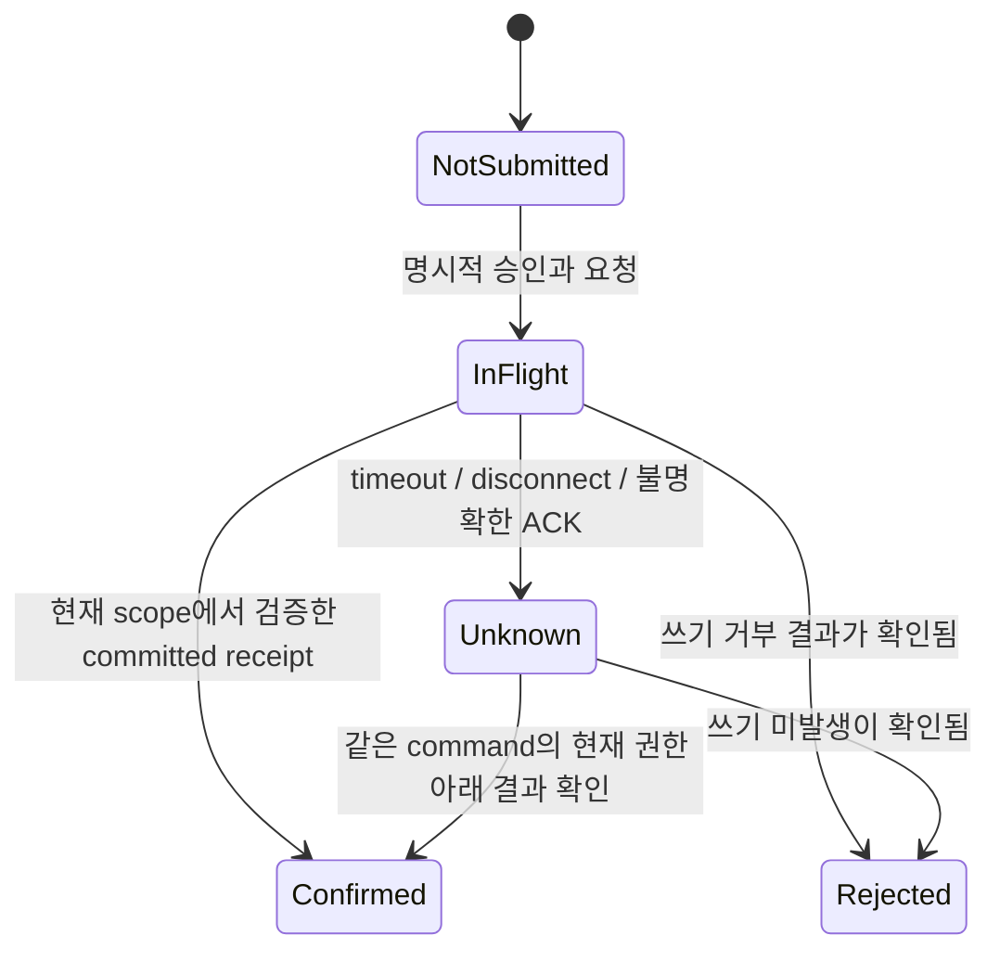

# R5A — 원자 저장·철회·불명확한 결과·삭제 설계

2026-10-03 / **DESIGN_ONLY / LOCAL_REVIEW_DRAFT**.
검토 기준 HEAD: `afbc0fbc4dd41669e468d8658965ef8f5f10ee7d`.
현재 cloud의 합성 보완은 미커밋 overlay다. 운영 adapter, migration, DB 설정,
인증 경로, 새로운 wire 또는 보존 기간을 구현·확정한 문서가 아니다.
`REAL_SECRET_GATE=CLOSED`; 실제 DB·Gmail·AI 연결 및 배포는 보류한다.

## 해결해야 할 연결 조건

현재 catalog/review는 transaction port를 주입받는다. callback을 실행했다는 사실이나
메모리 adapter의 성공만으로 실제 DB의 권한·동시성·durability가 보장되지는 않는다.
기존 계약을 유지하려면 운영 adapter가 아래 조건을 실제 저장소에서 충족해야 한다.

| 기존 source | 이미 요구하는 조건 | 운영 설계에서 남은 증거 |
| --- | --- | --- |
| [catalog transaction](../../../apps/benefits-web/src/server/catalog/contracts.ts) | entry/commit authority, deadline, unique/reference/CAS의 원자 강제, committed completion 뒤 반환 | DB의 동일 transaction·잠금·제약·실제 commit/오류 관찰 |
| [review transaction](../../../apps/benefits-web/src/server/review/contracts.ts) | owner별 읽기, callback 실패 시 전부 rollback, preview phantom 방지, service revision predicate | 다른 인스턴스의 confirm/edit/delete 및 권한 철회와 직렬화 |
| [catalog controller](../../../apps/benefits-web/src/server/catalog/service-catalog.ts) | 정규화 요청 fingerprint, operation replay, CAS, catalog revision, tombstone와 payload 제거 | 영속 operation의 수명·개인정보 분류·동시 replay·삭제 세대 |
| [HTTP 계약](../../../apps/benefits-web/HTTP_CONTRACT.md) | admission·deadline·최종 권한 확인, abort가 commit rollback은 아님 | proxy/transport 실패와 DB commit 결과의 분리 |
| [mail 실행 계약](../../../apps/benefits-web/MAIL_RUN_CONTRACT.md) | 현재 session/grant/recipient/policy와 dispatch 결합 | provider와 DB 사이의 철회 전파·외부 비용·불명확한 응답 |

공개 catalog/auth/Gmail route의 503 차단은 그대로 유지한다. 현재 source의 단순 두 번
`readAuthority()` 호출만 운영 DB 원자 검사의 대체 구현으로 제출하지 않는다.

## 논리 데이터와 소유권

다음은 provider를 정하기 전의 논리 설계다. 테이블 이름·SQL·암호화 방법·index·TTL은
아직 결정하지 않았다. R5A-1/2 승인 manifest와 독립 검토 후 구체화해야 한다.

| 논리 기록 | 최소 결합/조건 | 보존·삭제 검토 |
| --- | --- | --- |
| owner lifecycle | owner, active/deleted 상태, 단조 data generation | 삭제 후 늦은 결과·오래된 backup이 이전 generation으로 복귀하지 못하는 fence |
| app session | verifier가 확인한 session ID/revision/expiry와 owner | logout/revoke를 transaction 진입·완료와 같은 경계에서 관찰 |
| purpose consent/grant | 연결 계정의 opaque binding, 목적·scope·recipient/policy·동의 revision·철회 상태 | metadata와 FULL/외부 분석 목적 분리; 실제 token/메일 주소를 앱 공개 DTO에 넣지 않음 |
| catalog/service/benefit | owner/generation/ID/revision/state와 bounded 허용 payload | live reference·service version·삭제 tombstone, content 제거 |
| candidate/preview | owner/generation/출처 참조·불변 revision·access expiry·single-use 상태 | 접근 만료와 물리 삭제를 구분. consumed/revoked/deleted를 pending으로 되돌리지 않음 |
| operation | command namespace·owner·operation ID·generation·정규화 내용 비교 근거 | 원문 없이도 ID/fingerprint는 사적 metadata일 수 있음. 무기한 보존을 기본값으로 확정하지 않음 |
| quota/dispatch ledger | owner·목적·operation·허가된 budget·현재 상태 | 호출 전 원자 예약과 실제 비용 대조, timeout 이후 임의 환불/재실행 금지 |
| cleanup task | 삭제 generation·대상 저장 영역·진행/실패 상태·최소 재개 정보 | idempotent 재개, operator 화면에 raw mail/token/payload를 노출하지 않음 |

RLS는 방어 수단 중 하나다. API verifier, transaction의 owner/generation 조건,
참조 제약과 로그/backup/운영 계정의 접근 제한을 함께 검증한다. 관리자 권한으로
운영하는 client가 RLS를 우회하는 구성인지도 별도 확인해야 한다.

## 권한 철회와 commit의 직렬화

제안은 app authority/lifecycle의 현재 revision을 저장소의 일관된 경계에서 읽고,
권한 변경과 mutation이 같은 owner/session/목적 revision 경계에서 순서가 정해지도록
구현하는 것이다. 단순히 외부 verifier를 읽은 뒤 unchecked commit하지 않는다.

1. trusted verifier의 principal을 파싱하고 현재 owner/generation/session/expiry를 캡처한다.
2. transaction 안에서 현재 authority/lifecycle 조건을 확인한다. DB별 locking 또는
   직렬화 가능한 동등한 방법으로 revoke/delete와 충돌하는 조건을 commit까지 유지한다.
3. operation unique/replay·service version·reference·preview 조건을 같은 경계에서 확인한다.
4. 조건부 변경, operation, collection revision, preview payload 제거를 함께 처리한다.
5. commit 조건과 deadline을 다시 강제하고, DB의 committed completion을 관찰한 뒤 반환한다.

검사 순서만 적었다고 이 보장이 구현된 것은 아니다. 선택한 DB가 제공하는 실제
잠금 범위, phantom 방지, isolation anomaly, connection/statement timeout 및 commit
결과를 검증해야 한다. callback의 예외를 success로 삼키거나 일부 쓰기만 남기지 않는다.

provider가 외부에서 Gmail grant를 철회한 순간과 KeyAtlas DB commit 사이에는 분산 경계가
있다. 로컬 revision 잠금이 Google의 실제 철회 시점을 원자적으로 고정하지 않는다.
관찰한 철회는 새 dispatch를 차단하고 late result를 다음 scope에 적용하지 않도록 처리하되,
이미 시작된 provider 호출·비용·메일 수신을 즉시 되돌렸다는 표현은 사용하지 않는다.
이벤트/갱신 검사 주기와 전파 한계는 실환경 acceptance에 명시해야 한다.

## commit deadline의 승인 전 확인점

현재 `ReviewTransaction.limitCommitTime`의 문구는 **deadline 시각 또는 그 이후의 commit을
성공시키지 말 것**을 요구한다. app에서 commit 명령 직전에 시각을 한 번 읽거나
`statement timeout` 하나만 설정한 것은 그 요구의 증명이 아니다. DB가 이미 commit한 뒤
HTTP 응답만 deadline으로 바꿔도 DB 쓰기가 rollback됐다는 뜻은 아니다.

DB 선택 시 다음을 구분한 시험이 필요하다.

- app callback 완료 시점, DB commit 요청 시점, DB가 영속 commit을 확정한 시점,
  driver ACK 수신 시점과 HTTP 응답 시점.
- 만료 직전 lock 대기/느린 commit/연결 단절/timeout에서 실제 저장 결과와 반환 결과.
- transaction을 중단한 뒤에도 commit될 수 있는 시점과 unknown 결과 처리.

정확한 port 요구를 충족하는 adapter 근거를 확보하거나, 충족하지 못한다면 계약의 의미와
최소 변경안을 별도로 리뷰·승인받아야 한다. 이번 작업에서는 계약·deadline·reader·CI 정책을
완화하지 않았다. 이는 운영 adapter의 선행 설계 확인점이며 현재 mock controller의 새
운영 결함을 재현했다는 보고가 아니다.

## 불명확한 결과와 operation replay

`Unknown`은 saved/deleted/rollback 중 어느 하나의 동의어가 아니다. 자동 새 operation ID로
mutation을 반복하지 않는다. 사용자·session·generation이 바뀌면 이전 응답을 새 화면에
적용하지 않으며, 결과를 확인할 때에도 현재 권한과 admission이 필요하다.

현재 catalog는 같은 operation ID와 같은 canonical request만 replay하고 다른 내용/
generation은 conflict로 거부한다. 별도 운영 result-lookup route는 아직 없다.
향후 재확인 UI/endpoint를 만들려면 허용 파일과 새 계약을 승인해야 한다. 이 설계 문서는
모든 Unknown을 안전하게 재시도할 수 있다거나 새 endpoint가 구현됐다는 뜻이 아니다.

현재 catalog fingerprint는 bounded canonical request의 **비키 SHA-256**이다.
원문 저장은 피하지만 낮은 엔트로피의 metadata 추정이나 다른 기록과의 연결 가능성을
완전히 제거하지 않는다. hash를 익명화·암호화·삭제 완료로 표시하지 않는다.
키를 쓰는 별도 비교 방식, retention, operation fence 유지 방식이 필요하면 호환성/
key 관리/회전/삭제와 함께 승인 범위를 정해야 한다. 이번 작업에서는 바꾸지 않았다.

## 삭제·만료·disconnect는 서로 다른 작업

| 사용자 동작 | 즉시 적용할 접근/실행 경계 | 별도 확인할 영속 정리 |
| --- | --- | --- |
| preview/candidate 만료 | 해당 proposal을 더 이상 읽기·확정하지 못함 | 원문 없는 content도 cleanup/backup에서 언제 삭제되는지 |
| 서비스/혜택 삭제 | 현재 revision 조건에서 tombstone와 참조/preview 정리 | operation/fingerprint·로그·backup·검색/queue·지원 export |
| Gmail disconnect | 새 dispatch 차단, grant/token 수명 종료, 진행/late 결과 scope 무효화 | 과거 검토 기록을 유지할지 삭제할지 목적별 선택·근거 |
| 계정 삭제 | owner lifecycle 종료 및 새 generation/fence, session/작업 무효화 | DB/queue/cache/token/log/backup 전체 정리와 재시작/재유입 처리 |

완료 확인의 최소 단위는 대상과 결과를 포함한 정리 기록이다. UI에서 행이 사라진 시점,
논리 content nulling, active DB의 물리 삭제, backup 보존 만료 및 외부 수신자의 삭제를
같은 시점으로 묶지 않는다. 적법한 보존 예외·정확한 기간·책임 주체는 M06/법률 검토와
사용자 결정이 필요하며 여기서 임의로 정하지 않는다.

backup restore에는 삭제 fence가 적용되어야 한다. 과거 backup을 복원하고 삭제된 owner/
generation의 후보·token·operation을 다시 활성화하는 절차는 허용 결과가 아니다.
원본 Lovable DB/backup을 신규 KeyAtlas DB와 공유하는 방식은 제안하지 않는다.

## C06 → C04 표시 연결의 제안 경계

현재 C06 결과와 C04 예시 목록은 별도 화면이다. 자동 전달·공유 저장은 구현되지 않았다.
합성 화면의 후속 연결에서도 C06 DTO를 verified server analysis나 실제 가입 증거로 삼지 않는다.

| 가능한 다음 단계 | 허용 결과 | 구현 전 조건 |
| --- | --- | --- |
| 같은 C06 session 안의 C04 표시 재사용 | allowlisted service/signals/날짜만 ephemeral 분류, 실제 계정 힌트는 없음 | exact preview의 결과 범위 안내, 원래 5분 deadline/cancel/unmount에서 양쪽 결과 제거, 새로운 seed를 timer마다 만들지 않음 |
| 별도 화면으로 이동 | 명시적 이동·데이터 범위 확인과 원래 수명에 결합한 최소 DTO | 새로고침/뒤로 가기/만료/취소의 초기화, URL/storage 전송 없음, 분류 중복 source-of-truth 해결 |
| 실제 후보 저장 | 별도 metadata 목적의 trusted provenance·authority·저장 동의·transaction | R5A 승인, 실제 mailbox/grant와 입력의 결합, 삭제/철회/coverage·원문 최소화 검증 |

manual `confirmed`는 검토 표시다. source kind `official_notice`나 mail 문구만으로
계정 소유·현재 가입·현재 잔액을 인증하지 않는다. C04의 `inferred`와 C06의 3단계 상태가
다르므로, 기존 scanner enum을 조용히 늘리거나 분류 결과를 권한으로 전달하지 않는다.
공용 타입/셸/route 변경은 M01A 소유로 계획하고 이 문서에서는 source를 변경하지 않았다.

## 승인 후 검사 묶음

| 묶음 | 필수 사례 | 현재 결과 |
| --- | --- | --- |
| 권한 직렬화 | 다른 owner·같은 generation의 계정 전환, revoke/delete가 callback 전/중/commit과 경쟁 | 실제 adapter NOT_RUN |
| 원자성 | operation unique 충돌, CAS/collection revision, callback 실패, confirm vs service delete/edit, preview phantom | memory/loopback 근거만 있음; 실제 DB NOT_RUN |
| deadline/Unknown | commit 직전·중·후의 expiry/abort, ACK 손실, 현재 권한의 같은 command 확인 | 실제 driver/DB/proxy NOT_RUN |
| 삭제 | access expiry와 cleanup 구분, partial cleanup 재개, backup 재유입, logout/disconnect/account deletion | 실환경 NOT_RUN |
| 개인정보 | fingerprint/ID·최소 로그의 retention와 접근, backup/token의 삭제, 공급자 수신 범위 | 정책/법률/운영 검토 미완료 |
| 표시 연결 | C06 original TTL/동의·취소·부분 선택, C04 분류 유지/초점, raw 필드·storage·URL 비포함 | 새 handoff 구현 및 검사는 NOT_RUN |

선행 설계: [R5A 목적별 승인 표](R5A_PURPOSE_AND_ACCEPTANCE_2026-10-03.md),
[provider port 계획](PROVIDER_ADAPTER_PLAN.md),
[한국 데이터 처리 초안](../../privacy/mvp/2026-10-03-korea-data-handling-draft.md).
운영 구현에 앞서 exact 기준 commit/overlay·허용 파일·DB/지역/비용·목적/수신자·보존/삭제·
독립 리뷰와 acceptance evidence를 확정해야 한다.
