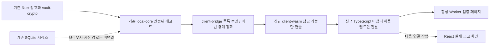

# KeyAtlas — Rust/WASM 출시 기반 작업 기록

작성일: 2026-09-12. 작업 시작: 21:29 KST. 실제 출시를 목표로 한 약 30분 작업.
**결론: Rust → WASM → TypeScript 경계를 구현하고 합성 실행을 검증했다.
실제 사용자 비밀번호/API 키를 넣는 출시 단계는 아직 아니다.**

## 실제 작업 위치

```text
C:\Users\USER\Desktop\PersonalProJect\KeyAtlas\worktrees\wanted-ai-championship
브랜치: codex/firstvibe-wanted-ai-championship
```

`Documents\ChatGPT\KeyAtlas`의 오래된 화면 프로토타입과 구분한다.
시작부터 있던 미커밋 작업은 보존했다. 이번 작업에서 commit/push/merge,
공개 배포, 실제 키 입력, Windows 보안 기능 해제는 하지 않았다.

## 구조와 이번 범위



WASM은 Rust 코드를 브라우저에서 실행하기 위한 형태다. 이번 작업은 서버에
평문을 보내는 API를 만든 것이 아니라 클라이언트 보안 로직의 연결부다.
기존 SQLite 저장소가 브라우저에서 자동으로 실행되는 것은 아니다.

## 이번 변경 파일

| 위치 | 구현 내용 |
| --- | --- |
| `crates/vault-client-wasm/Cargo.toml` | WASM crate, 정확한 도구 버전, 합성 기능 분리 |
| `crates/vault-client-wasm/src/lib.rs` | 잠금 검사, 임시 행 번호 검사, 허용된 목록 getter |
| `crates/vault-client-wasm/src/demo.rs` | 입력 없는 합성 암호화·목록 생성 경로 |
| `crates/vault-client-wasm/README.md` | 실행 방법, 제한, 보안 경계 |
| `crates/vault-client-bridge/src/lib.rs` | 중복 레코드 및 같은 레코드의 다른 revision 거부 |
| `crates/vault-client-bridge/tests/catalog_snapshot.rs` | 혼합 금고, 중복, 5001개 초과, 빈 목록 회귀 검사 |
| `apps/web/src/bridge/` | TS 계약·어댑터·47개 테스트·README |
| `apps/web/tests/wasm/` | 독립 Worker 실제 WASM 검증 페이지 |
| `apps/web/src/vite-env.d.ts`, `apps/web/vite.config.ts` | CSS 타입·Vitest 설정 타입 오류 수정 |
| `scripts/build-wasm.ps1`, `scripts/test-wasm.mjs` | 재현 가능한 빌드·실제 생성물 실행 검사 |
| `Cargo.toml`, `Cargo.lock`, `.gitignore` | workspace 및 새 의존성·생성물 제외 |

기존 React 디자인, 결제·로그인 화면, 기존 core/SQLite 미커밋 변경을 이번에
새로 구현했다고 집계하지 않는다. 디자인은 계속 보류했다.

## 확인한 결과

| 검사 | 결과 |
| --- | --- |
| `cargo fmt --all -- --check` | exit 0 |
| `cargo clippy -p vault-client-wasm --target wasm32-unknown-unknown --all-features --locked --offline -- -D warnings` | exit 0 |
| bridge all-targets Clippy | 담당 에이전트 실행 exit 0 |
| `cargo test -p vault-client-bridge --test catalog_snapshot --test secret_traits --locked --offline` | exit 0; 목록 7개 + 컴파일 실패 harness 1개(내부 사례 13개) 통과 |
| `scripts/build-wasm.ps1 -SyntheticDemo` | debug WASM 생성 exit 0 |
| `node scripts/test-wasm.mjs --demo` | 실제 WASM 실행 exit 0; 3개 합성 행, 모든 getter 잠금, 잘못된 참조 검증 |
| `scripts/build-wasm.ps1` 및 `node scripts/test-wasm.mjs` | exit 0; 기본 생성물에 합성 factory 미노출 확인 |
| `npm.cmd run typecheck` | exit 0 |
| `npm.cmd test` | exit 0; 전체 49/49 (어댑터 47 + 기존 2) |
| `npm.cmd run build` | exit 0; 현재 React 빌드이며 WASM 제품 화면 연결 증거는 아님 |
| Worker harness JS 문법 검사 | 두 파일 `node --check` exit 0 |
| Chrome Worker 실제 실행 | 첫 실행 60초 `WORKER_TIMEOUT`; 다른 검사 종료 후 단독 재실행 `WASM_SMOKE_PASSED` |
| `scripts/build-wasm.ps1 -SyntheticDemo -Release` | exit 101; Windows Application Control 오류 4551 |

Release 빌드에서는 `wasm-bindgen-shared`와 `rustversion`의 빌드 보조 실행 파일이
OS 정책에 차단됐다. 개발용 빌드는 성공했지만 최적화 배포용 빌드를 통과했다고
보고하지 않는다. 동일 시도 반복이나 보안 정책 우회는 하지 않았다.

테스트가 통과한 범위와 실제 출시 적합성은 다르다. 전체 workspace 테스트,
모바일 실기기, 외부 인증 제공자, 실제 저장/복구, 공개 배포는 이번에 검증하지 않았다.

## Red/Blue 관점에서 발견하고 수정한 내용

공격 재현이나 외부 서비스를 대상으로 한 테스트 없이, 자체 코드 경계를 검토했다.

| 위험 관점 | 방어 구현·검증 |
| --- | --- |
| 중복 레코드로 목록 해석이 모호해짐 | 복호화 전 ID 중복 거부, revision이 달라도 거부 |
| 잘못된 JS 숫자가 행 0으로 바뀜 | `f64` 단계에서 유한·정수·범위 확인 후 변환 |
| 잠금 뒤 이전 비동기 결과가 도착함 | generation 검사로 성공·실패 모두 오래된 결과 취소 |
| 오류 message/cause/추가 속성에 개인정보가 섞임 | 허용된 코드만 읽어 새 오류 생성, 원본 오류 전달 금지 |
| 행 일부만 인증됐는데 부분 목록이 노출됨 | 전체 실패 처리, 혼합 금고 합성 회귀 테스트 |
| 일반 직렬화·디버그로 내용이 노출됨 | Rust 경계의 금지 trait/API 컴파일 실패 검사 13개 |

독립 리뷰 에이전트가 오류 객체 정제와 오래된 실패 처리 2건을 지적했고,
다른 구현 에이전트가 수정했다. 리뷰 에이전트가 수정 반영을 재확인했다.

## 출시 전에 남은 필수 조건

1. **실제 저장·잠금 해제 흐름**: 인증, 클라이언트 암호화, 암호문 저장, 복구·기기 분실,
   재인증 정책을 함께 연결하고 검증해야 한다. 생체인증도 아직 이 연결부에는 없다.
2. **브라우저 실행·성능**: 단독 Worker 실행은 통과했다. 첫 실행 timeout의 원인은
   확정하지 않았으며 반복성·부하 조건과 최적화 WASM 빌드 검증이 필요하다.
   앱 화면에는 아직 이 모듈을 연결하지 않았다.
3. **메타데이터 보호**: 기존 account/notes/URL 등의 모든 Rust String이 지워진다고
   보장할 수 없다. JS 복사본과 DOM은 Rust lock으로 완전히 지울 수 없다.
4. **AI로 보내는 경계**: 기존 `toAiSafeInventory.ts`의 자유 입력 서비스명 등을
   실제 데이터와 연결하기 전 데이터 최소화·검증·명시적 동의가 필요하다.
   이번 WASM 어댑터는 AI/분석/로그에 연결하지 않았다.
5. **누락·과거 데이터 감지**: 개별 레코드 인증과 전체 금고의 최신성·완전성은 다르다.
   신뢰할 수 있는 checkpoint·동기화 설계가 필요하다.
6. **호스트·배포 보안**: CSP, 제3자 스크립트/확장 프로그램 위협, 세션 자동잠금,
   Worker 수명, 공급망·독립 보안 리뷰·운영 절차가 필요하다.

## 도구 변경과 복구 가능한 산출물

- Rust toolchain 1.95.0에 `wasm32-unknown-unknown` target을 설치했다.
- 공식 wasm-bindgen 0.2.128 Windows CLI를 내려받아 공개 SHA-256과 대조했다.
  SHA-256: `8fd8e2165da16b21ee3f5efd19e7f97d8d27cb7832f54edaef4b18e830283ec0`.
- CLI 위치: `%LOCALAPPDATA%\KeyAtlas\build-tools\wasm-bindgen-0.2.128\`.
- Rust 임시 빌드 캐시: `%LOCALAPPDATA%\Temp\keyatlas-rust-boundary-target`.
- PATH나 Windows 보안 정책은 바꾸지 않았다. 생성된 JS/WASM은 Git에서 제외했다.
- 원본 코드·설정·테스트가 산출물이다. clone 후 필요한 의존성을 받은 다음
  `crates/vault-client-wasm/README.md` 순서대로 재생성한다.

## 최종 기록

21:55 KST Chrome의 `/tests/wasm/` 페이지에서 다음 최종 결과를 직접 확인했다.

```json
{"schemaVersion":1,"status":"pass","code":"WASM_SMOKE_PASSED"}
```

검증 페이지는 실제 WASM과 TypeScript 어댑터를 전용 Worker에서 사용했다.
길이 3, 잠금 뒤 조회 거부, 허용 필드, 잠금 시 목록 비우기, 늦게 도착한 핸들의
취소·정리를 확인했다. 실제 키와 사용자 레코드는 사용하지 않았다.
일반 React 제품 화면은 그대로이며 이 테스트 페이지를 완성된 금고 UI로 보지 않는다.

최종 재검사: demo/default 실제 WASM 실행 모두 exit 0, Rust 포맷 exit 0,
`git diff --check` exit 0, PowerShell 빌드 스크립트 구문 및 신규 문서 공백·충돌
마커 검사 exit 0. CRLF 전환 안내는 있었지만 검사 오류는 아니었다.
검증용으로 시작한 localhost 개발 서버는 검증 후 종료 요청했고 프로세스가 종료됐다.
사용자 IDE나 다른 프로젝트의 Java/Node 프로세스는 종료하지 않았다.

다음 순서: 지원되는 빌드 환경에서 Release 생성물 검증 → Worker 성능 안정성 확인
→ 합성 데이터로 앱 화면/암호문 저장/재실행 연결 → 인증·복구·비밀 열람 정책 통합.
실제 비밀정보를 허용하는 결정은 이 작업 완료와 별도로 다룬다.
