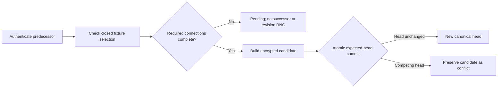

# Synthetic rotation cutover checkpoint

Date: 2026-09-16. Branch: `codex/firstvibe-synthetic-rotation-checklist`.

Status: implementation and independent source review completed; final runtime
verification pending. This is not release approval. `REAL_SECRET_GATE=CLOSED`.

## Scope

The Rust core can inspect a closed synthetic connection checklist and produce an
encrypted cutover candidate only after all recorded required connections are
confirmed. Optional pending connections remain `UpdateRequired`. Removed
connections retain their entire previous representation and cannot be selected.

- The replacement value and timestamp are build-included demonstration values.
- User/provider evidence choices are simulated fixture labels. No provider is
  contacted and neither choice proves external revocation.
- Readiness is based only on recorded connections; it does not discover usage.
- The authenticated predecessor revision determines `parent_revision_id`,
  `supersedes_revision_id`, and the expected CAS head.
- Predecessor ciphertext is immutable. A constructed candidate is not a durable
  success until the storage commit accepts it.
- New credential revocation fields reset to `NotRequested`/`None`; predecessor
  revocation evidence belongs only to the encrypted rotation history.
- Arbitrary Secret values, text, timestamps and entity IDs are not accepted.

## Files and responsibilities

| File | Responsibility |
| --- | --- |
| `crates/vault-local-core/src/rotation.rs` | Closed selection, authenticated readiness, final candidate generation |
| `crates/vault-local-core/src/persistence.rs` | Authenticated predecessor revision passed to the internal edit closure; parent linkage remains persistence-owned |
| `crates/vault-local-core/src/connection_edit.rs` | Existing synthetic profile validation reused only within the crate |
| `crates/vault-local-core/src/lib.rs` | Exports the closed synthetic API |
| `crates/vault-local-core/src/rotation_tests.rs` | Required/optional/removed cases, independent field preservation oracle, entropy and rejection boundaries |
| `crates/vault-local-store-sqlite/tests/commit_cas.rs` | Exact ciphertext/conflict mapping preservation, idempotent retries and close/reunlock authentication |

## Verification at this checkpoint

| Check | Result |
| --- | --- |
| `cargo clippy --locked --offline -p vault-local-core --all-targets --all-features -- -D warnings` | exit 0 |
| `cargo fmt --all -- --check` | exit 0 |
| `pwsh -NoProfile -NonInteractive -File scripts/check-repository-secrets.ps1 -Root .` | exit 0, `SECRET_SCAN_PASSED`, `REAL_SECRET_GATE=CLOSED` |
| `cargo test --locked --offline -p vault-local-core -- --test-threads=1` | Compiled; executable never started: Windows Application Control error 4551, also outside sandbox |
| Combined core/SQLite Clippy | SQLite/blake3 dependency build executables blocked by error 4551; no full-pass claim |
| SQLite new integration test | Source reviewed; final compilation/runtime not yet verified |
| Independent review | Original Important test-oracle issue fixed; rereview reports no remaining Critical/Important source findings |

The earlier 10-test focused pass preceded the independent-oracle and additional
tests in this checkpoint. It is not evidence that the final version passed.
No Windows protection was changed. The existing GitHub Windows workflow is the
next runtime verification environment. A pushed checkpoint remains pending until
its exact commit has completed the required checks.

## Known limits and follow-up

This is a one-shot synthetic core, without web/Worker/WASM/Android UI wiring.
The current model binds completed rotation history to the immediate parent, and
connection editing refuses items with rotation history. Further connection edits,
generic successors and another rotation therefore fail closed after cutover.
The refusal is explicitly tested. Pending optional connections cannot yet be
completed through this API. Active workflow state and historical rotation records
need separate lifecycle semantics before exposing a repeatable product flow.

Intermediate checklist persistence, real provider verification/revocation, real
Secret input, recovery/device workflows and deployment are not implemented by
this change. No global decoder compatibility rule was tightened.
