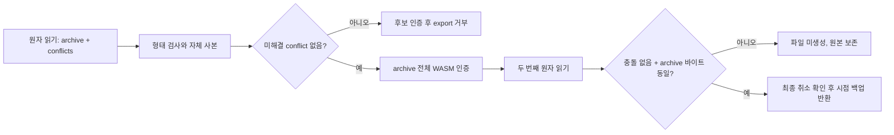

# 2026-09-17 합성 백업 원자 snapshot 검증

`REAL_SECRET_GATE=CLOSED`, `PHASE_0A_VERDICT=UNCHANGED`.

브랜치: `codex/firstvibe-atomic-backup-snapshot`, 기준 커밋: `06349e8`.
이 변경은 이전 [conflict guard](2026-09-16-synthetic-backup-conflict-guard.md)의
분리된 archive/list 읽기를 보완한다. 실제 비밀번호 관리자의 출시 승인이나
사용자 금고의 백업 완료를 뜻하지 않는다.

## 구현과 보장

- `readBackupSnapshot()`은 기존 DB v1의 archive와 conflict keyspace 전체를
  같은 readonly IndexedDB transaction에서 읽고 `oncomplete` 이후에만 반환한다.
  DB/schema/백업 wire version 변경은 없다.
- 소비자는 첫 번째와 두 번째 결과 모두 정확한 own data property, plain container,
  bounded 목록·고유 conflict ID, native Uint8Array/ArrayBuffer를 검사하고 동기 복사한다.
  접근자·추가 필드·손상·공유 버퍼·orphan conflicts를 거부한다.
- 원자 읽기 기능이 없는 adapter는 거부한다. 별도 `read()`와
  `listConflictArchives()`를 조합하는 fallback은 없다.
- conflict가 있으면 후보를 인증하고 `UNRESOLVED_CONFLICTS`로 멈춘다.
  후보 인증 실패는 고정 `STORAGE_FAILED`로 멈춘다. 후보를 삭제·승격·병합하지 않는다.
- archive를 인증한 후 최종 snapshot과 모든 바이트를 비교한다. 변경/삭제되면
  `STALE_BACKUP`으로 반환을 거부하고 UI는 다시 백업을 준비하도록 안내한다.
- 취소 후 늦게 끝난 작업은 결과를 내보내지 않는다. 내부 작업 완료와 최외곽 반환 사이도
  generation을 다시 확인하며, 이전 작업의 cleanup은 새 작업의 busy 상태를 변경하지 않는다.
- adapter 원본 버퍼가 canonical 상태와 같은 객체여도 직접 지우지 않는다.
  이 export가 생성한 작업 사본만 정리한다. JavaScript의 물리적 메모리 소거 보장은 아니다.
- 이전 download URL은 재준비 시 폐기하고 실패 시 새 URL을 만들지 않는다.

보장은 **최종 readonly transaction 시점에 인증한 archive와 저장된 archive가 같고
conflict가 없었다**는 것까지다. 이후 정상 write를 막거나 다운로드 시점의 최신성을
보장하지 않는다. outbox 포함 백업, 전체 DB rollback/누락·ABA 탐지, 악성 실행 코드나
거짓 adapter 격리는 이 기능의 보장이 아니다.

## 변경 파일

| 파일 | 담당 |
|---|---|
| `apps/web/src/storage/SyntheticCiphertextStore.ts` 및 `.test.ts` | 한 transaction의 snapshot capability, writer 순서·완료·abort·손상 보존 검사 |
| `apps/web/src/features/local-vault/SyntheticVaultBackup.ts` 및 `.test.ts` | 두 snapshot 비교, 입력·취소·사본 소유권 경계 |
| `apps/web/src/features/local-vault/SyntheticVaultBackup.wasm.test.ts` | 실제 WASM 인증 도중 다른 store의 successor/conflict 저장 회귀 |
| `apps/web/src/features/local-vault/SyntheticBackupSession.ts` 및 `.test.ts` | 고정 stale 오류, URL 미생성, 시점 백업 안내 |

## 로컬 실행 증거

아래 npm 명령의 작업 위치는 해당 worktree의 `apps/web`이다.

| 명령/검사 | 결과 |
|---|---|
| `npm ci --ignore-scripts` | exit 0, 고정 lockfile 설치 |
| `npm test -- src/storage/SyntheticCiphertextStore.test.ts` | exit 0, 122 passed |
| `node node_modules/vitest/vitest.mjs run src/features/local-vault/SyntheticVaultBackup.test.ts` | exit 0, 167 passed |
| `npm test -- src/features/local-vault/SyntheticBackupSession.test.ts` | exit 0, 47 passed |
| `npm test -- --exclude "**/*.wasm.test.ts"` | exit 0, 22 files, 965 passed |
| `pwsh -NoProfile -NonInteractive -File scripts/build-wasm.ps1 -SyntheticDemo -Release` (repo root) | exit 1, quote/getrandom build executable을 Windows Application Control이 error 4551로 차단 |
| `npm run typecheck` | exit 1, 위 WASM 생성 실패로 generated module TS2307 4건. 타입 검사 통과 아님 |
| 독립 구현 리뷰 | Critical/Important 발견 0. Store/Backup/Session 소스 검토이며 제품 보안 감사 아님 |
| `git diff --check` (repo root) | exit 0 |
| `pwsh -NoProfile -NonInteractive -File scripts/check-repository-secrets.ps1 -Root .` (repo root) | exit 0, `SECRET_SCAN_PASSED`, `REAL_SECRET_GATE=CLOSED` |

로컬에서 새 release WASM을 생성하지 못했으므로 실제 WASM 통합 테스트와 전체 웹 build를
통과했다고 보고하지 않는다. 이전 바이너리를 복사해 새 빌드로 간주하지 않았고 OS 보안
설정/예외도 변경하지 않았다. 이번 브랜치 전체 검증은 push 뒤 GitHub CI에서 수행하며
그 run의 SHA와 결과를 별도로 확인해야 한다.

실제 브라우저 멀티탭, 네이티브 파일 선택/디스크 다운로드, 모바일, 사용자 인증·복구,
실제 Secret 및 공개 배포는 미검증·미활성화다.
