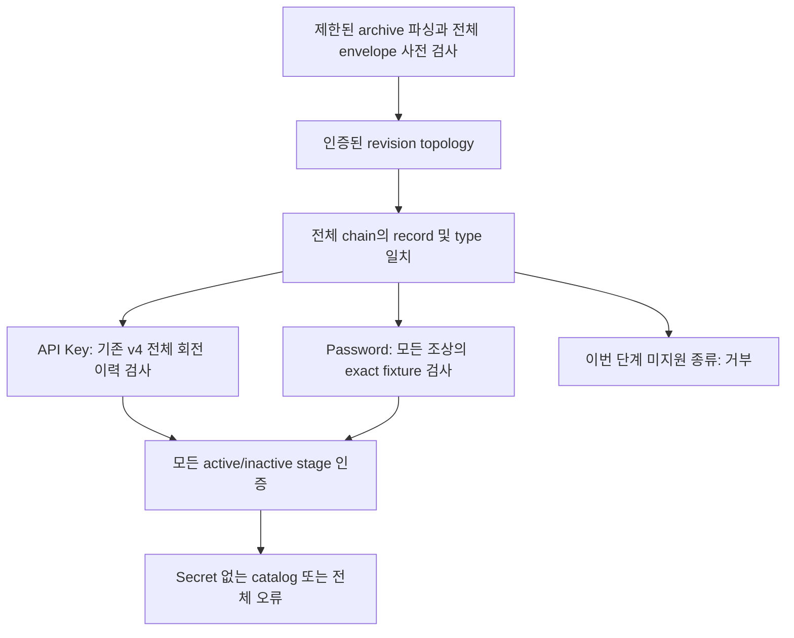

# 혼합 Password/API credential 금고 경계 검증

기준: 2026-09-18. 기준 커밋 `238f8b8f97afd2bb27e3392593406fbe3a1e0612`, 작업 브랜치 `codex/firstvibe-mixed-credential-archive`.

`REAL_SECRET_GATE=CLOSED`. 실제 비밀번호·API 키·사용자 데이터·provider 호출을 사용하지 않았다. main 병합, 공개 배포, 인증/복구 정책 결정, 도메인/IAM/결제 변경은 범위 밖이다. 전체 제품 및 자율 작업 목표는 아직 완료되지 않았다.

## 무엇을 구현했나

API 키 전용 회전 검사에 모든 항목을 종속시키던 구조에서, 일반 이력 무결성과 항목별 허용 정책을 분리했다. 닫힌 Password 예제가 API 키와 같은 archive에 들어가더라도 이력 검사를 생략하지 않는다.

v1/v2 API legacy snapshot의 기존 읽기 정책은 유지한다. 새 Password는 v1/v2에서 genesis만 허용하고, successor는 v3/v4의 전체 ancestry를 요구한다. 그림의 일반 chain 검사는 v3/v4에 적용하며 legacy Password도 root 여부를 검사한다. v4의 API 회전 canonical admission을 다른 버전으로 확대했다고 주장하지 않는다.

## 파일 역할

| 파일 | 역할 |
| --- | --- |
| `crates/vault-local-core/src/credential_history.rs` 및 `_tests.rs` | 실제 envelope로부터 동일 record/type, 부모 연결, 중복/누락/순환/불필요 조상을 검사. 인증 전 최대 512 revisions/8 MiB. 반환값은 type/count뿐 |
| `crates/vault-local-core/src/synthetic_password.rs` 및 `_tests.rs` | 고정 enum 두 종류의 Password 팩토리, 정확한 sensitive 값과 필드/정책/수명주기 classifier. 기존 private builder 재사용 |
| `crates/vault-local-core/src/credential_commands.rs`, `lib.rs` | 사용되기 시작한 Password variant의 dead-code 예외 제거, 새 닫힌 API/검사 재수출. private raw DTO는 계속 비공개 |
| `crates/vault-client-wasm/src/archive_canonical.rs` 및 `_tests.rs` | 모든 archive 버전에 새 Password admission 적용. v3/v4 constant type 및 모든 Password ancestor 확인, 미지원 kind 거부 |
| `crates/vault-client-wasm/src/archive.rs` | history → canonical → staging → catalog 순서의 공통 읽기 경계 |
| `crates/vault-client-wasm/src/archive_rotation.rs`, `archive_staging.rs` | API canonical 검사를 전용 wrapper로 유지. Password를 API 기능으로 취급하지 않으며 stage 전체 인증 유지 |
| `scripts/check-repository-secrets.ps1` | 독립 리뷰를 받은 archive.rs의 normalized SHA만 갱신. 검사 규칙·제한·다른 baseline은 변경 없음 |
| `docs/MVP.md`, `docs/AUTONOMOUS_WORK_STATUS.md` | 현재 구현과 미구현/사용자 결정 경계 정합화 |

## 정책과 한계

- generic chain 검사만으로 회전 허가, 합성 sensitive 값, 최신 head 또는 rollback 방지를 보증하지 않는다.
- Password classifier는 정확한 내장 password/identifier bytes만 허용한다. `DEMO_VALUE_ONLY_` 접두사만 맞는 다른 값은 거부한다. 필드 개수/순서/이름/역할/민감도/reauth 정책, provider/issuer/scope/lifecycle도 확인한다.
- 이름·메모·태그·수정 시간은 기존 model-bounded metadata successor와 호환된다. 따라서 암호문 인증이나 classifier가 서명된 합성 출처 증명 또는 metadata에 비밀이 없다는 증명은 아니다.
- Password에는 현재 connection edit/rotation/stage capability가 없다. 다른 API의 stage/finalize/append/edit는 Password ciphertext와 ancestry를 보존한다.
- 기존 archive의 512 revisions/512 KiB 제한, 미사용 stage 인증, 새 후보의 API 교체 완료 공간 예약을 유지한다. 실제 디스크/browser quota 보장은 아니다.
- 새 Rust 팩토리는 고정 enum만 받는다. 기존 초기 3개 API 예제와 JS/WASM 등록 선택 입력은 그대로이며, Password 웹 입력·Worker 등록 명령·일반 문자열/Secret reveal 입력은 추가하지 않았다.

## 실행 증거

| 정확한 명령 | 결과 |
| --- | --- |
| `cargo test --offline --locked -p vault-local-core credential_history::tests -- --test-threads=1` | exit 0, 10 passed, 60.39s |
| `cargo test --offline --locked -p vault-local-core synthetic_password::tests -- --test-threads=1` | exit 0, 7 passed, 39.36s |
| `cargo test --offline --locked --release -p vault-local-core --lib -- --test-threads=1` | exit 0, 전체 123 passed, 19.71s |
| `cargo test --offline --locked --release -p vault-client-wasm --features synthetic-demo --lib -- --test-threads=1` | exit 0, 전체 69 passed, 44.52s. 새 혼합 archive 회귀 9개 포함 |
| `cargo clippy --offline --locked -p vault-local-core --all-targets -- -D warnings` | exit 0 |
| `cargo clippy --offline --locked -p vault-client-wasm --features synthetic-demo --all-targets -- -D warnings` | exit 1. Windows Code Integrity가 의존성 macro DLL 로딩 차단; 아래 참조 |
| `cargo test --offline --locked --workspace --doc` | exit 0, compile-fail doctest 11개 passed |
| `pwsh -NoProfile -NonInteractive -File scripts/build-wasm.ps1 -Release` | exit 0, default release WASM 재생성 |
| `pwsh -NoProfile -NonInteractive -File scripts/build-wasm.ps1 -SyntheticDemo -Release` | exit 0, synthetic-demo release WASM 재생성 |
| `node scripts/test-wasm.mjs` | exit 0, 새 default WASM 40 checks |
| `node scripts/test-wasm.mjs --demo` | exit 0, 새 demo WASM 1,528 checks |
| `npm test -- --maxWorkers=1` (`apps/web`) | exit 0, 42 files / 1,360 tests, 99.26s |
| `npm run typecheck` (`apps/web`) | exit 0 |
| `npm run build` (`apps/web`) | exit 0, 48 modules. demo WASM 483.53 kB |
| `cargo fmt --all -- --check` | exit 0 |
| `git diff --check` | exit 0 |
| `pwsh -NoProfile -NonInteractive -File scripts/check-repository-secrets.ps1 -Root C:\Users\USER\Documents\ChatGPT\KeyAtlas\secure-vault-rotation-staging` | exit 0, `SECRET_SCAN_BASELINE_ALLOWED=4`, `SECRET_SCAN_PASSED`, `REAL_SECRET_GATE=CLOSED` |
| `pwsh -NoProfile -NonInteractive -File tests/verification/check-repository-secrets.Tests.ps1` | exit 0, `SECRET_SCANNER_TESTS_PASSED=99` (PowerShell 7). PS5.1은 이번 로컬 실행 범위 밖 |

위 smoke와 웹 회귀는 새 Password JS 입력 성공을 뜻하지 않는다. 새 혼합 Password의 통합 증거는 native Rust archive 경계에서 얻었다.

독립 소스 리뷰: Critical 0 / Important 0. 리뷰 권고에 따라 같은 record의 `Password→ApiKey`, `ApiKey→Password→ApiKey` v3 통합 거부와 알려진 미지원 credential enum 5종의 v1~v4 거부 회귀를 추가했고 전체 69개 실행에 포함했다. 독립 리뷰는 외부 전문 보안 감사가 아니다.

### 실패한 시도와 확인 범위

1. generic size-bound 테스트 첫 시도에서 1 MiB짜리 개별 가짜 envelope가 crypto의 개별 제한에도 걸렸다. 합계/개별 제한을 분리하는 16 KiB × 512 fixture로 테스트만 수정하고 10개를 다시 통과했다. 실제 검사 코드는 바꾸지 않았다.
2. archive 첫 컴파일에서 새 테스트의 checklist 호출에 인자 3개가 빠져 exit 1이었다. 테스트 호출만 고친 뒤 전체 69개를 통과했다.
3. WASM Clippy 의존성 로드 실패는 `E0463: can't find crate for wasm_bindgen_macro` 및 후속 compiler 오류였다. 읽기 전용 Code Integrity 이벤트에서 2026-09-18 10:01:37의 IDs 3077/3033이 `target/debug/deps/wasm_bindgen_macro-2d10af519d0a3f7c.dll`의 signing/policy 차단을 확인했다. OS 정책·예외·의존성·toolchain을 변경하거나 차단을 우회하지 않았다. 따라서 해당 Clippy와 현재 exact-SHA 원격 CI는 통과로 표시하지 않는다.

## Secret scanner 기준

독립 리뷰 후 archive.rs의 CRLF/CR→LF, UTF-8 without BOM SHA-256을 `7074659DA6D5B6F25DF085A7AFA376AA038BB83D931A639A48B133BE2861694D`로 갱신했다. 같은 파일의 기존 공개 합성 demo password 때문에 존재하던 exact-file baseline이며, 새 secret 허용 목록이나 검사 우회는 추가하지 않았다.

## 원격 기준점

직전 `238f8b8f97afd2bb27e3392593406fbe3a1e0612`의 [GitHub CI 35291131952](https://github.com/kjs844-art/secure-vault/actions/runs/35291131952)는 이번 작업 중 exact SHA `completed/success`를 확인했다. 이 성공은 현재 혼합 archive 변경의 CI 증거가 아니다. 새 브랜치는 비강제 push로 별도 백업하고 현재 exact-SHA CI를 따로 확인한다. main 병합이나 기존 브랜치 삭제는 하지 않는다.

## 아직 확인/구현하지 않은 것

- 이 체크포인트의 exact-SHA GitHub 전체 CI와 WASM package Clippy 완료.
- 새 Password 등록용 JS/Worker/session/UI 계약·버튼·브라우저 통합. 기존 웹 회귀를 새 Password 사용자 흐름의 증거로 대체하지 않는다.
- 이번 변경의 실제 브라우저 수동 동작, 다중 창/오프라인/mobile hardware/네이티브 파일 선택.
- 실제 Secret 개방, 보안 감사/인증·복구/생체인증·동기화·서버/IAM·결제·배포/운영.

다음 독립 작업은 닫힌 Password 선택 등록과 credential별 UI capability를 연결하고, 기존 CAS/잠금/백업/오류 보존 계약을 통과시키는 것이다. 실제 Secret 개방과 제품 완성을 앞당겨 선언하지 않는다.
