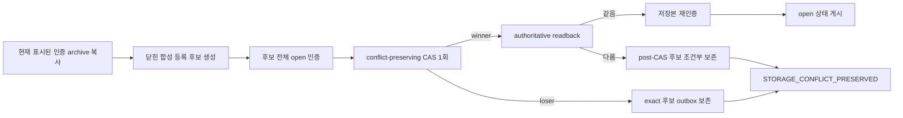

# 합성 등록 후보 사전 인증 및 충돌 보존 검증

기준: 2026-09-18. 기준 커밋 `120c616b9790168318ccd8e8067326ada0483038`, 작업 브랜치 `codex/firstvibe-registration-conflict-preservation`.

`REAL_SECRET_GATE=CLOSED`. 이 작업은 빌드에 포함된 닫힌 합성 API Key/Password 선택과 암호문 archive만 사용한다. 실제 비밀번호, API 키, 계정 식별자, 사용자 데이터, provider 호출, 도메인·배포·인증·복구·결제 결정은 포함하지 않는다.

## 닫은 보안 격차

기존 등록 경로는 expected original bytes를 사용하는 simple CAS로 정본 덮어쓰기는 막았지만, 등록 후보 전체를 저장 전에 별도로 인증하지 않았고 CAS 패자나 CAS 직후 displacement 후보를 conflict outbox에 남기지 못했다. 이번 보강은 등록을 기존 connection edit/rotation과 같은 충돌 보존 순서로 올린다.

- 등록 의도는 storage의 보이지 않는 최신 값이 아니라 사용자가 실제로 보고 있던 `#displayedArchive`의 소유 복사본에 결합한다.
- production 저장소의 두 conflict API가 모두 있을 때만 full outbox capability로 판단한다. 이 경로는 pre-CAS storage read를 하지 않는다.
- `append`가 만든 후보 전체를 `worker.open`으로 인증하기 전에는 어떤 storage write도 호출하지 않는다.
- preserving CAS 패자는 exact candidate를 원자적으로 outbox에 남기고 `STORAGE_CONFLICT_PRESERVED`를 반환한다. retry, rebase, merge, overwrite는 없다.
- CAS 성공 뒤 authoritative readback이 후보와 다르면 현재 정본을 유지하고 후보를 조건부 보존한다. 보존 실패는 `outbox-full` 같은 원래 고정 오류를 유지하며 보존 성공으로 오표기하지 않는다.
- exact-byte readback을 다시 인증한 뒤에만 목록과 archive를 open 상태로 게시한다.
- 오래된 injected store는 plain CAS fallback을 유지한다. 이 호환 경로는 기존 `STORAGE_CONFLICT` 의미를 유지하며 production outbox와 같은 보장을 주장하지 않는다.
- session이 소유한 predecessor, candidate, readback 복사본은 성공 소유권 이전본을 제외하고 `finally`에서 best-effort wipe한다. lock/cancel 뒤 늦은 continuation은 readback, 보존, 목록 게시를 다시 시작하지 못한다.

## 실행 증거

| 정확한 명령 | 결과 |
| --- | --- |
| `npm test -- src/features/local-vault/SyntheticVaultRegistration.test.ts src/features/local-vault/SyntheticVaultConnectionEdit.test.ts src/features/local-vault/SyntheticVaultRegistration.wasm.test.ts` (`apps/web`) | exit 0, 3 files / 109 tests |
| `npm test -- --maxWorkers=1` (`apps/web`) | exit 0, 46 files / 1,449 tests, 72.28s |
| `npm run typecheck` (`apps/web`) | exit 0 |
| `npm run build` (`apps/web`) | exit 0, 48 modules |
| `pwsh -NoProfile -NonInteractive -File scripts/check-repository-secrets.ps1 -Root C:\Users\USER\Documents\ChatGPT\KeyAtlas\secure-vault-rotation-staging` | exit 0, baseline allowed 4, `SECRET_SCAN_PASSED`, `REAL_SECRET_GATE=CLOSED` |

실제 generated demo WASM + fake IndexedDB 경합 검사는 같은 원본을 연 두 session에 서로 다른 닫힌 API/Password 등록을 동시에 실행했다. 결과는 정확히 winner 1개와 `STORAGE_CONFLICT_PRESERVED` loser 1개였고, 정본은 winner candidate와 일치하며 outbox에는 loser candidate가 정확히 1개 남았다. 두 candidate 모두 실제 WASM `open`으로 인증됐고 그 인증은 정본과 outbox를 변경하지 않았다.

문서 수정 직후 첫 전체 Secret scan은 `SECRET_SCAN_FAILED setup_or_execution`으로 fail-closed했고 finding 경로를 보고하지 않았다. 이를 통과로 간주하지 않고 동일한 최종 트리에서 다시 실행해 위 표의 exit 0과 닫힌 gate를 확인했다. 최초 실패의 세부 원인은 scanner 정책상 출력되지 않으므로 Secret 발견이나 구체적 원인으로 추정하지 않는다.

독립 읽기 전용 보안 리뷰는 Critical 0 / Important 0이었다. 이는 외부 전문 감사나 실제 Secret 입력 승인과 같지 않다.

## 미검증 및 다음 경계

- 실제 브라우저 Worker/IndexedDB 멀티탭 경합은 이번 실행 증거가 아니다. 현재 브라우저 제어 경로가 연결되지 않아 기존 사용자 브라우저 설정이나 OS 보안 정책을 변경·우회하지 않았다.
- 이 작업 브랜치의 exact-SHA 원격 CI는 아직 검증하지 않았다. 기준 커밋 `120c616`의 별도 CI 결과를 이번 변경의 증거로 재사용하지 않는다.
- 실제 사용자 입력, reveal/copy, recovery Key Slot, hardware-backed device key·생체 인증, rollback/누락 anchor, sync/checkpoint, Android, 실제 데이터용 backup/export, 독립 암호 검토와 침투 테스트는 여전히 미구현이다.
